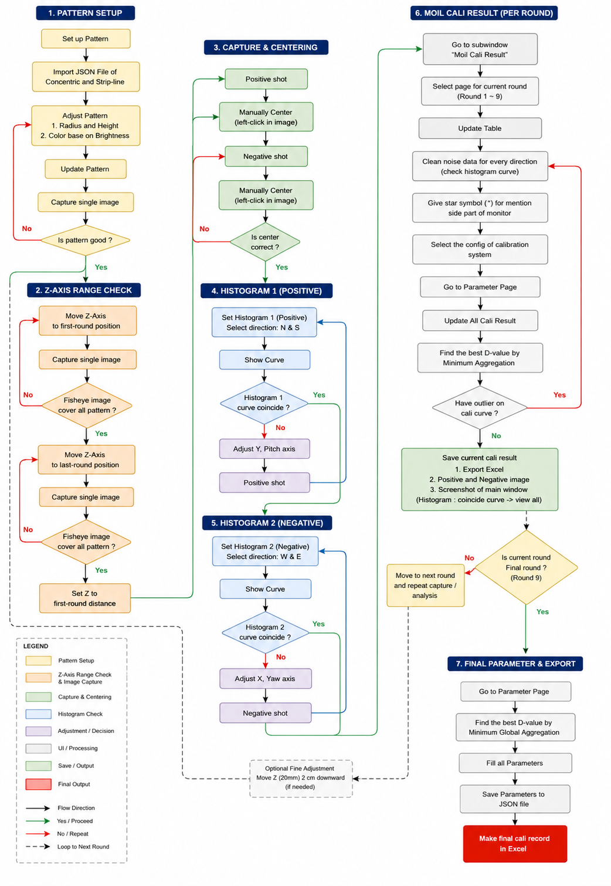

# Camera Calibration

This page explains the complete **Camera Calibration** workflow, starting from the theoretical basis, pattern setup, Z-axis range checking, image capture, centering, histogram verification, per-round calibration result processing, and final parameter export.

The calibration process is performed in several rounds. Each round must be checked carefully before moving to the next round, because the calibration result depends on pattern quality, image coverage, center accuracy, histogram alignment, and clean calibration curves.

The calibration method implemented in this system is based on **US Patent 7,042,508 B2** — *"Method for Presenting Fisheye-Camera Images"* by Gwo-Jen Jan and Chuang-Jan Chang (Appro Technology Inc., 2006). The patent describes a parameterization method that recovers the **principal point**, **focal length constant**, **viewpoint**, and **projection function** of a fisheye lens using a planar concentric calibration target.

---

## Theoretical Background

A fisheye lens has a field of view (FOV) larger than 180°. Because the projection function is far from rectilinear, traditional camera-calibration methods designed for narrow-FOV cameras do not work directly. The patent method integrates **multicollimator metrology** and **map projection theory from cartography** to systematically describe the projection mechanism of any fisheye image sensor (FIS).

### Core Concepts

| Concept | Description |
|---|---|
| **Fisheye Image Sensor (FIS)** | A camera with a fisheye lens. FOV typically > 180°. Produces a strong barrel-distorted image. |
| **Principal Point** `(iCx, iCy)` | The pixel where the optical axis intersects the image plane. Located at the center of the imaged concentric pattern (ICT). |
| **Optical Axis** | The symmetry axis of the lens. Used as the Z-axis in the calibration coordinate system. |
| **Viewpoint (VP)** | The logical optical center of the FIS. All incident rays in the model converge at this point. |
| **Focal Length Constant `f`** | The constant that relates principal distance `ρ` to zenithal distance `α` in the chosen projection function. |
| **Zenithal Distance `α`** | The angle between the optical axis and an incident ray. Range: 0 to π/2 for a 180° FOV. |
| **Azimuthal Distance `β`** | The angle around the optical axis, referenced to the prime meridian. Range: 0 to 2π. |
| **Principal Distance `ρ`** | The distance from the principal point to an imaged point on the 2D image plane. |
| **Physical Concentric Target (PCT)** | The calibration target — a planar pattern of concentric circles centered on the optical axis. |
| **Imaged Concentric Target (ICT)** | The image of the PCT captured by the FIS. Used to extract `ρᵢ` values for each ring. |

### The Three Projection Functions

A fisheye lens follows one of three idealized projection functions. The relationship between principal distance `ρ` and zenithal distance `α` differs for each:

| Projection | Formula | Inverse | Behavior at large α |
|---|---|---|---|
| **Equidistant (EDP)** | `ρ = f · α` | `α = ρ / f` | Linear in α. Most common assumption. |
| **Stereographic** | `ρ = 2f · tan(α / 2)` | `α = 2 · atan(ρ / 2f)` | Grows fastest; preserves circles. |
| **Orthographic** | `ρ = f · sin(α)` | `α = asin(ρ / f)` | Saturates near α = π/2; compresses the edge of the FOV. |

The calibration system tests all three functions for each lens and selects the one whose modeled `f` stays most constant across all concentric rings (lowest standard deviation `σ(f)`).

<div className="custom-note custom-warning">
  <div className="custom-note-title">⚠️ Do Not Assume Equidistant Projection</div>
  <p>Earlier image-based algorithms assume EDP for every fisheye lens. The patent shows this is wrong — the three curves diverge sharply at large α. The system must verify by checking <code>σ(f)</code> across all rings.</p>
</div>

### The Two-Step Image-Forming Model

The patent models the fisheye image formation in two logical stages, which makes inverse mapping (image → 3D ray) practical:

| Stage | Direction | Description |
|---|---|---|
| **Stage 1** | 3D ray → virtual sphere | Each incident ray converges at the viewpoint (VP) and is normalized onto a virtual sphere of radius `f`, becoming a point `(α, β)`. |
| **Stage 2** | Sphere → image plane | The normalized point is projected onto the 2D image plane using one of the three projection functions. |

```text
Incident ray
   ↓                       (Stage 1)
Virtual sphere point (α, β)
   ↓                       (Stage 2)
Image pixel (ρ, β) → (u, v)
```

The **inverse** of this pipeline — taking an imaged pixel and recovering the unique incident ray — is what enables panorama generation, perspective correction, and 3D inference from a single fisheye shot.

### Parameter Recovery from a Single PCT Capture

The patent shows that a planar **Physical Concentric Target (PCT)** can replace the expensive arc-laid multicollimator apparatus traditionally used to calibrate large convex lenses. The PCT works because of the **axial symmetry** of the lens: rays at the same azimuthal distance `β` on the same meridian map to the same radial line in the image.

The recovery procedure is:

```text
Capture image of PCT
   ↓
Adjust X / Y / Yaw / Pitch until ICT rings are concentric
   ↓
Mark ICT center → principal point (iCx, iCy)
   ↓
Measure ρᵢ for each ring i
   ↓
Trial-and-error search along optical axis for viewpoint VP
   ↓
Compute focal length constant f
   ↓
Test 3 projection functions → pick lowest σ(f)
   ↓
Output: (iCx, iCy), f, VP, projection function
```

The patent's verification procedure translates the PCT by known offsets (0, 5, 10, 15, 20, 25 mm) along the optical axis. If the calibration is correct, the recovered `f` stays constant across all offsets and the recovered object distances match the applied translations. The patent reports `σ(D) ≈ 0.005 mm` for `f ≈ 1.8 mm` — about 0.3% relative error.

<div className="custom-note custom-tip">
  <div className="custom-note-title">💡 From Patent Parameters to Application</div>
  <p>The calibration result window stores the recovered parameters as <code>parameter0</code> – <code>parameter5</code> (polynomial coefficients of the chosen projection function) together with <code>iCx</code>, <code>iCy</code>, and image dimensions. These six numbers are everything <code>Moildev</code> needs at runtime to dewarp live fisheye video into a panorama or perspective view.</p>
</div>

---

## Calibration Flowchart

<div className="center">

<a id="fig-1"></a>



<p><em><a href="#fig-1"><strong>Figure 1.</strong></a> Complete camera calibration workflow.</em></p>

</div>

<div className="custom-note custom-important">
  <div className="custom-note-title">📌 Workflow Stages</div>
  <p>The practical workflow below is divided into seven main stages: Pattern Setup, Axis Range Check, Capture &amp; Centering, Histogram 1 Positive, Histogram 2 Negative, Moil Cali Result per round, and Final Parameter &amp; Export. Each stage corresponds to a checkpoint in the flowchart above.</p>
</div>

---

## 1. Pattern Setup

The **Pattern Setup** stage prepares the calibration pattern before image capture begins. The purpose of this stage is to make sure the calibration pattern is correct, visible, and suitable for the fisheye camera.

### 1.1 Set up Pattern

Start by opening the pattern setup function and preparing the calibration pattern display.

This step is used to initialize the pattern before importing or editing the pattern configuration.

### 1.2 Import JSON File of Concentric and Strip-line

Import the required JSON pattern files:

| JSON Pattern | Purpose |
|---|---|
| **Concentric** | Used as the main circular calibration pattern. |
| **Strip-line** | Used as line reference pattern for alignment and verification. |

Make sure the selected JSON file matches the correct pattern type. If the wrong JSON type is imported, the pattern may not display correctly.

### 1.3 Adjust Pattern

After importing the JSON files, adjust the pattern parameters:

| Adjustment | Description |
|---|---|
| **Radius** | Controls the size of the concentric circle pattern. |
| **Height** | Controls the vertical size or position of the pattern area. |
| **Color based on Brightness** | Adjusts the pattern brightness so the camera can capture the pattern clearly. |

The pattern should not be too dark or too bright. Overexposed or unclear patterns can create wrong histogram and calibration results.

### 1.4 Update Pattern

Click **Update Pattern** after changing the pattern settings. This sends the latest pattern configuration to the display monitor.

### 1.5 Capture Single Image

Capture one image to verify whether the pattern is displayed correctly in the camera image.

### 1.6 Check: Is Pattern Good?

After capturing the image, check whether the pattern is good.

| Result | Action |
|---|---|
| **Yes** | Continue to **Axis Range Check**. |
| **No** | Return to the pattern adjustment step, update the pattern, and capture again. |

A good pattern should be clear, centered enough for checking, not overexposed, and visible across the required calibration area.

---

## 2. Axis Range Check

The **Axis Range Check** stage verifies whether the fisheye camera can see the full pattern at both the first-round and last-round Z-axis positions.

This step is important because every calibration round depends on the camera and monitor distance. If the pattern is not fully covered at the beginning or end of the range, the calibration data may become incomplete.

### 2.1 Move Z-axis to First-Round Position

Move the Z-axis to the first-round position. This is usually the starting distance for the first calibration round.

### 2.2 Capture Single Image

Capture one image at the first-round position.

### 2.3 Check: Does the Fisheye Image Cover All Pattern?

Check whether the fisheye image covers the complete pattern.

| Result | Action |
|---|---|
| **Yes** | Continue to the last-round position check. |
| **No** | Adjust the Z-axis position and capture again. |

### 2.4 Move Z-axis to Last-Round Position

Move the Z-axis to the last-round position. This verifies the other end of the calibration range.

### 2.5 Capture Single Image

Capture one image at the last-round position.

### 2.6 Check: Does the Fisheye Image Cover All Pattern?

Check again whether the fisheye image covers all required pattern areas.

| Result | Action |
|---|---|
| **Yes** | Continue to setting the Z-axis back to the first-round distance. |
| **No** | Adjust the Z-axis position and repeat the last-round capture check. |

### 2.7 Set Z to First-Round Distance

After the first and last positions are confirmed, return the Z-axis to the first-round distance.

This prepares the system for the first capture and centering process.

<div className="custom-note custom-warning">
  <div className="custom-note-title">Important</div>
  <p>
    Do not continue to capture and centering if the fisheye image cannot cover the full pattern
    at both first-round and last-round positions.
  </p>
</div>

---

## 3. Capture & Centering

The **Capture & Centering** stage captures positive and negative images and manually selects the image center.

The center position is critical because it affects the image center values used in calibration, such as ICX and ICY.

### 3.1 Positive Shot

Capture the positive image first.

### 3.2 Manually Center the Positive Image

Use **left-click** on the image to manually mark the center point.

Make sure the selected point is the correct visual center of the fisheye image.

### 3.3 Negative Shot

Capture the negative image after completing the positive shot centering.

### 3.4 Manually Center the Negative Image

Use **left-click** on the negative image to manually mark the center point.

### 3.5 Check: Is Center Correct?

After both positive and negative images are centered, verify whether the center position is correct.

| Result | Action |
|---|---|
| **Yes** | Continue to **Histogram 1 Positive**. |
| **No** | Repeat the capture and manual centering process. |

A correct center should align with the fisheye image center and should not be placed on a wrong pattern point or edge area.

---

## 4. Histogram 1 Positive

The **Histogram 1 Positive** stage checks the positive image curve alignment using the **North** and **South** directions.

This step helps verify whether the pitch-related alignment is correct.

### 4.1 Set Histogram 1 Positive

Set Histogram 1 to use the positive image.

Select direction:

```text
N & S
```

This means the system compares the histogram curve from the North and South directions.

### 4.2 Show Curve

Click **Show Curve** to display the histogram curve.

### 4.3 Check: Does Histogram 1 Curve Coincide?

Check whether the positive histogram curves coincide properly.

| Result | Action |
|---|---|
| **Yes** | Continue to **Histogram 2 Negative**. |
| **No** | Adjust the Y / Pitch axis, capture the positive shot again, and repeat Histogram 1 checking. |

### 4.4 Adjust Y / Pitch Axis if Needed

If the curve does not coincide, adjust the **Y / Pitch axis**.

After adjustment, capture a new positive shot and repeat the Histogram 1 process until the curve alignment becomes acceptable.

---

## 5. Histogram 2 Negative

The **Histogram 2 Negative** stage checks the negative image curve alignment using the **West** and **East** directions.

This step helps verify whether the yaw-related alignment is correct.

### 5.1 Set Histogram 2 Negative

Set Histogram 2 to use the negative image.

Select direction:

```text
W & E
```

This means the system compares the histogram curve from the West and East directions.

### 5.2 Show Curve

Click **Show Curve** to display the histogram curve.

### 5.3 Check: Does Histogram 2 Curve Coincide?

Check whether the negative histogram curves coincide properly.

| Result | Action |
|---|---|
| **Yes** | Continue to **Moil Cali Result per Round**. |
| **No** | Adjust the X / Yaw axis, capture the negative shot again, and repeat Histogram 2 checking. |

### 5.4 Adjust X / Yaw Axis if Needed

If the curve does not coincide, adjust the **X / Yaw axis**.

After adjustment, capture a new negative shot and repeat the Histogram 2 process until the curve alignment becomes acceptable.

---

## 6. Moil Cali Result Per Round

The **Moil Cali Result per Round** stage processes the calibration result for the current round.

This stage must be repeated for each calibration round until the final round is completed.

### 6.1 Go to Subwindow `Moil Cali Result`

Open the **Moil Cali Result** subwindow.

This window is used to update calibration tables, clean data, check curves, calculate calibration result, and save round output.

### 6.2 Select Page for Current Round

Select the page for the current calibration round.

```text
Round 1 ~ 9
```

Make sure the selected round page matches the capture data currently being processed.

### 6.3 Update Table

Click **Update Table** to load or refresh the calibration table for the current round.

This step prepares the data before cleaning, checking, and calculating calibration results.

### 6.4 Clean Noise Data for Every Direction

Clean noise data for every direction by checking the histogram curve.

Noise data should be removed because it can produce unstable calibration curves or wrong aggregation results.

### 6.5 Give Star Symbol `*` for Mention Side Part of Monitor

Add the star symbol:

```text
*
```

Use this marker for the specific side part of the monitor that needs to be mentioned or identified during analysis.

### 6.6 Select the Calibration System Configuration

Select the correct configuration of the calibration system.

This configuration must match the actual calibration setup. Wrong configuration may affect the result calculation.

### 6.7 Go to Parameter Page

Open the **Parameter Page** to continue result calculation and parameter checking.

### 6.8 Update All Cali Result

Click **Update All Cali Result** to calculate and refresh all calibration result values for the current round.

This step updates the result table and related calibration curves.

### 6.9 Find the Best D-value by Minimum Aggregation

Find the best **D-value** using the **Minimum Aggregation** method.

The best D-value is selected from the value that produces the lowest aggregation result for the current round.

### 6.10 Check: Have Outlier on Cali Curve?

Check whether the calibration curve contains outlier points.

| Result | Action |
|---|---|
| **Yes** | Return to cleaning noise data for every direction, then update and calculate again. |
| **No** | Save the current calibration result. |

Outliers usually indicate noisy points, wrong selected data, incorrect direction data, or unstable curve behavior.

### 6.11 Save Current Calibration Result

After the current round result is valid, save the calibration result.

Save the following data:

| Output | Description |
|---|---|
| **Export Excel** | Save the current round result into Excel format. |
| **Positive and Negative Image** | Save the positive and negative capture images used for this round. |
| **Screenshot of Main Window** | Save the main window screenshot, especially the histogram coincidence curve and view-all result. |

### 6.12 Check: Is Current Round the Final Round?

After saving the current round, check whether the current round is the final round.

| Result | Action |
|---|---|
| **Yes** | Continue to **Final Parameter & Export**. |
| **No** | Move to the next round and repeat capture / analysis. |

### 6.13 Move to Next Round and Repeat Capture / Analysis

If the current round is not the final round, move to the next round and repeat the workflow from capture and analysis.

This loop continues until the final round is completed.

### 6.14 Optional Fine Adjustment

If needed, perform optional fine adjustment:

```text
Move Z-axis 20 mm down
```

Use this only when the workflow requires an additional Z-axis correction before continuing to the next round.

<div className="custom-note custom-important">
  <div className="custom-note-title">Round Processing Rule</div>
  <p>
    Every round must pass histogram checking, noise cleaning, aggregation search, and curve outlier checking
    before it is saved and used for the next stage.
  </p>
</div>

---

## 7. Final Parameter & Export

The **Final Parameter & Export** stage is performed after the final calibration round is completed.

This stage generates the final parameter output and final calibration record.

### 7.1 Go to Parameter Page

Open the **Parameter Page**.

This page is used to calculate and verify the final calibration parameters.

### 7.2 Find the Best D-value by Minimum Global Aggregation

Find the best **D-value** using **Minimum Global Aggregation**.

This is different from the per-round minimum aggregation because it uses the global calibration result across completed rounds.

### 7.3 Fill All Parameters

Fill all required calibration parameters based on the final result. These are the parameters from US Patent 7,042,508:

| Parameter | Source | Meaning |
|---|---|---|
| `cameraName` | User input | Camera identifier. |
| `cameraFov` | Measurement | Field of view (degrees). |
| `cameraSensorWidth` / `cameraSensorHeight` | Camera datasheet | Sensor size. |
| `iCx`, `iCy` | Centering Panel | Principal point (optical center pixel). |
| `ratio` | Calibration | Image scale factor. |
| `imageWidth`, `imageHeight` | Camera | Raw pixel resolution. |
| `calibrationRatio` | Calibration | Calibration-specific scale factor. |
| `parameter0` – `parameter5` | Polynomial fit of α↔ρ | Coefficients of the chosen projection function. |

Make sure every parameter field is complete before saving.

<div className="custom-note custom-tip">
  <div className="custom-note-title">💡 Meaning of parameter0 – parameter5</div>
  <p>These six values are the polynomial coefficients fitted to the recovered <code>(α, ρ)</code> data points. They encode the inverse projection function for the specific lens being calibrated — i.e., they tell <code>Moildev</code> how to convert a pixel position back into a 3D incident ray direction at runtime. If the IH-Alpha graph is not smooth, the polynomial fit will be unstable and these coefficients will be unreliable.</p>
</div>

### 7.4 Save Parameters to JSON File

Save the final parameters into a JSON file.

This JSON file is the final camera calibration parameter file. It is consumed by `Moildev` at runtime to dewarp live fisheye video into panoramic, perspective, or stereographic views.

### 7.5 Make Final Calibration Record in Excel

Create the final calibration record in Excel.

This Excel file becomes the final report record for the completed calibration process. It contains all per-round data, the chosen projection function, the recovered focal length, and verification metrics (σ(D) across rounds).

<div className="custom-note custom-warning">
  <div className="custom-note-title">Before Final Export</div>
  <p>
    Confirm that all rounds are already saved, the final global aggregation result is correct,
    and all parameter fields are filled before generating the final JSON and Excel files.
  </p>
</div>

---

## Decision and Loop Summary

| Decision Point | If Yes | If No |
|---|---|---|
| **Is pattern good?** | Continue to Axis Range Check. | Adjust pattern and capture again. |
| **Does fisheye image cover all pattern at first-round position?** | Check last-round position. | Adjust Z-axis and repeat capture. |
| **Does fisheye image cover all pattern at last-round position?** | Set Z to first-round distance. | Adjust Z-axis and repeat capture. |
| **Is center correct?** | Continue to Histogram 1 Positive. | Repeat positive / negative capture and centering. |
| **Does Histogram 1 curve coincide?** | Continue to Histogram 2 Negative. | Adjust Y / Pitch axis and capture positive shot again. |
| **Does Histogram 2 curve coincide?** | Continue to Moil Cali Result. | Adjust X / Yaw axis and capture negative shot again. |
| **Have outlier on cali curve?** | Clean noise data again. | Save current calibration result. |
| **Is current round final round?** | Continue to Final Parameter & Export. | Move to next round and repeat capture / analysis. |

---

## Complete Workflow Summary

```text
Pattern Setup
   ↓
Axis Range Check
   ↓
Capture & Centering
   ↓
Histogram 1 Positive Check
   ↓
Histogram 2 Negative Check
   ↓
Moil Cali Result Per Round
   ↓
Save Current Round Result
   ↓
Repeat Until Final Round
   ↓
Final Parameter & Export
```

---

## Recommended Operator Checklist

Before moving to the next round, confirm the following:

- The pattern is clear and correctly displayed.
- The fisheye image covers the full pattern at the required Z-axis range.
- Positive and negative image centers are correctly selected.
- Histogram 1 positive curve coincides for **N & S** direction.
- Histogram 2 negative curve coincides for **W & E** direction.
- Noise data has been cleaned for every direction.
- The correct calibration system configuration has been selected.
- The best D-value has been found using minimum aggregation.
- The calibration curve has no outlier.
- The current round result has been exported and saved.

---

## Troubleshooting

| Problem | Possible Cause | Solution |
|---|---|---|
| Pattern is not clear | Brightness, radius, or height is not suitable | Adjust pattern settings and update pattern again. |
| Wrong pattern appears | Incorrect JSON file was imported | Import the correct concentric and strip-line JSON files. |
| Fisheye image does not cover all pattern | Z-axis position is not suitable | Adjust Z-axis range and repeat the image coverage check. |
| Center point is incorrect | Manual center selection is inaccurate | Capture again and left-click the correct image center. |
| Histogram 1 curve does not coincide | Y / Pitch axis is not aligned | Adjust Y / Pitch axis and capture positive shot again. |
| Histogram 2 curve does not coincide | X / Yaw axis is not aligned | Adjust X / Yaw axis and capture negative shot again. |
| Calibration curve has outlier | Noise data still exists or wrong data point is selected | Clean noise data for every direction and update the result again. |
| Wrong round result appears | Wrong round page was selected | Select the correct current round page before updating the table. |
| Final parameter is unstable | Per-round result or global aggregation is not clean | Recheck saved rounds, outlier points, and global aggregation result. |

---

## Summary

The **Camera Calibration** workflow must be performed step by step. The operator starts by preparing the calibration pattern, checking the Z-axis range, capturing positive and negative images, manually setting the center point, verifying histogram curve coincidence, processing the per-round calibration result, and finally exporting the final parameters.

Each round should only be saved after the histogram curves are aligned, noise data has been cleaned, the best D-value has been found, and the calibration curve has no outlier. After the final round is completed, the system calculates the best global D-value, saves the parameters to JSON, and creates the final calibration record in Excel.