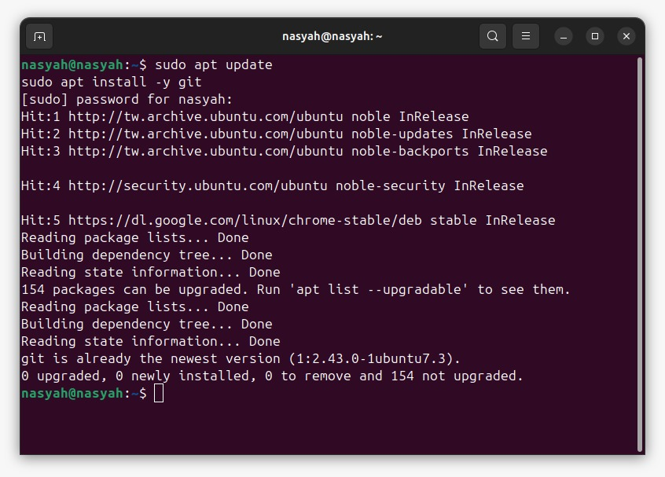
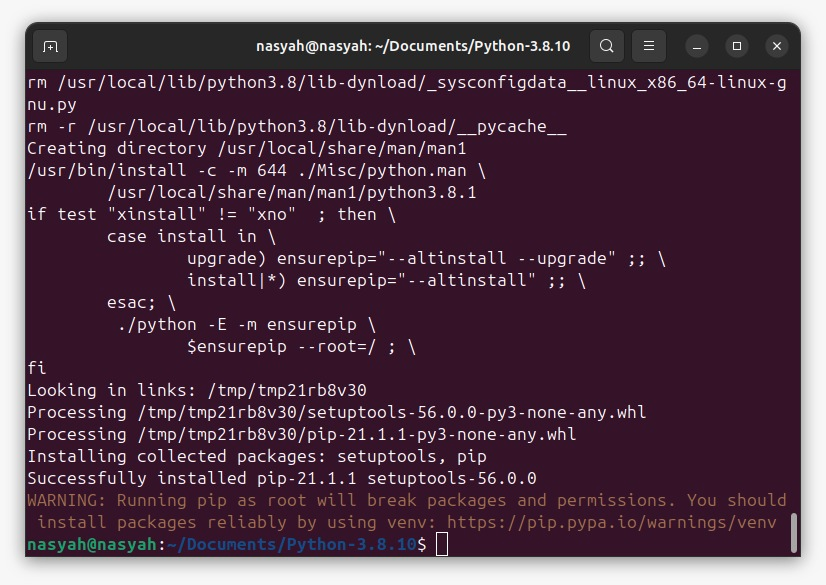
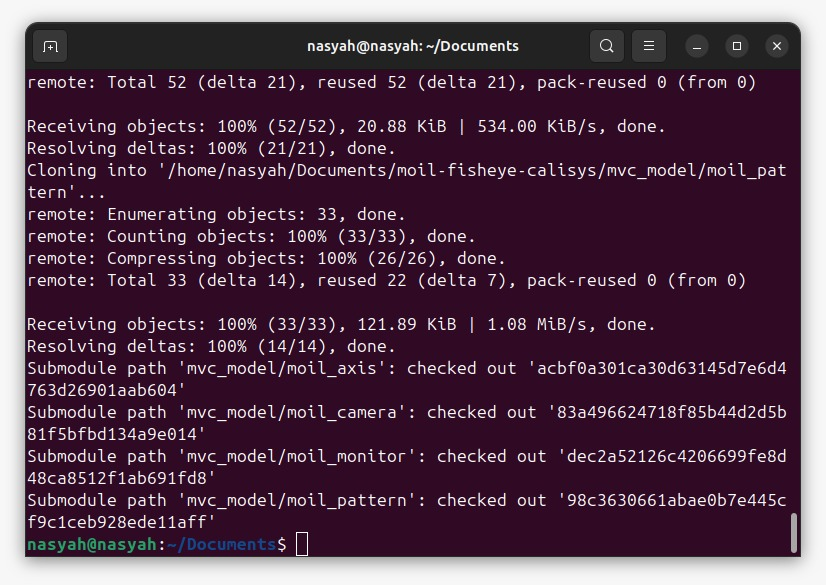
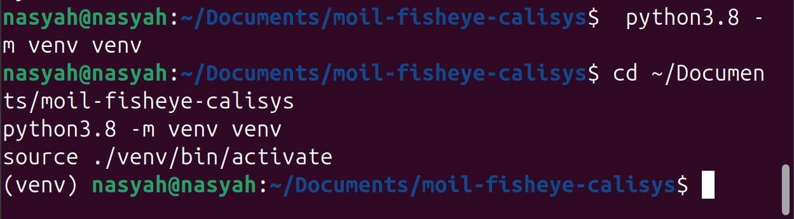
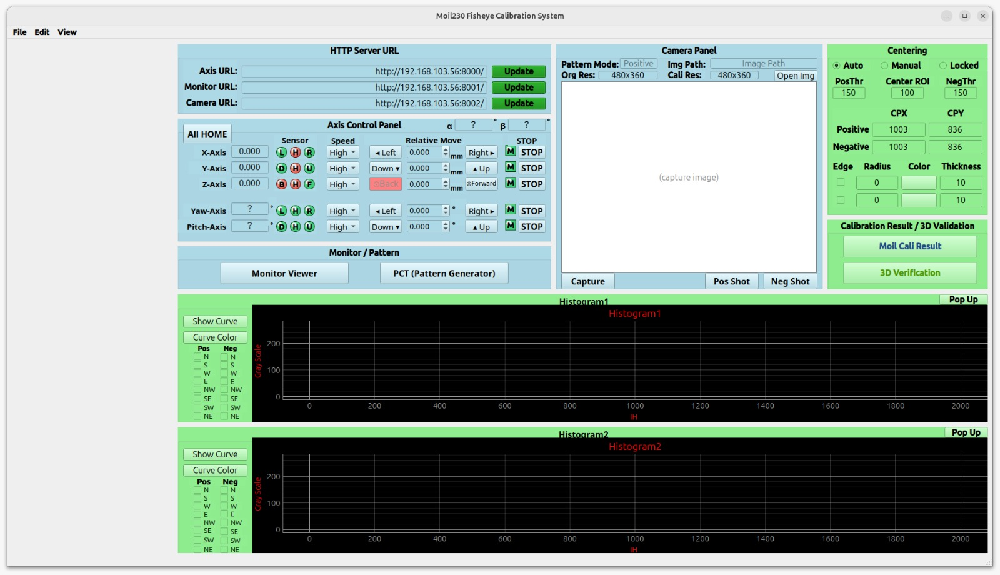

# Calibration System Client Installation Guide (Ubuntu 22.04)

This guide explains how to install and run the **Calibration System Client** on **Ubuntu 22.04**.

---

## Before You Start

Before beginning the installation, make sure that:

- You are using **Ubuntu 22.04**.
- Your computer is connected to the internet.
- You have access to the project repository on GitHub.
- You already have your **GitHub username** and **personal access token**.

---

## 1. Install Git

Git is required to download the project from GitHub.

Open a terminal and run:

```bash
sudo apt update
sudo apt install -y git
```



---

## 2. Install Python 3.8.10

This project requires **Python 3.8.10**.

Open a terminal and run the following commands:

```bash
sudo apt update
sudo apt upgrade -y
cd ~/Documents/
sudo apt install -y make build-essential libssl-dev zlib1g-dev \
    libbz2-dev libreadline-dev libsqlite3-dev wget curl llvm \
    libncurses5-dev libncursesw5-dev xz-utils tk-dev
wget https://www.python.org/ftp/python/3.8.10/Python-3.8.10.tgz
tar -xf Python-3.8.10.tgz
cd Python-3.8.10/
./configure --enable-optimizations --with-ensurepip=install
make -j8
sudo make altinstall
```



After the installation is complete, verify it with:

```bash
python3.8 --version
```

Expected output:

```bash
Python 3.8.10
```


> **Note:**  
> `make -j8` uses 8 CPU threads. If your computer has fewer resources, you may reduce this number, for example to `make -j4`.

---

## 3. Enable Git Credential Cache

This step allows Git to temporarily remember your login credentials so you do not need to enter them repeatedly.

```bash
git config --global credential.helper cache
```

---

## 4. Clone the Project Repository

Go to your `Documents` folder and clone the repository:

```bash
cd ~/Documents/
git clone --recurse-submodules https://github.com/perseverance-tech-tw/moil-fisheye-calisys.git
```



### GitHub Authentication Note

When GitHub asks for authentication, enter:

- Your **GitHub username**
- Your **GitHub personal access token** as the password

---

## 5. Update the Submodules

After the repository has been cloned, move into the project folder and update the submodules:

```bash
cd ~/Documents/moil-fisheye-calisys
git submodule update --remote
```


---

## 6. Create a Python Virtual Environment

A virtual environment keeps the project dependencies separate from the system Python packages.

### Step 1: Create the virtual environment

```bash
cd ~/Documents/moil-fisheye-calisys
python3.8 -m venv venv
```

### Step 2: Activate the virtual environment

```bash
source ./venv/bin/activate
```

After activation, your terminal prompt should start with `(venv)`.



> **Important:**  
> Because this guide uses the manually installed `python3.8`, you do **not** need to install `python3-venv` separately.

---

## 7. Install the Required Python Packages

Once the virtual environment is active, install the required Python packages.

```bash
pip install --upgrade pip==22.0
pip install setuptools==59.6
pip install -r requirements.client
```


> **Important:**  
> Run these commands **inside the virtual environment**. You do not need to use `sudo` for `pip` here.

---

## 8. Install Moildev 2.7

Install the `moildev` package inside the same virtual environment:

```bash
pip install moildev
```


---

## 9. Install PyCharm Community Edition

If you want to open and edit the project using PyCharm, install it with:

```bash
sudo snap install pycharm-community --classic
```

After the installation is complete, open the project folder in PyCharm.


---

## 10. Run the Client UI

After all installation steps are complete, run the client UI with:

```bash
python main.py
```



---

## Daily Usage

Each time you want to run the project, use the following commands:

```bash
cd ~/Documents/moil-fisheye-calisys
source ./venv/bin/activate
python main.py
```

---

## Quick Summary

The complete workflow is:

1. Install Git
2. Install Python 3.8.10
3. Enable Git credential cache
4. Clone the repository
5. Update submodules
6. Create and activate the virtual environment
7. Install project dependencies
8. Install `moildev`
9. Run the client UI

---

## Troubleshooting

### `python3.8: command not found`

Check whether Python 3.8.10 was installed successfully:

```bash
python3.8 --version
```

If the command is not found, repeat the Python installation step.

### Failed to activate the virtual environment

Make sure you are inside the correct project folder:

```bash
cd ~/Documents/moil-fisheye-calisys
source ./venv/bin/activate
```

### GitHub authentication failed

Make sure that:

- your GitHub account has permission to access the repository,
- your GitHub username is correct,
- your personal access token is still valid.

### `pip install` fails

Make sure the virtual environment is activated before installing packages:

```bash
source ./venv/bin/activate
```

Then retry the installation commands.

### `main.py` does not run

Check the following:

- the virtual environment is activated,
- all dependencies from `requirements.client` were installed successfully,
- `moildev` was installed successfully,
- you are running the command from the project folder.

---

## Final Note

Always activate the virtual environment before running the project:

```bash
cd ~/Documents/moil-fisheye-calisys
source ./venv/bin/activate
python main.py
```

This helps ensure that the client uses the correct Python version and the correct package dependencies.