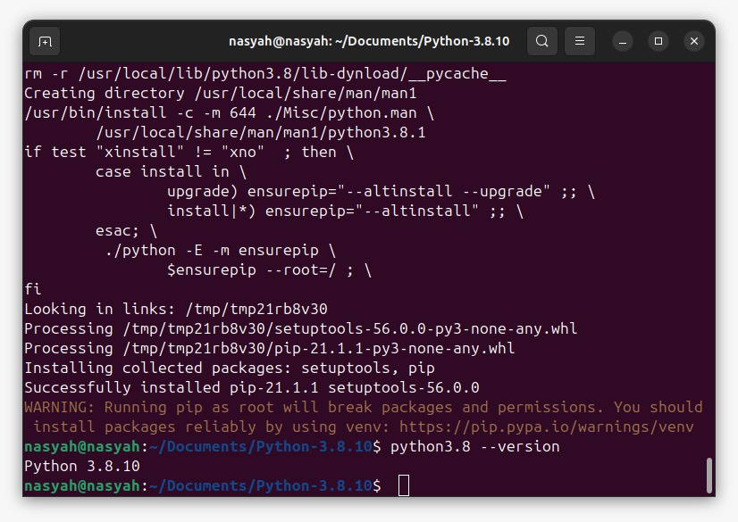
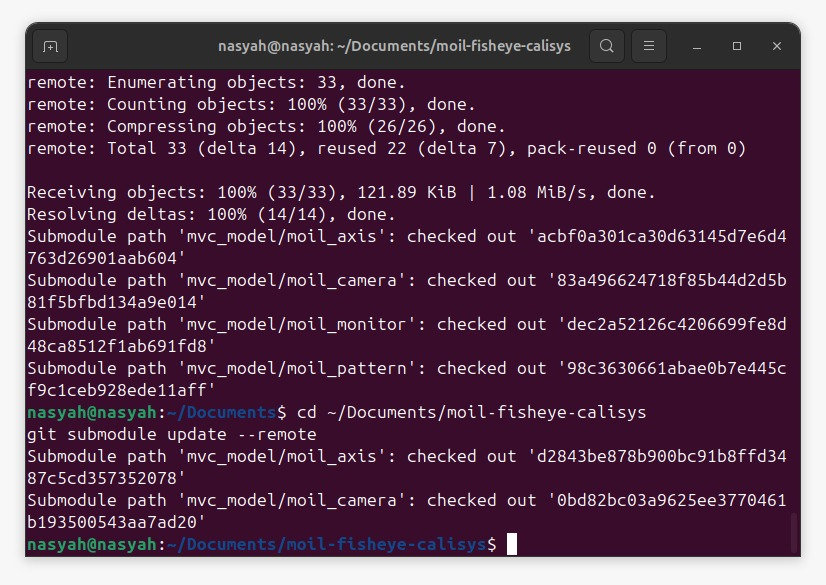
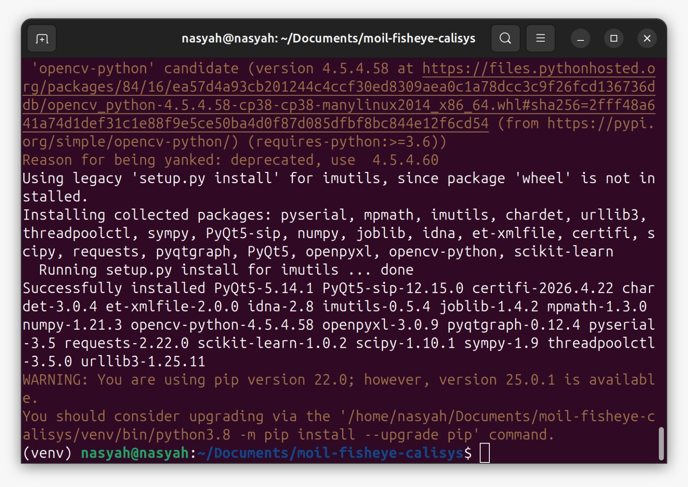
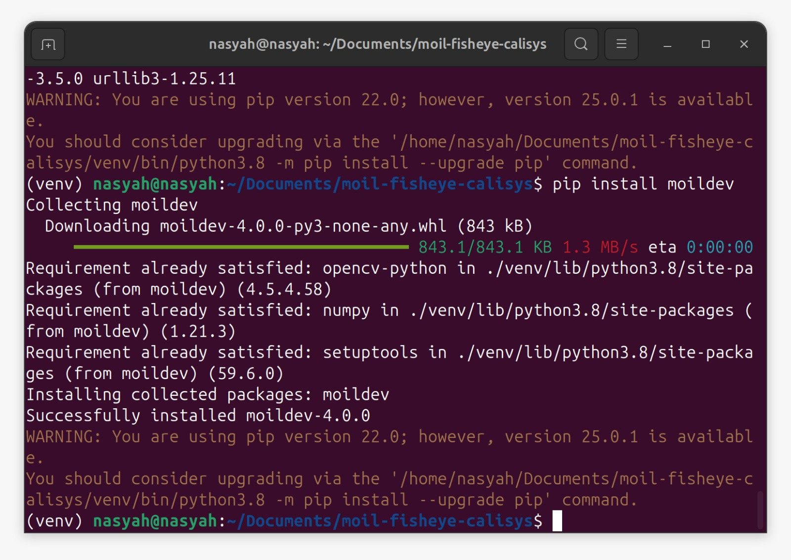
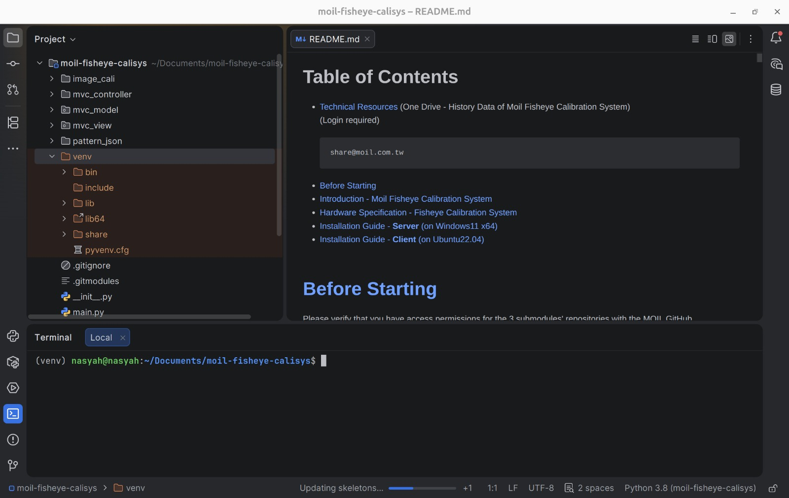

# Calibration System Client Installation Guide (Ubuntu 22.04)

This guide explains how to install and run the **Calibration System Client** on **Ubuntu 22.04**. Follow the steps in order so the project uses the correct Python version, virtual environment, and required packages.

---

## Before You Start

Before beginning the installation, make sure you have the following:

| Requirement | Description |
|---|---|
| **Operating System** | Ubuntu 22.04 |
| **Internet Connection** | Required to install packages and clone the project repository |
| **GitHub Access** | Required to download the private project repository |
| **GitHub Username** | Used when GitHub asks for login |
| **Personal Access Token** | Used as the GitHub password during authentication |

<div className="custom-note custom-important">
  <div className="custom-note-title">📌 READ FIRST</div>
  <div>
    This guide uses <strong>Python 3.8.10</strong>. Please follow the Python installation step carefully because the client program depends on this Python version.
  </div>
</div>

---

## 1. Install Git

Git is required to download the project from GitHub.

Open a terminal and run:

```bash
sudo apt update
sudo apt install -y git
```
<div className="center">

<a id="fig-1"></a>


<p><em><a href="#fig-1"><strong>Figure 1.</strong></a> Install Git.</em></p>

</div>

### 1.1 Check the Installation

Run:

```bash
git --version
```
If Git is installed correctly, the terminal will show the Git version.

---

## 2. Install Python 3.8.10

The Calibration System Client requires **Python 3.8.10**. This guide installs Python manually from source.

Open a terminal and run:

```bash
sudo apt update
sudo apt upgrade -y
cd ~/Documents/
sudo apt install -y make build-essential libssl-dev zlib1g-dev \
    libbz2-dev libreadline-dev libsqlite3-dev wget curl llvm \
    libncurses5-dev libncursesw5-dev xz-utils tk-dev
wget https://www.python.org/ftp/python/3.8.10/Python-3.8.10.tgz
tar -xf Python-3.8.10.tgz
cd Python-3.8.10/
./configure --enable-optimizations --with-ensurepip=install
make -j8
sudo make altinstall
```
<div className="center">

<a id="fig-2"></a>


<p><em><a href="#fig-2"><strong>Figure 2.</strong></a> Install Python 3.8.10.</em></p>

</div>

After the installation is complete, verify the Python version:

```bash
python3.8 --version
```
Expected output:

```bash
Python 3.8.10
```
<div className="center">

<a id="fig-3"></a>



<p><em><a href="#fig-3"><strong>Figure 3.</strong></a> Verify Python Version.</em></p>

</div>

<div className="custom-note custom-tip">
  <div className="custom-note-title">💡 NOTE</div>
  <div>
    <code>make -j8</code> uses 8 CPU threads. If your computer is slower or has fewer CPU resources, use <code>make -j4</code> instead.
  </div>
</div>

<div className="custom-note custom-warning">
  <div className="custom-note-title">⚠️ IMPORTANT</div>
  <div>
    Use <code>sudo make altinstall</code>, not <code>sudo make install</code>. The <code>altinstall</code> command helps avoid replacing the default system Python.
  </div>
</div>

---

## 3. Enable Git Credential Cache

This step allows Git to temporarily remember your login credentials, so you do not need to type your GitHub username and token repeatedly.

Run:

```bash
git config --global credential.helper cache
```
<div className="custom-note custom-important">
  <div className="custom-note-title">📌 WHAT THIS DOES</div>
  <div>
    Git will remember your credentials for a limited time after the first successful login.
  </div>
</div>

---

## 4. Clone the Project Repository

Go to the `Documents` folder and clone the project repository:

```bash
cd ~/Documents/
git clone --recurse-submodules https://github.com/perseverance-tech-tw/moil-fisheye-calisys.git
```
<div className="center">

<a id="fig-4"></a>


<p><em><a href="#fig-4"><strong>Figure 4.</strong></a> Clone Repository.</em></p>

</div>

### 4.1 GitHub Authentication

When GitHub asks for authentication, enter:

| Field | What to Enter |
|---|---|
| **Username** | Your GitHub username |
| **Password** | Your GitHub personal access token |

<div className="custom-note custom-warning">
  <div className="custom-note-title">⚠️ IMPORTANT</div>
  <div>
    GitHub no longer accepts normal account passwords for Git operations. Use a <strong>personal access token</strong> as the password.
  </div>
</div>

---

## 5. Update the Submodules

After cloning the repository, move into the project folder and update the submodules:

```bash
cd ~/Documents/moil-fisheye-calisys
git submodule update --remote
```
<div className="center">

<a id="fig-5"></a>



<p><em><a href="#fig-5"><strong>Figure 5.</strong></a> Update Submodules.</em></p>

</div>

<div className="custom-note custom-important">
  <div className="custom-note-title">📌 WHY THIS STEP IS NEEDED</div>
  <div>
    Some parts of the project are stored as Git submodules. If you skip this step, some files or libraries may be missing.
  </div>
</div>

---

## 6. Create a Python Virtual Environment

A virtual environment keeps the project dependencies separate from the system Python packages.

### 6.1 Step 1: Create the Virtual Environment

Run:

```bash
cd ~/Documents/moil-fisheye-calisys
python3.8 -m venv venv
```
### 6.2 Step 2: Activate the Virtual Environment

Run:

```bash
source ./venv/bin/activate
```
After activation, your terminal prompt should start with `(venv)`.

<div className="center">

<a id="fig-6"></a>


<p><em><a href="#fig-6"><strong>Figure 6.</strong></a> Activate Virtual Environment.</em></p>

</div>

<div className="custom-note custom-important">
  <div className="custom-note-title">✅ CHECKPOINT</div>
  <div>
    If you see <code>(venv)</code> at the beginning of the terminal line, the virtual environment is active.
  </div>
</div>

<div className="custom-note custom-tip">
  <div className="custom-note-title">💡 NOTE</div>
  <div>
    Because this guide uses the manually installed <code>python3.8</code>, you do <strong>not</strong> need to install <code>python3-venv</code> separately.
  </div>
</div>

---

## 7. Install the Required Python Packages

Make sure the virtual environment is active. Then install the required packages:

```bash
pip install --upgrade pip==22.0
pip install setuptools==59.6
pip install -r requirements.client
```
<div className="center">

<a id="fig-7"></a>



<p><em><a href="#fig-7"><strong>Figure 7.</strong></a> Install Python Packages.</em></p>

</div>

<div className="custom-note custom-warning">
  <div className="custom-note-title">⚠️ IMPORTANT</div>
  <div>
    Run these commands inside the virtual environment. Do <strong>not</strong> use <code>sudo pip</code>, because it may install packages into the system Python instead of the project environment.
  </div>
</div>

---

## 8. Install Moildev 2.7

Install the `moildev` package inside the same virtual environment:

```bash
pip install moildev
```
<div className="center">

<a id="fig-8"></a>



<p><em><a href="#fig-8"><strong>Figure 8.</strong></a> Install Moildev.</em></p>

</div>

### 8.1 Check the Installation

You can check whether `moildev` is installed by running:

```bash
python -c "import moildev; print('moildev installed')"
```
<div className="custom-note custom-important">
  <div className="custom-note-title">✅ EXPECTED RESULT</div>
  <div>
    If the installation is correct, the terminal should print <code>moildev installed</code> without an import error.
  </div>
</div>

---

## 9. Install PyCharm Community Edition

PyCharm is optional, but it is useful if you want to open, edit, and debug the project with an IDE.

Install PyCharm with:

```bash
sudo snap install pycharm-community --classic
```
After installation, open PyCharm and select the project folder:

```bash
~/Documents/moil-fisheye-calisys
```
<div className="center">

<a id="fig-9"></a>



<p><em><a href="#fig-9"><strong>Figure 9.</strong></a> Install PyCharm.</em></p>

</div>

<div className="custom-note custom-tip">
  <div className="custom-note-title">💡 OPTIONAL STEP</div>
  <div>
    You can still run the client from the terminal without PyCharm. PyCharm is only needed if you want a code editor or debugger.
  </div>
</div>

---

## 10. Run the Client UI

After all installation steps are complete, run the client UI:

```bash
cd ~/Documents/moil-fisheye-calisys
source ./venv/bin/activate
python main.py
```
<div className="center">

<a id="fig-10"></a>


<p><em><a href="#fig-10"><strong>Figure 10.</strong></a> Run Client UI.</em></p>

</div>

<div className="custom-note custom-important">
  <div className="custom-note-title">✅ SUCCESS CHECK</div>
  <div>
    If the installation is successful, the Calibration System Client window should open.
  </div>
</div>

---

## Daily Usage

After the first installation, you do not need to repeat all steps. Each time you want to run the client, use:

```bash
cd ~/Documents/moil-fisheye-calisys
source ./venv/bin/activate
python main.py
```
---

## Complete Installation Flow

| Step | Action | Command / Result |
|---|---|---|
| 1 | Install Git | `sudo apt install -y git` |
| 2 | Install Python 3.8.10 | `python3.8 --version` should show `Python 3.8.10` |
| 3 | Enable Git credential cache | Git temporarily remembers login credentials |
| 4 | Clone repository | Project is downloaded to `~/Documents/moil-fisheye-calisys` |
| 5 | Update submodules | Submodule files are downloaded |
| 6 | Create virtual environment | `venv` folder is created |
| 7 | Activate virtual environment | Terminal shows `(venv)` |
| 8 | Install dependencies | Packages from `requirements.client` are installed |
| 9 | Install Moildev | `moildev` can be imported in Python |
| 10 | Run client UI | Client window opens |

---

## Troubleshooting

### Problem: `python3.8: command not found`

Check whether Python 3.8.10 was installed correctly:

```bash
python3.8 --version
```
If the command is not found, repeat **Step 2: Install Python 3.8.10**.

---

### Problem: Failed to Activate the Virtual Environment

Make sure you are inside the correct project folder:

```bash
cd ~/Documents/moil-fisheye-calisys
source ./venv/bin/activate
```
If the `venv` folder does not exist, create it again:

```bash
python3.8 -m venv venv
```
---

### Problem: GitHub Authentication Failed

Check the following:

| Item | Check |
|---|---|
| GitHub username | Make sure it is typed correctly |
| Personal access token | Make sure it is valid and not expired |
| Repository permission | Make sure your GitHub account has access to the repository |
| Network connection | Make sure your computer can access GitHub |

---

### Problem: `pip install` Fails

First, confirm that the virtual environment is active:

```bash
source ./venv/bin/activate
```
Then upgrade and retry:

```bash
pip install --upgrade pip==22.0
pip install setuptools==59.6
pip install -r requirements.client
```
<div className="custom-note custom-warning">
  <div className="custom-note-title">⚠️ COMMON MISTAKE</div>
  <div>
    Do not install the packages outside the virtual environment. Always check that <code>(venv)</code> appears in the terminal before running <code>pip install</code>.
  </div>
</div>

---

### Problem: `main.py` Does Not Run

Check the following:

- The virtual environment is active.
- All packages from `requirements.client` were installed successfully.
- `moildev` was installed successfully.
- You are running the command from the project folder.

Run again:

```bash
cd ~/Documents/moil-fisheye-calisys
source ./venv/bin/activate
python main.py
```
---

## Final Note

Always activate the virtual environment before running the project:

```bash
cd ~/Documents/moil-fisheye-calisys
source ./venv/bin/activate
python main.py
```

This ensures the client uses the correct Python version and the correct package dependencies.