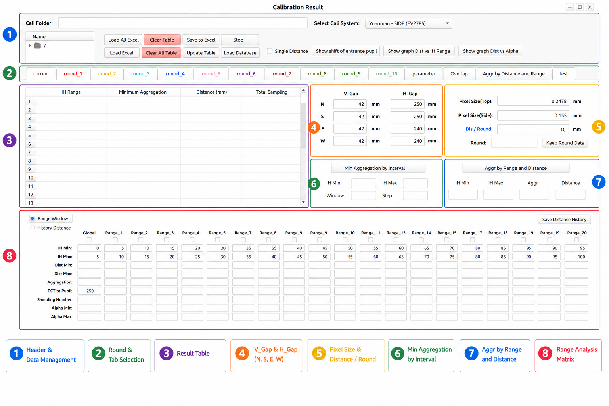
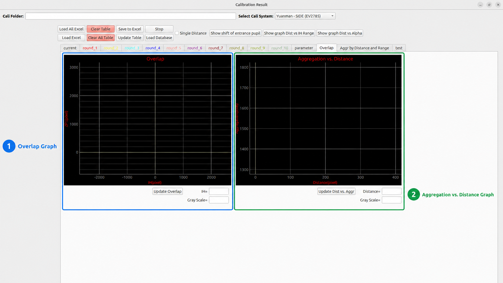

# Main Cali Result Overview

The **Main Cali Result** window is the main workspace for reviewing calibration result data. In this window, the user can load Excel calibration data, check each round, update calculated values, inspect graphs, configure parameters, and calculate aggregation for distance optimization.

This overview is divided into **4 main views** based on the provided UI images.

| No. | Main View | Main Purpose | Image |
|---:|---|---|---|
| 1 | [Main Window Overview](#1-main-window-overview) | Explains the complete window layout and the 8 main areas in a general way. | `img_27.png` |
| 2 | [Result Table View](#2-result-table-view) | Explains the control input row, result table, and calculation formula panel. | `img_34.png` |
| 3 | [Parameter View](#3-parameter-view) | Explains the IH-Alpha graph, ZFL-IH graph, and camera parameter panel. | `img_35.png` |
| 4 | [Overlap & Aggregation View](#4-overlap--aggregation-view) | Explains the overlap graph and aggregation-vs-distance graph. | `img_36.png` |

---

## 1. Main Window Overview


<div className="center">

<a id="fig-1"></a>



<p><em><a href="#fig-1"><strong>Figure 1.</strong></a> Main Cali Result window overview with 8 main functional areas.</em></p>

</div>

The **Main Window Overview** shows the full structure of the Main Cali Result window. This first view should only be understood as a general map of the interface. The detailed explanation for the table, parameters, overlap, and aggregation graphs is provided in the next sections.

The window is divided into **8 main areas**.

| No. | Area | General Function |
|---:|---|---|
| **1** | Header & Data Management | Used to load, clear, update, stop, save, and manage calibration data. |
| **2** | Round & Tab Selection | Used to switch between round tables and analysis pages. |
| **3** | Result Table | Used to display raw calibration values and calculated result values. |
| **4** | V_Gap & H_Gap | Used to define gap values for the side calculation formula. |
| **5** | Pixel Size & Distance / Round | Used to define pixel size, distance per round, and round distance behavior. |
| **6** | Min Aggregation by Interval | Used to calculate minimum aggregation by moving IH interval windows. |
| **7** | Aggr by Range and Distance | Used to calculate aggregation from a selected IH range and distance. |
| **8** | Range Analysis Matrix | Used to analyze Global / Range_1 to Range_20 and store best distance results. |

### 1.1 Header & Data Management

The **Header & Data Management** area is the main control area at the top of the window. It is used before most other operations because the table, graphs, parameters, and aggregation results depend on the data loaded from this area.

This area generally handles:

| UI Item | General Explanation |
|---|---|
| **Cali Folder** | Displays or receives the calibration folder path. It can also receive a URL path for downloaded calibration data. |
| **Tree View** | Shows the folder/file structure after a calibration folder is selected or loaded. |
| **Load All Excel** | Loads Excel files from multiple round folders, usually round `1` to round `10`. |
| **Load Excel** | Loads one Excel file into the currently selected round table. |
| **Clear Table** | Clears only the current round table. |
| **Clear All Table** | Clears all round tables from round `1` to round `10`. |
| **Save to Excel** | Saves the current table result into an Excel file. |
| **Update Table** | Updates the table from the latest image center, pattern data, ICT data, and calculation result. |
| **Stop** | Requests cancellation for running aggregation or range calculation processes. |
| **Load Database** | Opens the database window for loading calibration data from database records. |
| **Single Distance** | Changes the distance behavior so each round can use its own distance value. |
| **Show shift of entrance pupil** | Opens the entrance-pupil shift visualization feature. |
| **Show graph Dist vs IH Range** | Opens or updates the graph related to distance and IH range behavior. |
| **Show graph Dist vs Alpha** | Opens or updates the graph related to distance and alpha behavior. |

In the Python code, this area is connected mainly through button handlers such as `onclick_btn_load_all_excel()`, `onclick_btn_load_excel()`, `onclick_btn_clear_table()`, `onclick_btn_clear_all_table()`, `onclick_btn_save_to_excel()`, `onclick_btn_update_table()`, `onclick_btn_stop()`, and `onclick_btn_load_database()`.

### 1.2 Round & Tab Selection

The **Round & Tab Selection** area is used to choose which data page or analysis page is displayed. The UI includes round tabs and special tabs for graphs, parameters, and aggregation analysis.

The general tab groups are:

| Tab Group | General Explanation |
|---|---|
| `current` | Shows the current table or temporary working table. |
| `round_1` to `round_10` | Shows calibration data for each calibration round. |
| `parameter` | Shows camera parameters and parameter-related graphs. |
| `Overlap` | Shows overlap and aggregation graph visualization. |
| `Aggr by Distance and Range` | Shows range-based aggregation calculation tools. |
| `test` | Used as a test or additional working tab. |

The round tabs are also used as status indicators. When data is loaded or updated, the code can mark a tab with `*` to show that the round contains modified or loaded data.

The code also supports **right-click behavior** on round tabs. The context menu allows the user to turn a round on or off and open graph popups for a specific round. When a round is turned off, it is skipped during calculation and graph updates.

### 1.3 Result Table

The **Result Table** area displays calibration data and calculated data for the selected round. This is the main place to check whether the loaded Excel data and calculated values are correct.

In general, the table contains:

| Data Type | General Explanation |
|---|---|
| Raw calibration values | Values loaded from Excel, such as `Round`, `Side`, `PCT`, and directional ICT values. |
| Calculated values | Values calculated by the system, such as `AVG`, `PCT Cal`, `Distance`, `Alpha`, and `ZFL`. |
| Directional values | Values for `N`, `S`, `W`, `E`, `NW`, `SE`, `SW`, and `NE`. |
| Average values | Average Alpha and ZFL values calculated from valid directional data. |
| Separator columns | Black columns used only to visually separate table groups. |

The table is connected to the calculation pipeline in the code. After data is loaded or updated, the system calculates ICT average, PCT calculation, distance, alpha, ZFL, average alpha, average ZFL, and aggregation.

### 1.4 V_Gap & H_Gap

The **V_Gap & H_Gap** area contains vertical gap and horizontal gap values for the four main directions:

```text
N, S, E, W
```
These values are used when calculating **Alpha** for the side area of the calibration result. In the code, the side Alpha formula uses `V_Gap` and `H_Gap` to calculate the angle for side-screen data.

General meaning:

| Field | General Explanation |
|---|---|
| **V_Gap** | Vertical gap value used in side Alpha calculation. |
| **H_Gap** | Horizontal gap value used in side Alpha calculation. |
| **N / S / E / W** | Direction-specific gap values. Each direction can have a different gap setting. |

When the user changes these values and presses Enter, the system updates the calibration result again. Therefore, changing gap values can change Alpha, ZFL, graph shape, and aggregation result.

### 1.5 Pixel Size & Distance / Round

The **Pixel Size & Distance / Round** area defines how pixel data is converted and how distance is applied across rounds.

General meaning:

| Field / Button | General Explanation |
|---|---|
| **Pixel Size (Top)** | Pixel size used for top-area PCT calculation. |
| **Pixel Size (Side)** | Pixel size used for side-area PCT calculation. |
| **Dis / Round** | Distance increment between calibration rounds. |
| **Round** | Target round number used when keeping or copying round data. |
| **Keep Round Data** | Copies or keeps current data into a selected round. |

The code uses pixel size values when calculating `pct_cal`. It uses distance settings when calculating the `distance` column. If **Single Distance** is disabled, distance can be calculated using a base distance and `Dis / Round`. If **Single Distance** is enabled, each round can use its own distance input.

### 1.6 Min Aggregation by Interval

The **Min Aggregation by Interval** area is used to search for the minimum aggregation value using interval-based IH ranges.

General input fields:

| Field | General Explanation |
|---|---|
| **IH Min** | Starting IH percentage for the interval search. |
| **IH Max** | Ending IH percentage for the interval search. |
| **Window** | Maximum window area used for interval movement. |
| **Step** | Step size used to move the IH interval. |
| **Min Aggregation by interval** | Starts the interval-based minimum aggregation process. |

In the code, this feature collects IH data from enabled rounds, converts IH percentage into pixel bounds, searches the best distance for each interval, calculates aggregation, and fills the interval result table. The result can also be saved as CSV.

### 1.7 Aggr by Range and Distance

The **Aggr by Range and Distance** area is used to calculate or search aggregation based on an IH range and distance value.

General input fields:

| Field | General Explanation |
|---|---|
| **IH Min** | Minimum IH percentage for the selected range. |
| **IH Max** | Maximum IH percentage for the selected range. |
| **Aggr** | Aggregation value. It can be calculated or used as a target value. |
| **Distance** | Distance value. It can be used as input or calculated by the system. |
| **Aggr by Range and Distance** | Runs the range-and-distance aggregation calculation. |

The code supports three general behaviors:

| Condition | Behavior |
|---|---|
| Distance is filled | The system calculates aggregation for that distance and IH range. |
| Aggregation is filled but distance is empty | The system searches for a distance that is closest to the target aggregation. |
| Both aggregation and distance are empty | The system searches for the distance that gives the minimum aggregation. |

After calculation, the system can update the **Aggregation vs. Distance** graph using the generated distance and aggregation samples.

### 1.8 Range Analysis Matrix

The **Range Analysis Matrix** is the large bottom area used to analyze multiple IH ranges. It contains `Global` and range fields such as `Range_1` to `Range_20`.

General functions:

| Function | General Explanation |
|---|---|
| **Range Window** | Uses manually configured IH range windows. |
| **History Distance** | Uses saved best-distance history when available. |
| **Global / Range_1 to Range_20** | Defines the IH percentage ranges used for range-based calculation. |
| **IH Min / IH Max** | Defines the IH range percentage for each range column. |
| **Dist Min / Dist Max** | Defines the allowed search range for distance. |
| **Aggregation** | Displays the best or calculated aggregation value. |
| **PCT to Pupil** | Stores pupil-related distance or PCT reference data. |
| **Sampling Number** | Displays how many IH-ZFL samples are inside the selected range. |
| **Alpha Min / Alpha Max** | Displays the Alpha range for the selected IH range. |
| **Checkboxes** | Enable or disable calculation for each range. |
| **Save Distance History** | Saves range distance results for later reuse. |

When a range checkbox is enabled, the code calculates pixel bounds from the IH percentage range, counts valid samples, searches the best distance, calculates aggregation, and highlights the result fields when the calculation succeeds.

This area also supports **right-click on range labels** to open a ZFL-IH graph for a selected range. This helps the user visually check the points inside that IH range.

---

## 2. Result Table View


<div className="center">

<a id="fig-2"></a>


<p><em><a href="#fig-2"><strong>Figure 2.</strong></a> Result Table View showing the control input row, result table, and calculation formula panel.</em></p>

</div>

The **Result Table View** is used to inspect one selected round. This view is usually used when the user wants to check the loaded data, verify calculated values, or manually review the calibration result before moving to graphs or aggregation analysis.

This view is divided into **3 sections**.

| No. | Section | Purpose |
|---:|---|---|
| **1** | Control & Input Row | Contains center values, aggregation round, aggregation result, and distance value. |
| **2** | Result Table | Displays raw Excel data and calculated calibration result values. |
| **3** | Calculation Formula Panel | Shows the main Alpha and ZFL formulas used by the system. |

### 2.1 Control & Input Row

The **Control & Input Row** is located above the result table. It gives quick access to the main values used by the selected round.

| Field | Explanation |
|---|---|
| `pos_iCx` | Positive image center X value copied from the main calibration window. |
| `pos_iCy` | Positive image center Y value copied from the main calibration window. |
| `neg_iCx` | Negative image center X value copied from the main calibration window. |
| `neg_iCy` | Negative image center Y value copied from the main calibration window. |
| `Aggr Round` | Button used to run aggregation search for the selected round. |
| `Aggregation` | Displays the aggregation value calculated from IH-ZFL data. |
| `Distance` | Displays or receives the distance value used for the calculation. |

In the code, the center values are updated by `update_table_lineedit_img_center()`. The distance and aggregation fields are connected to per-round calculation functions such as `calculate_result_single_round()`, `update_aggregation_single_round()`, and `onclick_btn_aggr_round()`.

### 2.2 Result Table

The **Result Table** contains both the original calibration data and the calculated calibration result. The table uses fixed column groups defined in the code.

| Column Group | Columns | Explanation |
|---|---|---|
| Basic data | `Round`, `Side`, `PCT` | Stores round number, side marker, and pattern calibration target values. |
| ICT direction data | `N`, `S`, `W`, `E`, `NW`, `SE`, `SW`, `NE` | Stores directional image-height / intersection-point data from calibration. |
| Average ICT | `AVG.` | Stores the average ICT value calculated from valid directional values. |
| PCT calculation | `PCT Cal` | Stores the converted PCT value after applying pixel size. |
| Distance | `Distance` | Stores the distance used for the current calculation. |
| Alpha direction data | `α N`, `α S`, `α W`, `α E`, `α NW`, `α SE`, `α SW`, `α NE` | Stores the Alpha value for each valid direction. |
| ZFL direction data | `ZFL N`, `ZFL S`, `ZFL W`, `ZFL E`, `ZFL NW`, `ZFL SE`, `ZFL SW`, `ZFL NE` | Stores the ZFL value for each valid direction. |
| Average result | `AVG α`, `AVG ZFL` | Stores the average Alpha and ZFL result. |

The calculation sequence in the code is generally:

```text
Update side layer
    ↓
Calculate ICT average
    ↓
Calculate PCT Cal
    ↓
Calculate Distance
    ↓
Calculate Alpha for 8 directions
    ↓
Calculate ZFL for 8 directions
    ↓
Calculate Alpha AVG and ZFL AVG
    ↓
Calculate Aggregation
```
Important calculated values:

| Value | How it is calculated generally |
|---|---|
| `ICT AVG` | Average of valid directional ICT values. Zero or empty values are ignored. |
| `PCT Cal` | Sum of PCT values multiplied by `Pixel Size (Top)` or `Pixel Size (Side)`. |
| `Distance` | Uses base distance and `Dis / Round`, or per-round distance when Single Distance is enabled. |
| `Alpha` | Uses top formula for top area and side formula for side area. |
| `ZFL` | Uses Alpha and ICT to calculate focal-length-related value. |
| `Aggregation` | Sorts IH-ZFL points by IH and sums the distance between neighboring points. |

### 2.3 Calculation Formula Panel

The **Calculation Formula Panel** shows the main formulas used in the result table.

#### Top-area Alpha formula

```text
α = atan(PCT / distance)
```
This formula is used for the top area, before the side layer starts.

#### Side-area Alpha formula

```text
α = π/2 - atan((distance - PCT - V_Gap) / H_Gap)
```
This formula is used for side-area calculation. It uses the direction-specific `V_Gap` and `H_Gap` values.

#### ZFL formula

```text
ZFL = 1 / tan(α) × IH
```
In the code, `IH` is taken from the related ICT direction value. The system calculates ZFL for each valid direction and then calculates the average ZFL value when possible.

---

## 3. Parameter View


<div className="center">

<a id="fig-3"></a>


<p><em><a href="#fig-3"><strong>Figure 3.</strong></a> Parameter View showing the IH-Alpha graph, ZFL-IH graph, and parameter panel.</em></p>

</div>

The **Parameter View** is used to check graph results and manage camera parameter values. This view is usually opened from the `parameter` tab.

This view is divided into **3 sections**.

| No. | Section | Purpose |
|---:|---|---|
| **1** | IH-Alpha Graph | Shows the relationship between Alpha and IH. |
| **2** | ZFL-IH Graph | Shows the relationship between IH and ZFL. |
| **3** | Parameter Panel | Shows and saves camera calibration parameters. |

### 3.1 IH-Alpha Graph

The **IH-Alpha Graph** displays the relationship between Alpha and IH. In the code, Alpha values are calculated in radians, then plotted in degrees for easier visual checking.

This graph is used to generally check:

| Purpose | Explanation |
|---|---|
| Alpha distribution | Shows how Alpha changes as IH changes. |
| Curve stability | Helps identify whether the Alpha curve is smooth or abnormal. |
| Round comparison | Displays enabled round data using different round colors. |
| Parameter fitting | The code can use polynomial regression to update parameter fields from the Alpha-IH data. |

Related controls:

| Control | Explanation |
|---|---|
| **Update IH Alpha Graphics** | Refreshes the IH-Alpha graph. |
| **Alpha** | Shows the Alpha coordinate from mouse movement or graph checking. |
| **Gray Scale** | Shows the graph coordinate/helper value used by the UI. |

### 3.2 ZFL-IH Graph

The **ZFL-IH Graph** displays the relationship between IH and ZFL. This graph is important because aggregation is calculated from the IH-ZFL point movement.

This graph is used to generally check:

| Purpose | Explanation |
|---|---|
| ZFL distribution | Shows how ZFL changes across IH values. |
| Calibration smoothness | Helps identify jumps, unstable points, or abnormal round behavior. |
| Round enable/disable effect | Disabled rounds are skipped from graph updates. |
| Range inspection | The same IH-ZFL data is also used by overlap and range graph features. |

Related controls:

| Control | Explanation |
|---|---|
| **Update IH ZFL Graphics** | Refreshes the ZFL-IH graph. |
| **IH** | Shows the IH coordinate from mouse movement or graph checking. |
| **Gray Scale** | Shows the graph coordinate/helper value used by the UI. |

### 3.3 Parameter Panel

The **Parameter Panel** contains camera parameters and configuration controls.

| Parameter | Explanation |
|---|---|
| `cameraName` | Camera name or camera identifier. |
| `cameraFov` | Camera field of view. |
| `cameraSensorWidth` | Camera sensor width value. |
| `cameraSensorHeight` | Camera sensor height value. |
| `iCx` | Image center X coordinate. |
| `iCy` | Image center Y coordinate. |
| `ratio` | Camera ratio value used by the calibration system. |
| `imageWidth` | Image width in pixels. |
| `imageHeight` | Image height in pixels. |
| `calibrationRatio` | Calibration ratio value. |
| `parameter0` to `parameter5` | Camera model parameters used by the calibration calculation. |

Related controls:

| Control | Explanation |
|---|---|
| **Update All Cali Result** | Recalculates calibration results for enabled rounds. |
| **Save Parameters** | Saves camera parameters into a JSON file. |
| **Calibration System** | Selects the calibration system configuration. |
| **Distance / Round** | Defines distance-per-round configuration for the selected calibration system. |
| **Save Configuration** | Saves system type and distance-per-round information into `main.json`. |

In the code, parameter saving is handled by `onclick_btn_save_parameter()`, while system configuration saving is handled by `onclick_btn_save_configuration_system()`.

---

## 4. Overlap & Aggregation View


<div className="center">

<a id="fig-4"></a>



<p><em><a href="#fig-4"><strong>Figure 4.</strong></a> Overlap & Aggregation View showing the overlap graph and aggregation-vs-distance graph.</em></p>

</div>

The **Overlap & Aggregation View** is used to visually check calibration consistency and observe how aggregation changes when distance changes.

This view is divided into **2 sections**.

| No. | Section | Purpose |
|---:|---|---|
| **1** | Overlap Graph | Shows IH-ZFL overlap behavior from enabled rounds. |
| **2** | Aggregation vs. Distance Graph | Shows aggregation change across distance samples. |

### 4.1 Overlap Graph

The **Overlap Graph** displays IH-ZFL data from enabled rounds. It is used to visually compare whether different rounds overlap smoothly or show unstable behavior.

General behavior:

| Function | Explanation |
|---|---|
| **Update Overlap** | Refreshes the overlap graph. |
| **IH** | Shows the IH coordinate from mouse movement. |
| **Gray Scale** | Shows the graph coordinate/helper value used by the UI. |
| Round filtering | Disabled rounds are skipped from the overlap graph. |
| Snake line | The code can draw a connected line across round points to make the curve movement easier to see. |

The overlap graph uses the same IH-ZFL point data collected from the result table. Therefore, changes in distance, gap values, pixel size, or disabled rounds can change the overlap graph.

### 4.2 Aggregation vs. Distance Graph

The **Aggregation vs. Distance Graph** displays distance on the X-axis and aggregation on the Y-axis.

General behavior:

| Function | Explanation |
|---|---|
| **Update Dist vs. Aggr** | Refreshes the aggregation-vs-distance graph. |
| **Distance** | Shows the selected distance coordinate from graph checking. |
| **Gray Scale** | Shows the graph coordinate/helper value used by the UI. |
| Minimum point | The graph can mark the best distance and minimum aggregation result. |
| Samples | The graph uses distance-aggregation samples generated during search or range calculation. |

Aggregation is calculated by sorting IH-ZFL points and summing the point-to-point movement. A lower aggregation value usually means the IH-ZFL result is smoother and more stable.

```text
Sort IH-ZFL points by IH
        ↓
Measure distance between neighboring points
        ↓
Sum all neighboring distances
        ↓
Return aggregation value
```