# Main Window Overview

The **Main Cali Result** window is used to load calibration data, manage round tables, calculate calibration results, inspect graph behavior, and search the best distance based on aggregation values.

<div className="center">

<a id="fig-main-cali-result-overview"></a>


<p><em><a href="#fig-main-cali-result-overview"><strong>Figure 1. Main Cali Result Overview.</strong></a> Main Cali Result window divided into 8 main functional areas.</em></p>

</div>

---

## Page Structure

| No. | Section | Main Purpose |
|---:|---|---|
| 1 | [Header & Data Management](#1-header--data-management) | Load, update, clear, save, and manage calibration data. |
| 2 | [Round & Tab Selection](#2-round--tab-selection) | Switch between current, round, parameter, overlap, aggregation, and test pages. |
| 3 | [Result Table View](#3-result-table-view) | Display IH range, minimum aggregation, distance, and total sampling. |
| 4 | [V_Gap & H_Gap Settings](#4-v_gap--h_gap-settings) | Configure physical gap values used for side-screen calculation. |
| 5 | [Pixel Size & Distance / Round](#5-pixel-size--distance--round) | Configure pixel size conversion and round distance interval. |
| 6 | [Min Aggregation by Interval](#6-min-aggregation-by-interval) | Search minimum aggregation over IH percentage intervals. |
| 7 | [Aggr by Range and Distance](#7-aggr-by-range-and-distance) | Calculate aggregation or search distance for a selected IH range. |
| 8 | [Range Analysis Matrix](#8-range-analysis-matrix) | Analyze global and range-based distance / aggregation results. |

<div className="custom-note custom-important">
  <div className="custom-note-title">Main Goal</div>
  <p>The main goal of this window is to find the distance value that produces the lowest aggregation value. A lower aggregation value usually means the IH-ZFL curve is smoother and the calibration result is more stable.</p>
</div>

---

## Terminology

| Term | Meaning |
|---|---|
| IH / ICT | Image-height or intersection-coordinate value used as the X-axis source for curve analysis. |
| PCT | Pattern calibration target value loaded from the calibration pattern data. |
| PCT_CAL | Converted PCT value after pixel-size conversion. |
| Alpha | Angle value calculated from distance, PCT_CAL, V_Gap, and H_Gap. |
| ZFL | Calculated focal-length related value used in the IH-ZFL curve. |
| Aggr | Aggregation value used to measure IH-ZFL curve smoothness. Lower is usually better. |
| Distance | Distance value used in Alpha and ZFL calculation. |
| Range | IH percentage interval used for aggregation analysis. |

---

## Figure Reference List

Use the links below when you want to reference a figure from another part of this page.

| Figure | Name | Image File |
|---|---|---|
| [Figure 1](#fig-main-cali-result-overview) | Main Cali Result Overview | `img_27.png` |
| [Figure 2](#fig-header-data-management) | Header & Data Management | `img_28.png` |
| [Figure 3](#fig-loaded-data-example) | Loaded Data Example | `img_48.png` |
| [Figure 4](#fig-cali-folder-url-input) | Cali Folder URL Input | `img_29.png` |
| [Figure 5](#fig-cali-folder-selected-url) | Selected URL Input | `img_30.png` |
| [Figure 6](#fig-cali-folder-local-cache) | Local Cache Path | `img_31.png` |
| [Figure 7](#fig-tree-view-folder) | Tree View Folder Browser | `img_32.png` |
| [Figure 8](#fig-load-all-excel-dialog) | Load All Excel Dialog | `img_46.png` |
| [Figure 9](#fig-save-to-excel-dialog) | Save to Excel Dialog | `img_44.png` |
| [Figure 10](#fig-load-excel-dialog) | Load Excel Dialog | `img_45.png` |
| [Figure 11](#fig-excel-layout-example) | Excel Layout Example | `img_47.png` |
| [Figure 12](#fig-clear-all-table-confirmation) | Clear All Table Confirmation | `img_33.png` |
| [Figure 13](#fig-stop-terminal-output) | Stop Process Terminal Output | `img_52.png` |
| [Figure 14](#fig-calibration-data-window) | Calibration Data Window | `img_55.png` |
| [Figure 15](#fig-database-right-click-menu) | Database Right-Click Menu | `img_56.png` |
| [Figure 16](#fig-database-open-url) | Database Open URL Result | `img_53.png` |
| [Figure 17](#fig-database-select-source-dialog) | Database Source Selection Dialog | `img_54.png` |
| [Figure 18](#fig-range-history-source-data) | Range Window and History Distance Source Data | `img_57.png` |
| [Figure 19](#fig-entrance-pupil-ray-curve) | Entrance Pupil Ray Curve | `img_49.png` |
| [Figure 20](#fig-distance-vs-ih-range) | Distance vs IH Range Graph | `img_50.png` |
| [Figure 21](#fig-distance-vs-alpha) | Distance vs Alpha Graph | `img_51.png` |
| [Figure 22](#fig-select-cali-system-dropdown) | Select Cali System Dropdown | `img_58.png` |
| [Figure 23](#fig-round-tab-selection) | Round & Tab Selection | `img_37.png` |
| [Figure 24](#fig-round-loaded) | Loaded Round Indicator | `img_60.png` |
| [Figure 25](#fig-round-off) | Disabled Round State | `img_61.png` |
| [Figure 26](#fig-round-context-menu) | Round Tab Right-Click Menu | `img_62.png` |
| [Figure 27](#fig-zfl-ih-popup) | ZFL-IH Popup Graph | `img_63.png` |
| [Figure 28](#fig-overlap-popup) | Overlap Popup Graph | `img_64.png` |
| [Figure 29](#fig-result-table-view) | Result Table View | `img_38.png` |
| [Figure 30](#fig-vgap-hgap-settings) | V_Gap & H_Gap Settings | `img_39.png` |
| [Figure 31](#fig-pixel-size-distance-round) | Pixel Size & Distance / Round | `img_40.png` |
| [Figure 32](#fig-min-aggregation-by-interval) | Min Aggregation by Interval | `img_41.png` |
| [Figure 33](#fig-aggr-by-range-distance) | Aggr by Range and Distance | `img_42.png` |
| [Figure 34](#fig-range-analysis-matrix) | Range Analysis Matrix | `img_43.png` |

---

## 1. Header & Data Management

<div className="center">

<a id="fig-header-data-management"></a>

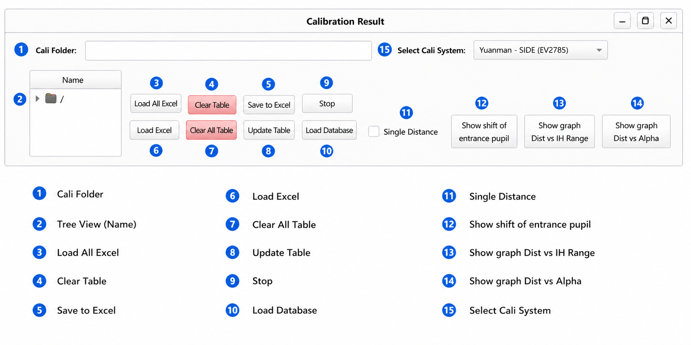

<p><em><a href="#fig-header-data-management"><strong>Figure 2. Header & Data Management.</strong></a> Header & Data Management area with 15 main UI functions.</em></p>

</div>

The **Header & Data Management** area is the top control section in the **Main Cali Result** window. This area is used to load calibration data, browse calibration folders, import or export Excel files, update table values, clear data, stop running calculations, open supporting graphs, and select the calibration system configuration.

### 1.1 Loaded Data Example

The screenshot below shows the **Header & Data Management** area after a complete calibration result folder has been loaded. The tree view shows folders `1` to `10`, the round tabs show `*` marks, and the active table contains PCT, ICT, alpha, and ZFL result columns.

<div className="center">

<a id="fig-loaded-data-example"></a>

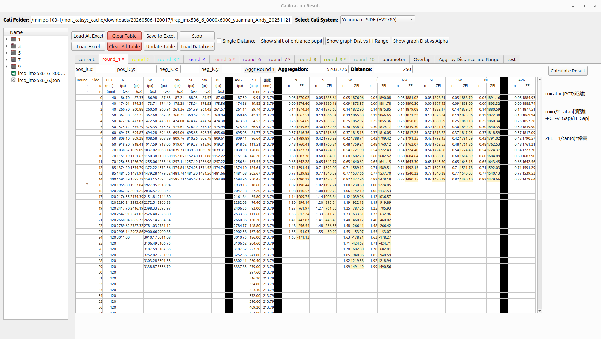

<p><em><a href="#fig-loaded-data-example"><strong>Figure 3. Loaded Data Example.</strong></a> Example of loaded calibration data with round tabs and result table.</em></p>

</div>

---

### 1.2 Purpose of This Section

Before checking detailed calibration results, the user should first prepare the data from this section. The data loaded here will be used by the result table, parameter calculation, aggregation tools, and graph visualization tools.

This section is mainly responsible for:

| Main Task | Description |
|---|---|
| Data loading | Load calibration result data from a local folder, Excel file, or URL. |
| Data browsing | Display the selected calibration folder in the tree view. |
| Table management | Clear one table, clear all tables, update the active table, and save results. |
| Calculation control | Stop long-running aggregation or range-search processes. |
| Data source selection | Select the calibration system and load database data when needed. |
| Visualization | Open entrance pupil shift, distance vs IH range, and distance vs alpha graphs. |

---

### 1.3 Main Controller Functions

In `controller_cali_result.py`, the main button and input behaviors are connected through these controller functions:

| Code Area | Purpose |
|---|---|
| `btn_connect()` | Connects the buttons in the header area to their related click functions. |
| `_on_folder_path_entered()` | Handles the **Cali Folder** input field when the user presses **Enter**. |
| `_load_from_url()` | Handles remote URL input and downloads or resolves the calibration source. |
| `_after_download_load_folder()` | Loads the local folder after a folder or downloaded URL is ready. |
| `_load_file_dispatch()` | Decides how to load a selected file, such as an Excel file. |
| `_on_treeview_double_click()` | Handles double-click behavior inside the tree view. |
| `connect_cb_distance()` | Connects the **Single Distance** checkbox behavior. |

---

### 1.4 Recommended Workflow

<div className="custom-note custom-tip">

<div className="custom-note-title">Recommended Workflow</div>

1. Select the correct **Cali System** first.
2. Load calibration data using **Cali Folder**, **Tree View**, **Load Excel**, or **Load All Excel**.
3. Check whether the round tabs are loaded correctly. Loaded tabs usually show the `*` mark.
4. Use **Update Table** when the calibration image, center point, PCT, or ICT data has changed.
5. Enable **Single Distance** only when each round must use a different distance value.
6. Open the graph or visualization tools when checking distance, IH range, alpha, or entrance pupil behavior.
7. Save the final result using **Save to Excel**.

</div>

---

### 1.5 Quick Function Summary

| No. | UI Element | Related Function / Handler | Main Purpose |
|---:|---|---|---|
| 1 | Cali Folder | `_on_folder_path_entered()` | Enter a local folder path, Excel file path, or URL. |
| 2 | Tree View | `_on_treeview_double_click()` | Browse calibration folders and load data by double-clicking. |
| 3 | Load All Excel | `onclick_btn_load_all_excel()` | Load Excel files from round folders `1` to `10`. |
| 4 | Clear Table | `onclick_btn_clear_table()` | Clear only the currently active table. |
| 5 | Save to Excel | `onclick_btn_save_to_excel()` | Save the active table as an `.xlsx` file. |
| 6 | Load Excel | `onclick_btn_load_excel()` | Load one Excel file into the active round table. |
| 7 | Clear All Table | `onclick_btn_clear_all_table()` | Clear all round tables from `round_1` to `round_10`. |
| 8 | Update Table | `onclick_btn_update_table()` | Update center, PCT, ICT, and calculated result data. |
| 9 | Stop | `onclick_btn_stop()` | Cancel running aggregation or range-search processes. |
| 10 | Load Database | `onclick_btn_load_database()` | Open or load calibration result data from the database. |
| 11 | Single Distance | `onclick_cb_distance_changed()` | Use independent distance values for each round. |
| 12 | Show shift of entrance pupil | Visualization handler | Open entrance pupil shift visualization. |
| 13 | Show graph Dist vs IH Range | `onclick_btn_show_graph_dist_ih_range()` | Show distance trend over IH ranges. |
| 14 | Show graph Dist vs Alpha | `onclick_btn_show_graph_dist_alpha()` | Show the relationship between distance and alpha. |
| 15 | Select Cali System | `update_line_edits()` / `config_file_map` | Select the calibration system configuration. |

---

### 1.6 Detailed Function Explanation

### 1.7 Cali Folder

#### Function

The **Cali Folder** field is used to manually enter the calibration data source. It can accept a local folder path, a local Excel file path, or a remote URL.

| Input Type | Example | System Behavior |
|---|---|---|
| Folder path | `/home/user/calibration_result` | Updates the tree view root folder. |
| Excel file path | `/home/user/calibration_result/1/result.xlsx` | Loads or dispatches the Excel file into the current workflow. |
| URL | `https://...` or copied remote file link | Resolves or downloads the remote file/folder into the local cache. |

#### URL Input Example

When a remote file or folder URL is pasted into **Cali Folder**, the user should press **Enter** to let the system process the input.

<div className="center">

<a id="fig-cali-folder-url-input"></a>

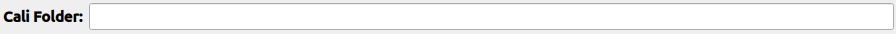

<p><em><a href="#fig-cali-folder-url-input"><strong>Figure 4. Cali Folder URL Input.</strong></a> Remote URL pasted into the Cali Folder field.</em></p>

</div>

The URL can also appear selected inside the input field before the system finishes processing it.

<div className="center">

<a id="fig-cali-folder-selected-url"></a>

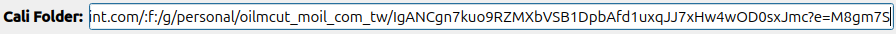

<p><em><a href="#fig-cali-folder-selected-url"><strong>Figure 5. Selected URL Input.</strong></a> Selected remote URL before the system finishes processing.</em></p>

</div>

After the URL is resolved or downloaded, the field can be changed automatically to a local cache folder path. This means the remote data has been prepared locally and can now be loaded from the computer.

<div className="center">

<a id="fig-cali-folder-local-cache"></a>

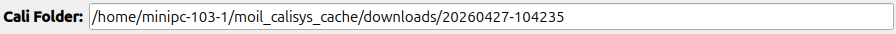

<p><em><a href="#fig-cali-folder-local-cache"><strong>Figure 6. Local Cache Path.</strong></a> Local cache path after the URL is resolved or downloaded.</em></p>

</div>

#### Related Code

```python
_on_folder_path_entered()
```
#### How It Works

When the user presses **Enter**, the system reads the input text:

```python
path = (self.folder_path.text() or "").strip()
```
Then the system checks whether the input is a URL, a folder path, or a file path:

```python
if re.match(r"^https?://", path, re.I):
    self._load_from_url(path)

if os.path.isdir(path):
    self._after_download_load_folder(path)

if os.path.isfile(path):
    self._load_file_dispatch(path)
```
#### How to Use

1. Click the **Cali Folder** input field.
2. Paste or type the folder path, Excel file path, or URL.
3. Press **Enter**.
4. Wait until the system checks the input source.
5. If the input is a folder, the tree view updates.
6. If the input is a URL, the system downloads or resolves the data into a local cache path.
7. Continue loading the data using the tree view, **Load Excel**, or **Load All Excel**.

#### Internal Flow

```text
User enters path or URL
   ↓
Press Enter
   ↓
System checks input type
   ↓
URL    → _load_from_url()
Folder → _after_download_load_folder()
File   → _load_file_dispatch()
   ↓
Tree view or table data is updated
```
<div className="custom-note custom-tip">

<div className="custom-note-title">Note</div>

A folder path only updates the tree view root. To load data into the round table, use the **Tree View**, **Load Excel**, or **Load All Excel** after the folder appears.

</div>

---

### 1.8 Tree View

#### Function

The **Tree View** displays the selected calibration folder structure. It helps the user browse downloaded or local calibration data without manually searching through the file manager.

<div className="center">

<a id="fig-tree-view-folder"></a>

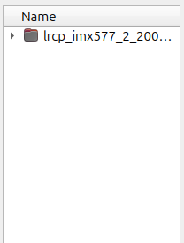

<p><em><a href="#fig-tree-view-folder"><strong>Figure 7. Tree View Folder Browser.</strong></a> Tree View showing calibration folder structure after loading a folder or URL.</em></p>

</div>

#### Related Code

```python
_on_treeview_double_click()
```
#### Behavior

| Double-Clicked Item | System Behavior |
|---|---|
| `.xlsx` file | Loads the selected Excel file into the current active round table. |
| Folder | Clears all round tables first, then loads Excel files from the selected folder when valid files are found. |

#### How to Use Tree View to Load One Excel File

1. Enter a calibration folder path or URL in **Cali Folder**.
2. Press **Enter** and wait until the folder appears in the tree view.
3. Expand the folder if needed.
4. Double-click one `.xlsx` file.
5. The file is loaded into the currently active round table.

#### How to Use Tree View to Load a Folder

1. Enter the main calibration folder path or URL in **Cali Folder**.
2. Press **Enter**.
3. Double-click the folder in the tree view.
4. The system clears all round tables.
5. The system loads valid Excel files from the selected folder.

#### Related Code Behavior

```python
self._load_excel_to_current_round(path)
self.onclick_btn_clear_all_table()
self._load_all_excel_from_folder(path)
```
<div className="custom-note custom-warning">

<div className="custom-note-title">Important</div>

Double-clicking a folder may clear existing round table data before loading the new folder. Save important data before loading another folder.

</div>

---

### 1.9 Load All Excel

#### Function

The **Load All Excel** button loads calibration result Excel files from round folders `1` to `10`. This is useful when the calibration result is already organized by round.

When the button is clicked, the system opens a folder selection dialog. Select the main calibration result folder that contains the round folders.

<div className="center">

<a id="fig-load-all-excel-dialog"></a>

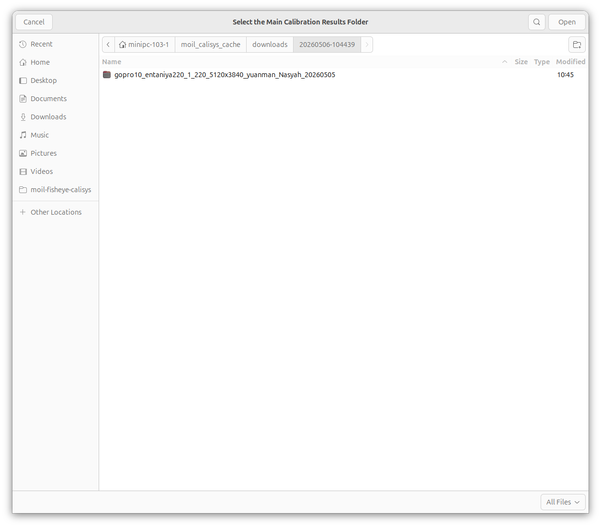

<p><em><a href="#fig-load-all-excel-dialog"><strong>Figure 8. Load All Excel Dialog.</strong></a> Folder selection dialog used to load all Excel files from round folders.</em></p>

</div>

#### Related Code

```python
onclick_btn_load_all_excel()
```
Button connection:

```python
self.btn_load_all_excle.clicked.connect(self.onclick_btn_load_all_excel)
```
#### Required Folder Structure

```text
calibration_result/
├── 1/
│   └── result.xlsx
├── 2/
│   └── result.xlsx
├── 3/
│   └── result.xlsx
...
└── 10/
    └── result.xlsx
```
After loading, the same folder structure appears in the tree view on the left side of the window, and the loaded round tabs are marked with `*`.

#### How to Use

1. Click **Load All Excel**.
2. Select the main calibration result folder.
3. The system scans folders `1` to `10`.
4. The first `.xlsx` file in each folder is loaded.
5. Loaded round tabs are marked with `*`.
6. All calibration results are recalculated.

#### Internal Flow

```text
Click Load All Excel
   ↓
Select main folder
   ↓
Scan folders 1–10
   ↓
Find .xlsx files
   ↓
Read Excel workbook
   ↓
Load data into round tables
   ↓
Mark loaded tabs with "*"
   ↓
Run all calibration result calculations
   ↓
Load main.json if available
```
#### Excel Reading Behavior

```python
workbook = load_workbook(excel_file_path, data_only=True)
sheet = workbook.worksheets[0]
```
The system searches for a header row containing:

```text
pct
```
or:

```text
(mm)
```
#### After Loading

After all Excel files are loaded, the system updates calculation and range data:

```python
self.onclick_btn_update_all_cali_result()
self.update_min_max_aggregation_range_0()
self.update_all_range_data_totals()
self.refresh_percent_only_ranges_and_totals(bins=20)
```
<div className="custom-note custom-tip">

<div className="custom-note-title">Note</div>

Use **Load All Excel** when the data is already separated into round folders. Use **Load Excel** when you only want to load one Excel file into the active tab.

</div>

---

### 1.10 Clear Table

#### Function

The **Clear Table** button clears only the currently active table. It does not clear the other round tabs.

#### Related Code

```python
onclick_btn_clear_table()
```
Button connection:

```python
self.btn_clear_table.clicked.connect(self.onclick_btn_clear_table)
```
#### How to Use

1. Select the round tab that should be cleared.
2. Click **Clear Table**.
3. The active table data is removed.
4. The tab `*` mark is removed.
5. The calculation result is updated.

#### Internal Flow

```text
Click Clear Table
   ↓
Get active table index
   ↓
Clear data columns
   ↓
Keep separator columns black
   ↓
Reset round and side values
   ↓
Remove "*" from the active tab
   ↓
Update all calibration results
```
#### Important Behavior

The function clears the columns defined in:

```python
self._dict_column_index
```
Special separator columns remain black:

```text
empty11
empty15
empty32
```
---

### 1.11 Save to Excel

#### Function

The **Save to Excel** button exports the currently active table to an `.xlsx` file.

The save dialog allows the user to choose the output folder and file name before exporting the active result table.

<div className="center">

<a id="fig-save-to-excel-dialog"></a>

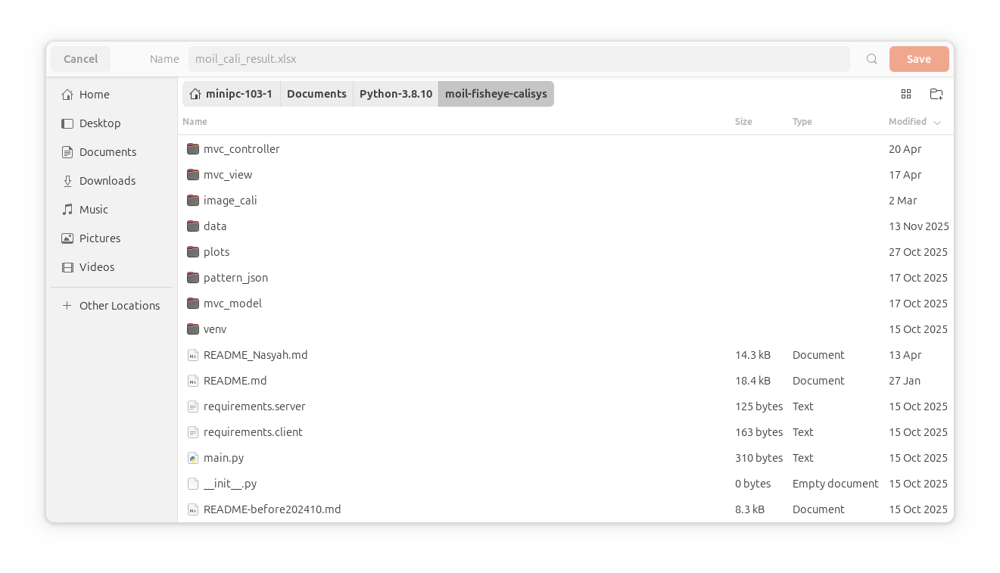

<p><em><a href="#fig-save-to-excel-dialog"><strong>Figure 9. Save to Excel Dialog.</strong></a> Save dialog used to export the active calibration result table.</em></p>

</div>

#### Related Code

```python
onclick_btn_save_to_excel()
```
Button connection:

```python
self.btn_save_to_excel.clicked.connect(self.onclick_btn_save_to_excel)
```
#### How to Use

1. Select the table or round you want to save.
2. Click **Save to Excel**.
3. Choose the output folder.
4. Enter the file name.
5. Save the file.

#### Internal Flow

```text
Click Save to Excel
   ↓
Get active table
   ↓
Open save dialog
   ↓
Create workbook
   ↓
Read table rows
   ↓
Write rows to Excel
   ↓
Save .xlsx file
```
#### Saved Data

The function saves columns from:

```python
round
```
to:

```python
ict_ne
```
The exported data mainly includes:

```text
round
side
pct
ict_n
ict_s
ict_w
ict_e
ict_nw
ict_se
ict_sw
ict_ne
```
---

### 1.12 Load Excel

#### Function

The **Load Excel** button loads one `.xlsx` file into the active table. This is used when only one round needs to be loaded or replaced.

<div className="center">

<a id="fig-load-excel-dialog"></a>

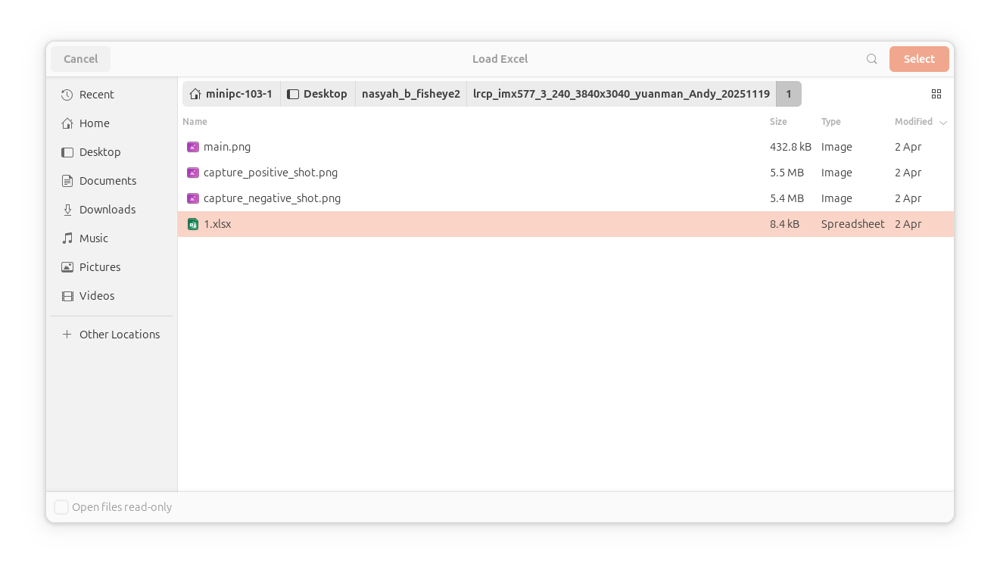

<p><em><a href="#fig-load-excel-dialog"><strong>Figure 10. Load Excel Dialog.</strong></a> File selection dialog used to load one Excel file into the active round table.</em></p>

</div>

#### Related Code

```python
onclick_btn_load_excel()
```
Button connection:

```python
self.btn_load_excel.clicked.connect(self.onclick_btn_load_excel)
```
#### How to Use

1. Select the target round tab.
2. Click **Load Excel**.
3. Select one `.xlsx` file.
4. The active table is cleared.
5. The Excel data is loaded.
6. The active tab is marked with `*`.
7. All calibration results are recalculated.

#### Internal Flow

```text
Click Load Excel
   ↓
Open file dialog
   ↓
Select .xlsx file
   ↓
Update tree view folder
   ↓
Clear active table
   ↓
Read the selected sheet and required calibration columns
   ↓
Insert data into active table
   ↓
Mark tab with "*"
   ↓
Update all calibration results
```
#### Excel Requirement

The Excel file should contain the calibration result columns used by the table. The most important columns are:

| Column | Meaning | Unit / Content |
|---|---|---|
| `Round` | Round or sample index | Number |
| `Side` | Side or row index | Number |
| `PCT` | Pattern/calibration point distance | Usually `(mm)` |
| `N`, `S`, `W`, `E` | ICT values in four main directions | Pixel `(px)` |
| `NW`, `SE`, `SW`, `NE` | ICT values in diagonal directions | Pixel `(px)` |

The screenshot below shows an example Excel file layout that can be loaded into the calibration result table.

<div className="center">

<a id="fig-excel-layout-example"></a>

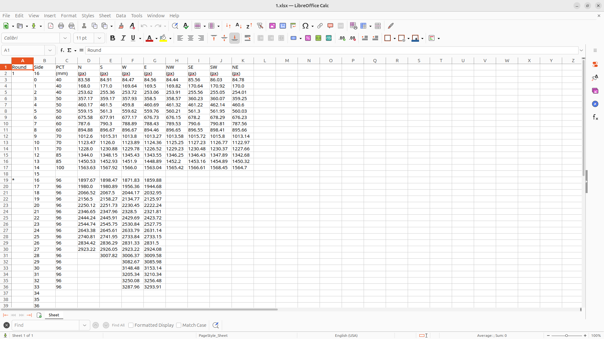

<p><em><a href="#fig-excel-layout-example"><strong>Figure 11. Excel Layout Example.</strong></a> Example Excel layout containing Round, Side, PCT, and ICT direction columns.</em></p>

</div>

```text
Recommended sheet name: Sheet
Required content: Round, Side, PCT, N, S, W, E, NW, SE, SW, NE
Legacy import range used by some workflows: A3:K42
```
<div className="custom-note custom-warning">

<div className="custom-note-title">Important</div>

If the selected Excel file does not follow the expected format, the table may not load correctly. Make sure the workbook contains the required calibration result columns and that the PCT/ICT values are placed in the correct columns.

</div>

---

### 1.13 Clear All Table

#### Function

The **Clear All Table** button clears all round tables from `round_1` to `round_10`.

#### Related Code

```python
onclick_btn_clear_all_table()
```
Button connection:

```python
self.btn_clear_all_table.clicked.connect(self.onclick_btn_clear_all_table)
```
#### Confirmation Dialog

Before deleting all round data, the system shows a confirmation dialog.

<div className="center">

<a id="fig-clear-all-table-confirmation"></a>

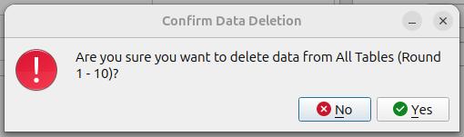

<p><em><a href="#fig-clear-all-table-confirmation"><strong>Figure 12. Clear All Table Confirmation.</strong></a> Confirmation dialog before clearing all round tables.</em></p>

</div>

The confirmation message is:

```text
Are you sure you want to delete data from All Tables (Round 1 - 10)?
```
#### How to Use

1. Click **Clear All Table**.
2. Read the confirmation dialog carefully.
3. Click **Yes** to clear all round tables.
4. Click **No** to cancel the operation.

#### Internal Flow

```text
Click Clear All Table
   ↓
Show confirmation dialog
   ↓
If user clicks Yes:
      ↓
      Loop round_1 to round_10
      ↓
      Clear all data columns
      ↓
      Reset round and side values
      ↓
      Remove "*" from tabs
      ↓
      Update all results
```
<div className="custom-note custom-warning">

<div className="custom-note-title">Data Deletion Warning</div>

This function clears all round data from `round_1` to `round_10`. Save important results before using **Clear All Table**.

</div>

---

### 1.14 Update Table

#### Function

The **Update Table** button updates the active table using the latest calibration image data and pattern data.

#### Related Code

```python
onclick_btn_update_table()
```
Button connection:

```python
self.btn_update_table.clicked.connect(self.onclick_btn_update_table)
```
#### What It Updates

This function updates:

| Updated Data | Description |
|---|---|
| Image center values | Updates center-related line edit values into the active table. |
| Round number | Updates the current round information. |
| PCT column | Updates the PCT values from pattern data. |
| ICT 8-direction values | Updates ICT values for north, south, west, east, and diagonal directions. |
| Calculated result data | Recalculates the calibration result after the table is updated. |

#### How to Use

1. Prepare positive and negative calibration images.
2. Make sure the Pattern Generator data is available.
3. Select the target round tab.
4. Click **Update Table**.
5. The active table is refreshed.
6. All calibration calculations are updated.

#### Internal Flow

```text
Click Update Table
   ↓
Clear active table
   ↓
Update image center values
   ↓
Update round number
   ↓
Update PCT column
   ↓
Update ICT 8 directions
   ↓
Run all calibration calculations
   ↓
Mark tab with "*"
```
#### Main Internal Calls

```python
self.update_table_lineedit_img_center(table_index)
self.update_round_num(table_index)
self.update_column_pct(table_index)
self.update_ict_8direction(table_index)
self.onclick_btn_update_all_cali_result()
```
#### ICT Data Source

```text
image_cali/capture_positive_shot.png
image_cali/capture_negative_shot.png
```
The 8-direction ICT values are:

```text
ict_n
ict_s
ict_w
ict_e
ict_nw
ict_se
ict_sw
ict_ne
```
---

### 1.15 Stop

#### Function

The **Stop** button is used to cancel a running calculation process. This is commonly used when aggregation, range counting, or range-search processing takes too long, or when the user started the wrong process and wants to stop it before the UI is updated.

#### Related Code

```python
onclick_btn_stop()
```
Button connection:

```python
self.btn_stop.clicked.connect(self.onclick_btn_stop)
```
#### Stop Button Example

The screenshot below shows the terminal output after the **Stop** button is pressed during range processing.

<div className="center">

<a id="fig-stop-terminal-output"></a>

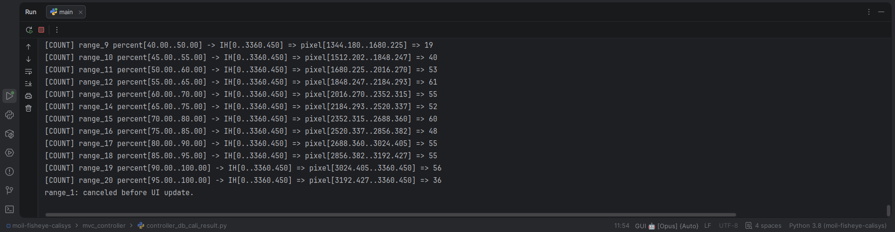

<p><em><a href="#fig-stop-terminal-output"><strong>Figure 13. Stop Process Terminal Output.</strong></a> Terminal message after cancelling range or aggregation processing.</em></p>

</div>

In this example, the system was still counting IH range data. After the stop request was received, the terminal displayed:

```text
range_1: canceled before UI update.
```
This message means the running process was cancelled before the table or UI was refreshed. It is a normal cancellation status, not a program error.

#### What Happens When Stop Is Pressed

When the user clicks **Stop**, the system sends a cancellation request to the active calculation process.

The stop logic may perform these actions:

- set the cancellation flag,
- stop active timers,
- stop range-based processing,
- prevent the next UI update,
- clear active UI highlights or active range states,
- exit the running loop safely.

#### How to Use

1. Start a long-running aggregation, range search, or calculation process.
2. Click **Stop**.
3. Wait until the current calculation step exits safely.
4. Check the terminal message to confirm that the process was cancelled.

#### Internal Flow

```text
Click Stop
   ↓
Set _cancel_min_aggr = True
   ↓
Set _cancel_aggr event
   ↓
Stop active timers
   ↓
Prevent further UI update
   ↓
Exit the active calculation loop
   ↓
Show cancellation message in terminal if available
```
#### Important Behavior

```python
self._cancel_min_aggr = True
self._cancel_aggr.set()
```
<div className="custom-note custom-tip">

<div className="custom-note-title">Note</div>

The process may not stop at the exact same second the button is clicked. Some calculation steps need to finish their current iteration before the program can stop safely.

</div>

<div className="custom-note custom-warning">

<div className="custom-note-title">Important</div>

If the terminal shows a message such as `canceled before UI update`, it means the stop request worked correctly and the system prevented the cancelled result from being written to the UI.

</div>

---

### 1.16 Load Database

#### Function

The **Load Database** button opens the **Calibration Data** window. This window is used to search calibration records, select a calibration dataset, load the dataset into the system, or open the related URL source.

#### Related Code

```python
onclick_btn_load_database()
```
Button connection:

```python
self.btn_load_database.clicked.connect(self.onclick_btn_load_database)
```
#### Related Controller

```python
from .controller_db_cali_result import ControllerDBCaliResult
```
#### Database Window Overview

After clicking **Load Database**, the **Calibration Data** window appears.

<div className="center">

<a id="fig-calibration-data-window"></a>

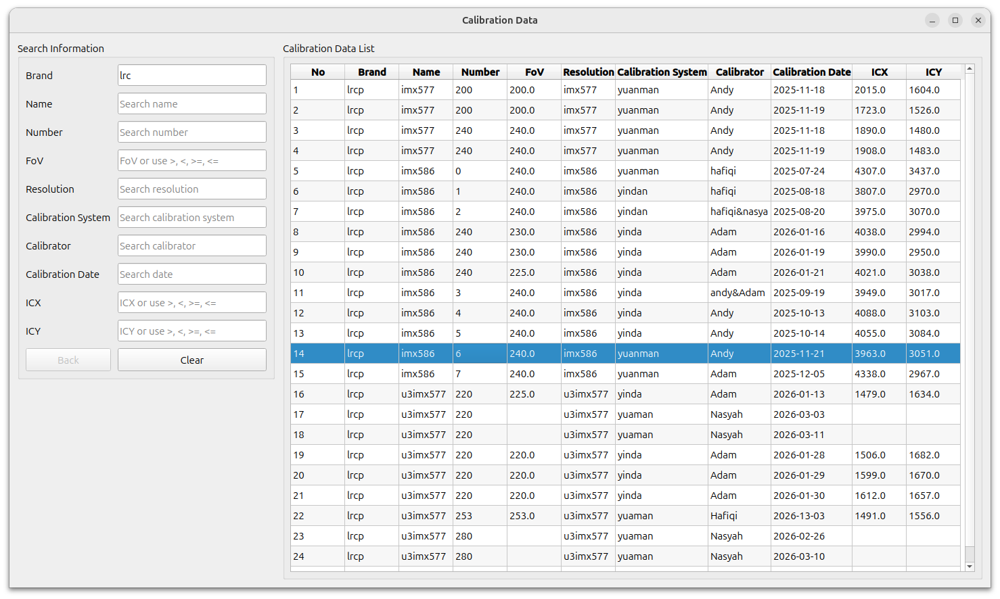

<p><em><a href="#fig-calibration-data-window"><strong>Figure 14. Calibration Data Window.</strong></a> Database window used to search and select calibration result records.</em></p>

</div>

The database window is divided into two main areas:

| Area | Description |
|---|---|
| **Search Information** | Used to filter data by Brand, Name, Number, FoV, Resolution, Calibration System, Calibrator, Calibration Date, ICX, and ICY. |
| **Calibration Data List** | Displays available calibration records from the database. Each row represents one calibration dataset. |

#### How to Search Data

1. Type a keyword or value into one of the search fields.
2. The table filters the matching calibration records.
3. Select the row that matches the camera and calibration result you want to use.
4. Continue with **Load to System** or **Open URL**.

#### Database Right-Click Menu

After selecting a row in the database table, right-click the row to open the action menu.

<div className="center">

<a id="fig-database-right-click-menu"></a>

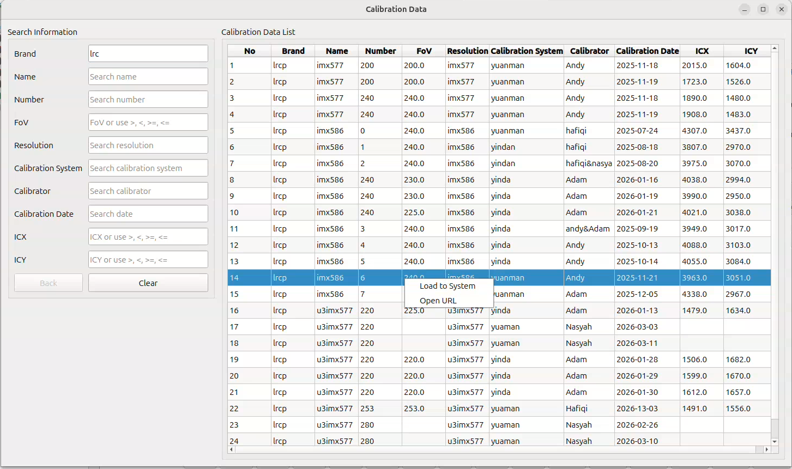

<p><em><a href="#fig-database-right-click-menu"><strong>Figure 15. Database Right-Click Menu.</strong></a> Right-click menu for loading calibration data or opening its URL.</em></p>

</div>

The menu provides two main actions:

| Menu Action | Function |
|---|---|
| **Load to System** | Loads the selected calibration data into the calibration result system. |
| **Open URL** | Opens the related cloud or OneDrive URL for the selected calibration dataset. |

#### Open URL from Database

When **Open URL** is selected, the related dataset location opens in the browser.

<div className="center">

<a id="fig-database-open-url"></a>

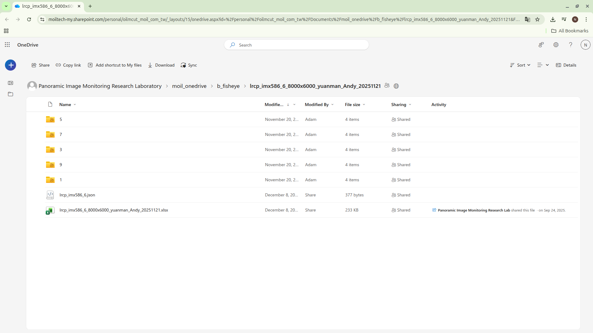

<p><em><a href="#fig-database-open-url"><strong>Figure 16. Database Open URL Result.</strong></a> Cloud folder opened from the selected database URL.</em></p>

</div>

This page usually contains the calibration dataset folders, JSON configuration file, and Excel result file.

A typical opened URL may contain:

```text
round folders, such as 1, 3, 5, 7, 9
camera or calibration JSON file
calibration result Excel file
```
#### Select File or Folder from Database

When the system needs the user to choose which source should be opened, a selection dialog appears.

<div className="center">

<a id="fig-database-select-source-dialog"></a>

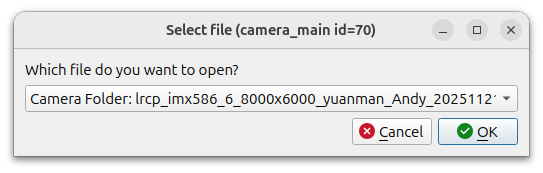

<p><em><a href="#fig-database-select-source-dialog"><strong>Figure 17. Database Source Selection Dialog.</strong></a> Dialog used to choose which file or folder should be opened from the database record.</em></p>

</div>

Use this dialog when one database record has more than one related source or when the system needs confirmation before opening the selected camera folder or file.

#### How to Use Load Database

1. Click **Load Database**.
2. The **Calibration Data** window opens.
3. Use the search fields to find the target calibration record.
4. Select the correct row in the data table.
5. Right-click the selected row.
6. Choose one of these actions:
   - **Load to System** to load the data into the application.
   - **Open URL** to open the dataset source in the browser.
7. If the selection dialog appears, choose the correct camera folder or file and click **OK**.

#### Typical Workflow

```text
Click Load Database
   ↓
Open Calibration Data window
   ↓
Search or filter calibration record
   ↓
Select the correct row
   ↓
Right-click the row
   ↓
Choose Load to System or Open URL
   ↓
If needed, select the target camera folder or file
   ↓
Load data into system or open the dataset URL
```
#### When to Use Load Database

Use **Load Database** when:

- the calibration result already exists in the database,
- the user does not want to manually paste a folder path or URL,
- the user wants to search data by camera brand, name, FoV, resolution, calibrator, or calibration date,
- the user wants to open the source folder from the stored URL,
- the user wants to load database-selected data directly into the calibration workflow.

<div className="custom-note custom-tip">

<div className="custom-note-title">Note</div>

Use **Open URL** when you only want to inspect or download the dataset from the browser. Use **Load to System** when you want the selected calibration data to be used directly by the application.

</div>

---

### 1.17 Single Distance

#### Function

The **Single Distance** checkbox changes how the distance value is calculated.

#### Related Code

```python
connect_cb_distance()
onclick_cb_distance_changed()
_is_use_single_round_distance()
update_distance_auto()
calculate_distance_single_round()
```
Checkbox connection:

```python
cb.stateChanged.connect(self.onclick_cb_distance_changed)
```
#### Mode 1 — Single Distance OFF

When unchecked, distance is calculated automatically:

```text
distance = base_distance + dis_per_round × (current_round - first_valid_round)
```
Use this mode when the distance difference between rounds follows the same step value.

#### Mode 2 — Single Distance ON

When checked, each round can use its own distance value.

The system reads the round-specific distance field using:

```python
_get_distance_lineedit_by_round(table_index)
```
Use this mode when each round has a manually measured or different distance value.

#### How to Use Automatic Distance

1. Leave **Single Distance** unchecked.
2. Enter the base distance.
3. Enter `Dis / Round`.
4. Update or calculate the result.

#### How to Use Per-Round Distance

1. Check **Single Distance**.
2. Enter distance values for each round.
3. Press **Enter** or run the update.
4. Each round is calculated independently.

---

### 1.18 Show Shift of Entrance Pupil

#### Function

The **Show shift of entrance pupil** button opens a visualization related to entrance pupil shift. This visualization is based on the distance, alpha, IH range, and history-distance values prepared from the range analysis area.

#### Source Data for Entrance Pupil and Graph Tools

The screenshot below shows the **Range Window** and **History Distance** information used as the source data for the entrance pupil visualization and the graph buttons.

<div className="center">

<a id="fig-range-history-source-data"></a>

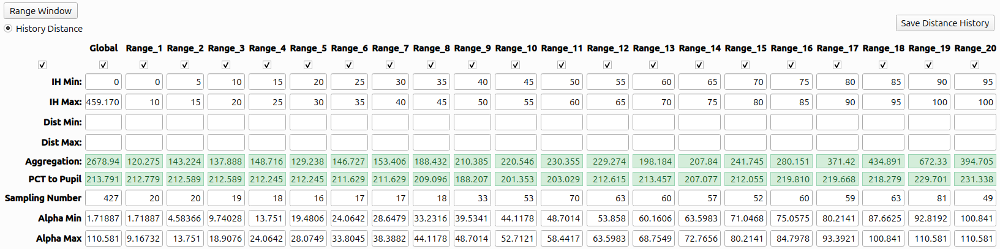

<p><em><a href="#fig-range-history-source-data"><strong>Figure 18. Range Window and History Distance Source Data.</strong></a> Range and history-distance values used by graph and entrance-pupil visualization tools.</em></p>

</div>

This area contains the calculated values for each range group. These values are used by:

| Source Field | Used For |
|---|---|
| **IH Min / IH Max** | Defines the IH percentage range for each `Range_1` to `Range_20`. |
| **Aggregation** | Shows the aggregation value for each range. This helps identify which range has stable or unstable results. |
| **PCT to Pupil** | Provides the distance-related value used when drawing the entrance pupil and distance graphs. |
| **Sampling Number** | Shows how many samples are used in each range. This helps judge whether the range has enough data. |
| **Alpha Min / Alpha Max** | Defines the alpha angle range used for alpha-related graph visualization. |
| **History Distance** | Stores or recalls previous distance results so they can be compared or reused. |

<div className="custom-note custom-tip">

<div className="custom-note-title">Note</div>

The **Show shift of entrance pupil**, **Show graph Dist vs IH Range**, and **Show graph Dist vs Alpha** buttons use values from this range/history-distance area. Therefore, before opening these graphs, make sure the range values have already been calculated or updated.

</div>

#### Purpose

This visualization helps the user inspect how the entrance pupil changes based on calibration data. The output window can show a ray curve based on distance and alpha values for each range or round.

<div className="center">

<a id="fig-entrance-pupil-ray-curve"></a>

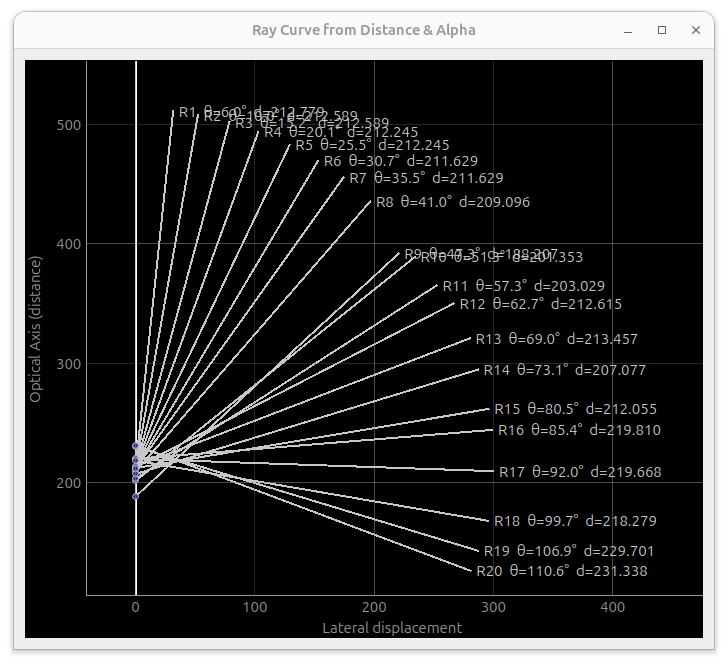

<p><em><a href="#fig-entrance-pupil-ray-curve"><strong>Figure 19. Entrance Pupil Ray Curve.</strong></a> Ray curve visualization generated from distance and alpha values.</em></p>

</div>

In this graph, each ray represents one range or round result. The label shows the angle `θ` and the distance `d`, so the user can compare whether the ray direction and distance distribution are reasonable.

#### How to Use

1. Load calibration data.
2. Update or calculate results.
3. Check that the **Range Window** / **History Distance** values are filled.
4. Click **Show shift of entrance pupil**.
5. Inspect the visualization window.

#### When to Use

Use this function when checking:

| Check Item | Purpose |
|---|---|
| Entrance pupil stability | Checks whether the entrance pupil shifts abnormally. |
| Round-to-round behavior | Compares entrance pupil movement between loaded rounds. |
| Calibration consistency | Helps verify whether the calibration result is reasonable. |
| Possible alignment issue | Helps identify unusual movement or inconsistent data. |
| Range-source correctness | Confirms that the graph is generated from the expected IH, alpha, and distance range values. |

---

### 1.19 Show Graph Dist vs IH Range

#### Function

The **Show graph Dist vs IH Range** button opens a graph that compares distance with IH range.

<div className="center">

<a id="fig-distance-vs-ih-range"></a>

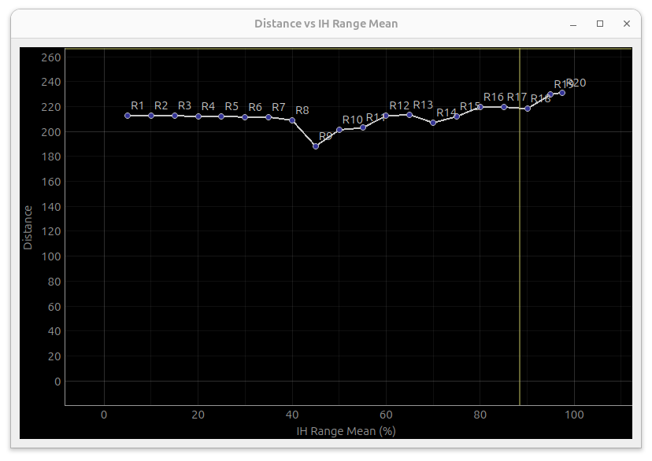

<p><em><a href="#fig-distance-vs-ih-range"><strong>Figure 20. Distance vs IH Range Graph.</strong></a> Graph showing distance changes across IH range mean values.</em></p>

</div>

The graph shows the distance value for each IH range group. The X-axis is **IH Range Mean (%)**, and the Y-axis is **Distance**. Each point is labeled by range number, such as `R1`, `R2`, and so on.

The source values come from the **Range Window**. The IH range is taken from **IH Min / IH Max**, while the distance value is taken from the range distance result such as **PCT to Pupil** or history-distance calculation output.

#### Related Code

```python
onclick_btn_show_graph_dist_ih_range()
```
Button connection:

```python
self.btn_show_graph_dist_ih_range.clicked.connect(self.onclick_btn_show_graph_dist_ih_range)
```
#### How to Use

1. Load calibration data.
2. Run aggregation or range analysis.
3. Make sure distance values are filled.
4. Click **Show graph Dist vs IH Range**.
5. Inspect the graph.

#### What It Helps Check

This graph helps check:

| Check Item | Description |
|---|---|
| Best distance stability | Shows whether the best distance is stable across IH ranges. |
| Abnormal IH range | Helps identify IH ranges that produce unusual distance values. |
| Distance reliability | Helps decide whether the selected distance is reliable. |
| Range consistency | Shows whether range groups behave consistently. |

---

### 1.20 Show Graph Dist vs Alpha

#### Function

The **Show graph Dist vs Alpha** button opens a graph that compares distance with alpha.

<div className="center">

<a id="fig-distance-vs-alpha"></a>

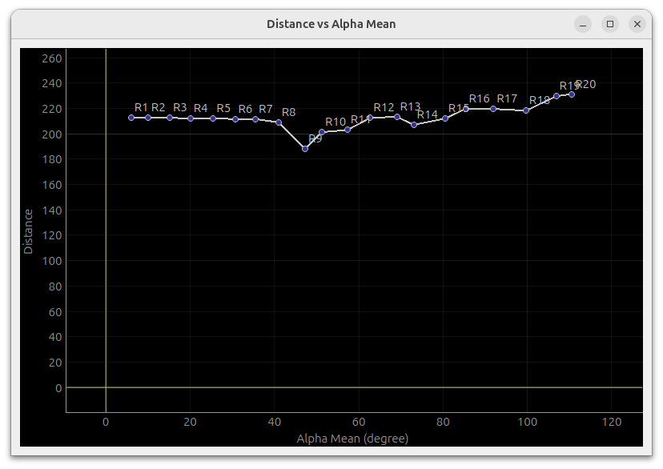

<p><em><a href="#fig-distance-vs-alpha"><strong>Figure 21. Distance vs Alpha Graph.</strong></a> Graph showing the relationship between alpha mean and distance.</em></p>

</div>

The graph shows the relationship between **Alpha Mean (degree)** and **Distance**. Each point is labeled by range number, so abnormal alpha or distance changes can be checked visually.

The source values come from the **Range Window**. The alpha range is taken from **Alpha Min / Alpha Max**, while the distance value is taken from the range distance result such as **PCT to Pupil** or history-distance calculation output.

#### Related Code

```python
onclick_btn_show_graph_dist_alpha()
```
Button connection:

```python
self.btn_show_graph_dist_alpha.clicked.connect(self.onclick_btn_show_graph_dist_alpha)
```
#### How to Use

1. Load calibration data.
2. Update all calculation results.
3. Make sure alpha values are calculated.
4. Click **Show graph Dist vs Alpha**.
5. Inspect the graph.

#### Related Alpha Formulas

For top-screen layers:

```text
alpha = atan(pct_cal / distance)
```
For side-screen layers:

```text
alpha = π/2 - atan((distance - pct_cal - v_gap) / h_gap)
```
#### What It Helps Check

This graph helps check:

| Check Item | Description |
|---|---|
| Alpha smoothness | Checks whether alpha changes smoothly. |
| Distance sensitivity | Shows how alpha changes when distance changes. |
| Abnormal alpha behavior | Helps identify unstable or incorrect alpha values. |
| Calibration geometry stability | Helps verify whether geometry parameters are reasonable. |

---

### 1.21 Select Cali System

#### Function

The **Select Cali System** dropdown selects the calibration system configuration. This selection is important because it defines the default calibration geometry used by the system.

The selected calibration system is directly related to:

| Related Setting | Why It Is Connected |
|---|---|
| **V_Gap & H_Gap** | These values describe the physical gap geometry for the selected calibration system. |
| **Pixel Size (Top / Side)** | These values convert PCT data from pixel units into physical millimeter values. |
| **Dis / Round** | This value controls how distance changes between calibration rounds. |
| **Alpha and ZFL Calculation** | V_Gap, H_Gap, pixel size, and distance are all used together to calculate alpha and ZFL. |

<div className="center">

<a id="fig-select-cali-system-dropdown"></a>

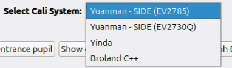

<p><em><a href="#fig-select-cali-system-dropdown"><strong>Figure 22. Select Cali System Dropdown.</strong></a> Dropdown options for choosing the calibration system configuration.</em></p>

</div>

The dropdown options shown in the screenshot include **Yuanman - SIDE (EV2785)**, **Yuanman - SIDE (EV2730Q)**, **Yinda**, and **Broland C++**.

#### Why This Setting Must Be Selected First

The **Select Cali System** option should be checked before adjusting **V_Gap**, **H_Gap**, **Pixel Size**, and **Dis / Round** because these values represent one complete calibration system setup.

In other words, these sections should be understood as one connected configuration group:

```text
Select Cali System
   ↓
Load system configuration JSON
   ↓
Set or confirm V_Gap and H_Gap
   ↓
Set or confirm Pixel Size Top / Side
   ↓
Set or confirm Dis / Round
   ↓
Calculate PCT_CAL, Distance, Alpha, and ZFL
```
#### Related Code

```python
combox_type_of_system
update_line_edits()
config_file_map
_load_main_json_or_reset_default()
reset_to_default_main_config()
```
Combobox connection:

```python
self.combox_type_of_system.currentIndexChanged.connect(self.update_line_edits)
```
#### Configuration Mapping

```python
self.config_file_map = {
    "Yuanman - SIDE (EV2785)": "cali_system_configuration_json/yuanman_ev2785.json",
    "Yuanman - SIDE (EV2730Q)": "cali_system_configuration_json/yuanman_ev2730q.json",
    "Yinda": "cali_system_configuration_json/yinda.json",
    "Brodand C++": "cali_system_configuration_json/brodand_cpp.json"
}
```
#### How to Use

1. Select the correct **Cali System** first.
2. Confirm that **V_Gap** and **H_Gap** match the selected hardware setup.
3. Confirm that **Pixel Size (Top)** and **Pixel Size (Side)** are correct.
4. Confirm **Dis / Round** if the calibration uses multiple rounds.
5. Load or update calibration data.
6. Run calculation and inspect the IH-ZFL / Overlap graph.

#### `main.json` Behavior

When a full calibration folder is loaded, the system checks for:

```text
main.json
```
If `main.json` exists, it loads:

```text
systemType
distance_per_round
```
If `main.json` does not exist or is invalid, it uses the default values:

```text
System: Yuanman - SIDE (EV2785)
Distance per round: 10
```
<div className="custom-note custom-warning">

<div className="custom-note-title">Important</div>

Do not treat **Select Cali System**, **V_Gap / H_Gap**, and **Pixel Size** as separate settings. They work together as one calibration geometry configuration. If one of them is incorrect, the calculated alpha, ZFL, aggregation, and best distance can also become incorrect.

</div>

---

## 2. Round & Tab Selection

<a id="2-round--tab-selection"></a>

The **Round & Tab Selection** area is used to switch between calibration rounds, parameter pages, overlap visualization, aggregation analysis, and testing pages.

<div className="center">

<a id="fig-round-tab-selection"></a>

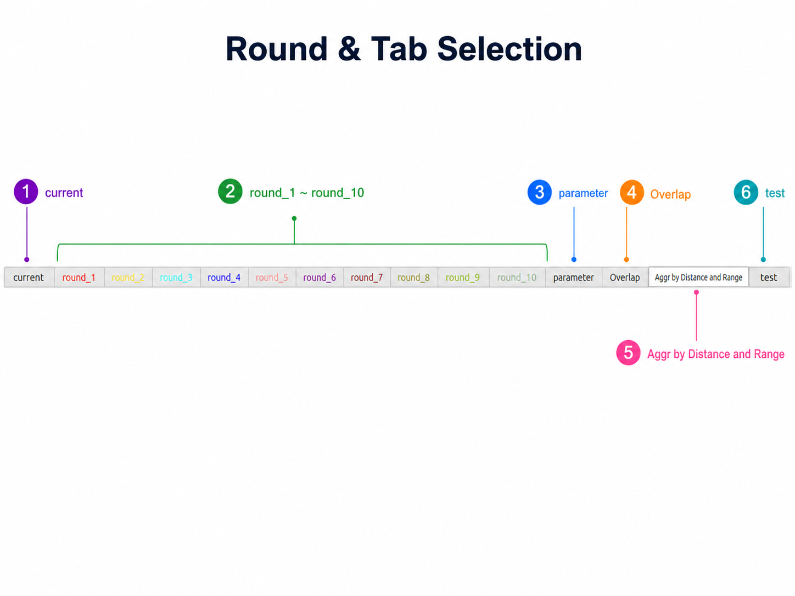

<p><em><a href="#fig-round-tab-selection"><strong>Figure 23. Round & Tab Selection.</strong></a> Tab selection area for current, round, parameter, overlap, aggregation, and test pages.</em></p>

</div>

### 2.1 Main Functions

| No. | Tab / Area | Purpose |
|---:|---|---|
| 1 | `current` | Temporary/current working table. |
| 2 | `round_1 ~ round_10` | Calibration result tables for each round. |
| 3 | `parameter` | Parameter and graph calculation page. |
| 4 | `Overlap` | Overlap visualization page. |
| 5 | `Aggr by Distance and Range` | Aggregation analysis page. |
| 6 | `test` | Testing and validation page. |

---

### 2.2 Loaded Round Indicator

When calibration data is loaded successfully, the related round tab is marked using the `*` symbol.

<div className="center">

<a id="fig-round-loaded"></a>


<p><em><a href="#fig-round-loaded"><strong>Figure 24. Loaded Round Indicator.</strong></a> Round tabs marked with <code>*</code> after calibration data is loaded.</em></p>

</div>

#### Meaning of `*`

| Indicator | Meaning |
|---|---|
| `round_x *` | The round already contains loaded calibration data. |
| `*` mark | The data has been updated or loaded successfully. |
| Active round | The round can be included in calculation and graph processing. |

Example:

```text
round_1 *
round_3 *
round_5 *
```
---

### 2.3 Disabled Round State

Rounds can also be disabled from calculation and visualization.

When disabled, the tab displays `[OFF]`.

<div className="center">

<a id="fig-round-off"></a>

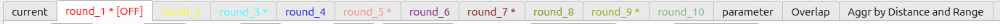

<p><em><a href="#fig-round-off"><strong>Figure 25. Disabled Round State.</strong></a> Round disabled using the <code>[OFF]</code> status.</em></p>

</div>

#### Disabled Round Behavior

| Behavior | Description |
|---|---|
| Excluded from aggregation | Disabled round is ignored during aggregation calculation. |
| Excluded from graphs | Disabled round is not included in graph visualization. |
| Ignored during update | Update-all calculation skips this round. |
| Data remains stored | Table data still exists but is temporarily ignored. |

---

### 2.4 Right Click Menu on Round Tabs

Each round tab supports a custom right-click menu.

<div className="center">

<a id="fig-round-context-menu"></a>

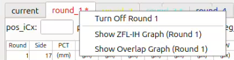

<p><em><a href="#fig-round-context-menu"><strong>Figure 26. Round Tab Right-Click Menu.</strong></a> Context menu used to control round behavior and graphs.</em></p>

</div>

#### Available Menu Actions

| Menu Action | Purpose |
|---|---|
| Turn Off Round | Disable round calculation and plotting. |
| Show ZFL-IH Graph | Open single-round ZFL-IH popup graph. |
| Show Overlap Graph | Open overlap graph popup. |

#### Related Code

```python
self.tabwidget.setContextMenuPolicy(Qt.CustomContextMenu)
self.tabwidget.customContextMenuRequested.connect(self.show_round_context_menu)
```
---

### 2.5 ZFL-IH Popup Graph

The **Show ZFL-IH Graph** menu opens a popup graph for the selected round.

<div className="center">

<a id="fig-zfl-ih-popup"></a>

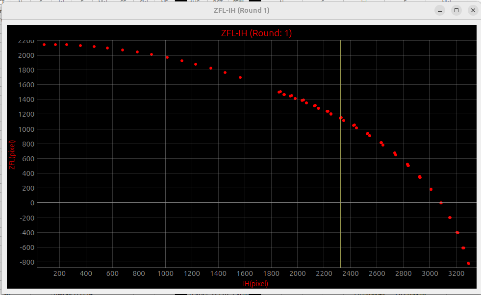

<p><em><a href="#fig-zfl-ih-popup"><strong>Figure 27. ZFL-IH Popup Graph.</strong></a> Popup graph showing IH versus ZFL behavior for one calibration round.</em></p>

</div>

#### Graph Information

| Graph Element | Meaning |
|---|---|
| X-axis | IH value |
| Y-axis | ZFL value |
| Red points | Calibration samples |
| Yellow line | Reference IH position |

#### Purpose

- inspect IH-ZFL smoothness,
- detect unstable regions,
- identify abnormal points,
- compare curve behavior between rounds.

---

### 2.6 Overlap Popup Graph

The **Show Overlap Graph** menu opens an overlap visualization for the selected round.

<div className="center">

<a id="fig-overlap-popup"></a>

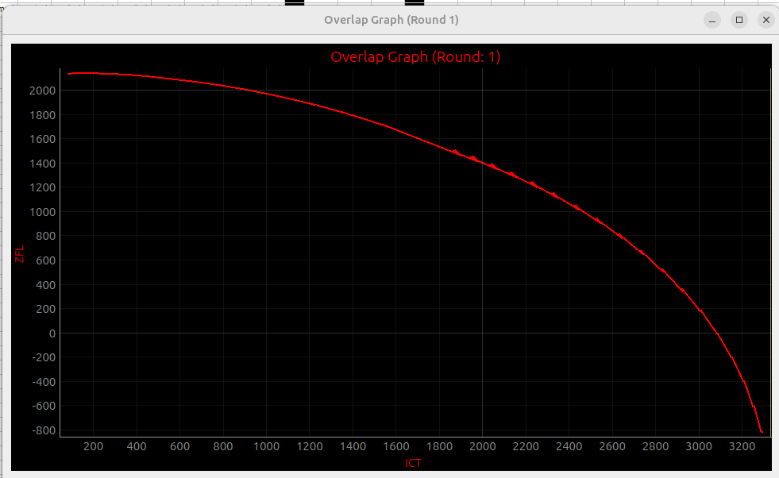

<p><em><a href="#fig-overlap-popup"><strong>Figure 28. Overlap Popup Graph.</strong></a> Overlap graph visualization for one calibration round.</em></p>

</div>

#### Graph Information

| Element | Meaning |
|---|---|
| X-axis | ICT |
| Y-axis | ZFL |
| Red curve | Calculated overlap curve |
| Yellow line | Reference position |

#### Purpose

- inspect overlap continuity,
- compare round consistency,
- detect unstable transitions,
- identify outlier points.

---

### 2.7 Recommended Workflow

<div className="custom-note custom-tip">

<div className="custom-note-title">Recommended Workflow</div>

1. Load calibration data first.
2. Check which rounds contain `*`.
3. Disable unused rounds if needed.
4. Open the ZFL-IH graph to inspect curve smoothness.
5. Open the overlap graph to inspect overlap continuity.
6. Continue with aggregation or range analysis.

</div>

---

## 3. Result Table View

<a id="result-table-view"></a>

<div className="center">

<a id="fig-result-table-view"></a>

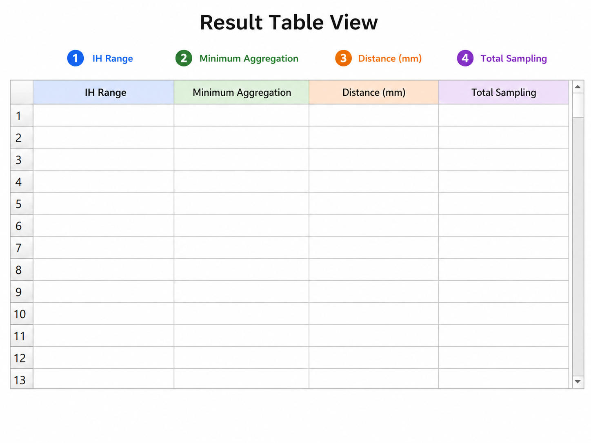

<p><em><a href="#fig-result-table-view"><strong>Figure 29. Result Table View.</strong></a> Summary table showing IH range, minimum aggregation, best distance, and total sampling.</em></p>

</div>

The **Result Table View** is the output table for the interval aggregation process. This table is closely connected to **[Section 6. Min Aggregation by Interval](#6-min-aggregation-by-interval)**.

In simple terms:

```text
Section 6 setup
   ↓
Click Min Aggregation by Interval
   ↓
System searches best distance and minimum aggregation
   ↓
Section 3 Result Table View is filled
   ↓
The same result can be saved as CSV
```
<div className="custom-note custom-important">

<div className="custom-note-title">Relationship Between Section 3 and Section 6</div>

The values shown in **Result Table View** are generated from the settings in **Min Aggregation by Interval**. Therefore, Section 3 should be understood as the **result/output area**, while Section 6 is the **setup/process area**.

</div>

### 3.1 Output Example After Running Min Aggregation by Interval

The screenshot below shows the result table after the interval calculation has been executed. The table contains the generated IH interval rows and the calculated output values.

<div className="center">

<a id="fig-result-table-after-interval"></a>

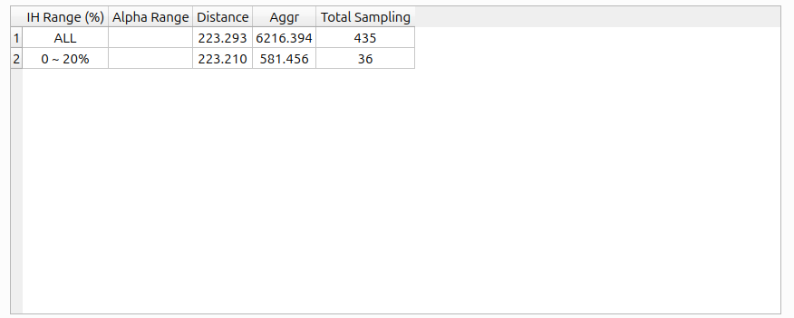

<p><em><a href="#fig-result-table-after-interval"><strong>Figure 30. Result Table Output from Min Aggregation by Interval.</strong></a> Result table filled after the interval aggregation calculation is completed.</em></p>

</div>

### 3.2 Visible Columns

| No. | Column | Generated From | Description |
|---:|---|---|---|
| 1 | **IH Range (%)** | `IH Min`, `IH Max`, `Window`, and `Step` from Section 6 | Shows the IH interval being analyzed, for example `ALL` or `0 ~ 20%`. |
| 2 | **Alpha Range** | Calculated alpha values inside the selected IH range | Shows the alpha range if alpha data is available. |
| 3 | **Distance** | Best-distance search result | Shows the distance that produces the lowest aggregation in that IH interval. |
| 4 | **Aggr** | Aggregation calculation result | Shows the aggregation value at the selected or best distance. |
| 5 | **Total Sampling** | Number of IH/ZFL samples inside the range | Shows how many valid data points were used for that interval. |

### 3.3 Meaning of Each Output Row

Each row represents one interval analysis result.

| Row Example | Meaning |
|---|---|
| `ALL` | Global calculation using all available samples. |
| `0 ~ 20%` | Calculation using only samples inside the 0 to 20 percent IH range. |

For example, if the table shows:

```text
IH Range (%)    Distance    Aggr      Total Sampling
ALL             223.293     6216.394  435
0 ~ 20%         223.210     581.456   36
```
It means the system calculated one global result and one interval-specific result. The interval-specific row uses fewer samples because it only includes points inside the selected IH percentage range.

### 3.4 Why Total Sampling Is Important

`Total Sampling` shows how much data was used to produce the result.

| Total Sampling Condition | Interpretation |
|---|---|
| High sampling count | Result is usually more reliable because more data points are used. |
| Low sampling count | Result should be checked carefully because it is based on fewer data points. |
| Empty or zero sampling | The interval may not contain valid IH/ZFL data. |

<div className="custom-note custom-warning">

<div className="custom-note-title">Important</div>

If **Total Sampling** is too small, the minimum aggregation result may be less reliable. Always check this column before deciding that a distance value is good.

</div>

### 3.5 How Result Table View Is Filled

The table is filled after the user runs **Min Aggregation by Interval** in Section 6.

```text
User enters interval setup
   ↓
System filters IH data by interval
   ↓
System searches distance
   ↓
System calculates aggregation
   ↓
System counts total sampling
   ↓
Result Table View is updated
```
### 3.6 CSV Output Relationship

The same result shown in the table can also be saved as a CSV file. After the calculation finishes, the system can open a save dialog and write the table output into `interval.csv` or another selected file name.

The saved CSV contains the same main output columns:

```text
IH Range (%), Alpha Range, Distance, Aggr, Total Sampling
```
---
## 4. V_Gap & H_Gap Settings

<a id="vgap-hgap-settings"></a>

<div className="center">

<a id="fig-vgap-hgap-settings"></a>

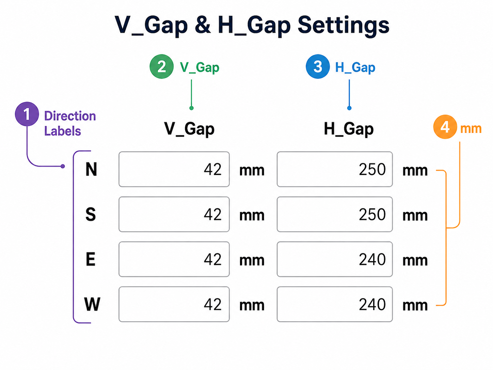

<p><em><a href="#fig-vgap-hgap-settings"><strong>Figure 25. V_Gap & H_Gap Settings.</strong></a> Physical gap settings used together with the selected calibration system.</em></p>

</div>

The **V_Gap & H_Gap** section is part of the calibration system geometry configuration. These values should match the selected system in **Select Cali System**.

This means **V_Gap & H_Gap**, **Pixel Size**, and **Select Cali System** are connected. They are used together to calculate side-screen alpha, ZFL, and aggregation results.

<div className="custom-note custom-important">

<div className="custom-note-title">Configuration Relationship</div>

When the user changes **Select Cali System**, the physical geometry may also change. Therefore, the user should always confirm **V_Gap**, **H_Gap**, **Pixel Size (Top)**, **Pixel Size (Side)**, and **Dis / Round** before running the final calculation.

</div>

### 4.1 Main Components

| No. | Component | Description |
|---:|---|---|
| 1 | **Direction Labels** | Shows direction labels `N`, `S`, `E`, and `W`. |
| 2 | **V_Gap** | Vertical gap value for each side direction. |
| 3 | **H_Gap** | Horizontal gap value for each side direction. |
| 4 | **mm** | Unit label showing that the values are in millimeters. |

### 4.2 Direction Meaning

| Direction | Meaning |
|---|---|
| `N` | North direction. |
| `S` | South direction. |
| `E` | East direction. |
| `W` | West direction. |

### 4.3 How This Section Connects to Select Cali System

The selected calibration system defines the physical layout of the calibration setup. The **V_Gap** and **H_Gap** values describe the gap geometry for that selected layout.

| Selected System Setting | Connected Value |
|---|---|
| Calibration system type | Determines which physical setup is used. |
| V_Gap | Defines vertical offset for each side direction. |
| H_Gap | Defines horizontal offset for each side direction. |
| Pixel Size | Converts PCT data before alpha and ZFL are calculated. |
| Distance / Round | Defines the distance used together with gap values. |

### 4.4 Related Line Edits

The gap values are connected to recalculation through `lineedit_connect()`.

```python
self.lineedit_v_gap_n.returnPressed.connect(self.onclick_btn_update_all_cali_result)
self.lineedit_v_gap_s.returnPressed.connect(self.onclick_btn_update_all_cali_result)
self.lineedit_v_gap_w.returnPressed.connect(self.onclick_btn_update_all_cali_result)
self.lineedit_v_gap_e.returnPressed.connect(self.onclick_btn_update_all_cali_result)
self.lineedit_h_gap_n.returnPressed.connect(self.onclick_btn_update_all_cali_result)
self.lineedit_h_gap_s.returnPressed.connect(self.onclick_btn_update_all_cali_result)
self.lineedit_h_gap_w.returnPressed.connect(self.onclick_btn_update_all_cali_result)
self.lineedit_h_gap_e.returnPressed.connect(self.onclick_btn_update_all_cali_result)
```
This means pressing **Enter** in any V_Gap or H_Gap field recalculates all enabled round results.

### 4.5 How the Values Are Used

For top-screen layers, alpha is calculated using distance and calibrated PCT:

```text
alpha = atan(pct_cal / distance)
```
For side-screen layers, alpha is calculated using **V_Gap** and **H_Gap**:

```text
alpha = π/2 - atan((distance - pct_cal - v_gap) / h_gap)
```
After alpha is calculated, ZFL is calculated using:

```text
zfl = 1 / tan(alpha) × ict
```
### 4.6 How to Use

1. Select the correct **Cali System** first.
2. Confirm that the V_Gap and H_Gap values match the selected system.
3. Edit the values if the physical setup is different.
4. Press **Enter** after editing a value.
5. Confirm **Pixel Size** and **Dis / Round** in the next section.
6. Run **Update All Cali Result**.
7. Check IH-ZFL and Overlap graphs to confirm that the result is stable.

<div className="custom-note custom-warning">

<div className="custom-note-title">Warning</div>

Incorrect V_Gap or H_Gap values can produce wrong alpha and ZFL results, especially for side-screen layers. Always check these values together with **Select Cali System** and **Pixel Size**.

</div>

---

## 5. Pixel Size & Distance / Round

<a id="pixel-size-distance-round"></a>

<div className="center">

<a id="fig-pixel-size-distance-round"></a>

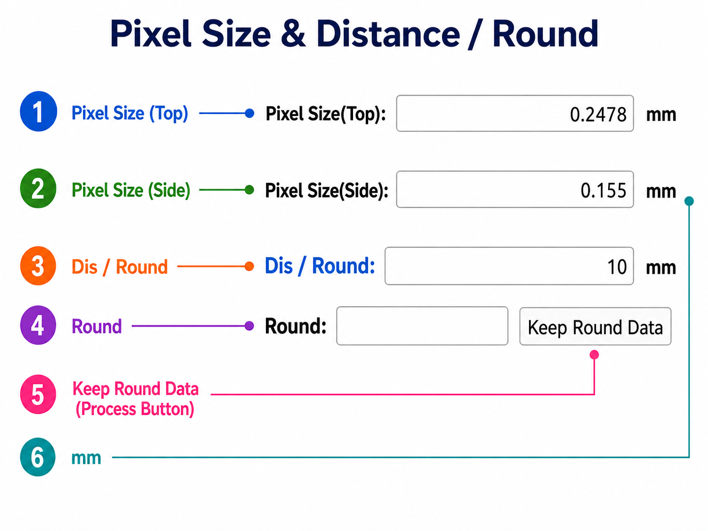

<p><em><a href="#fig-pixel-size-distance-round"><strong>Figure 26. Pixel Size & Distance / Round.</strong></a> Pixel size and distance settings used together with V_Gap, H_Gap, and the selected calibration system.</em></p>

</div>

The **Pixel Size & Distance / Round** section is also part of the same calibration system configuration group. It should be checked together with **Select Cali System** and **V_Gap & H_Gap**.

This section controls how PCT data is converted into millimeters and how the distance changes between calibration rounds.

### 5.1 Why This Section Is Connected to Select Cali System

The selected calibration system defines the calibration setup. The pixel size values and distance-per-round value describe how that setup should be calculated.

```text
Select Cali System
   ↓
Confirm V_Gap / H_Gap
   ↓
Confirm Pixel Size Top / Side
   ↓
Confirm Dis / Round
   ↓
Calculate PCT_CAL, Distance, Alpha, ZFL
```
If the selected system is changed, the user should confirm these values again because a different system may use different screen geometry, pixel conversion, or distance step.

### 5.2 Main Components

| No. | Component | Related Widget | Description |
|---:|---|---|---|
| 1 | **Pixel Size (Top)** | `lineedit_pixel_size_top` | Pixel size used for top-screen layers. |
| 2 | **Pixel Size (Side)** | `lineedit_pixel_size_side` | Pixel size used for side-screen layers. |
| 3 | **Dis / Round** | `lineedit_dis_per_round` | Distance increment between rounds. |
| 4 | **Round** | `lineedit_round` | Target round number for copying current data. |
| 5 | **Keep Round Data** | `btn_keep_round_data` | Copies current table data into the selected round. |
| 6 | **mm** | Unit label | Shows millimeter unit. |

### 5.3 Pixel Size Usage

Pixel size is used inside `calculate_pct_cal()` to convert PCT pixel values into physical millimeter values.

The system selects the pixel size based on the layer position:

| Layer Condition | Pixel Size Used |
|---|---|
| `layer < side_layer` | Pixel Size (Top) |
| `layer >= side_layer` | Pixel Size (Side) |

Simplified formula:

```text
pct_cal = sum(PCT values) × selected_pixel_size
```
The calculated `pct_cal` is then used together with **distance**, **V_Gap**, and **H_Gap** to calculate alpha and ZFL.

### 5.4 Distance / Round Formula

When **Single Distance** is not enabled, distance is calculated automatically:

```text
distance = base_distance + dis_per_round × (current_round - first_valid_round)
```
| Term | Meaning |
|---|---|
| `base_distance` | The starting distance value. |
| `dis_per_round` | The distance increment between rounds. |
| `current_round` | The active round number. |
| `first_valid_round` | The first round that contains valid ICT/IH data. |

### 5.5 Calculation Relationship

These values work together in the calculation pipeline:

| Value | Used For |
|---|---|
| Select Cali System | Determines which configuration profile should be used. |
| Pixel Size Top / Side | Converts PCT into `pct_cal`. |
| Distance / Round | Calculates distance for each round. |
| V_Gap / H_Gap | Calculates side-screen alpha. |
| Alpha | Used to calculate ZFL. |
| ZFL | Used for IH-ZFL curve and aggregation analysis. |

### 5.6 Keep Round Data Function

Related function:

```python
onclick_btn_keep_round_data()
```
This function copies data from the current table into the selected round table.

Simplified flow:

```text
Enter target round
   ↓
Click Keep Round Data
   ↓
Read data from tablewidget_0
   ↓
Copy data into tablewidget_{round}
```
### 5.7 How to Use

1. Select the correct **Cali System** first.
2. Confirm **V_Gap** and **H_Gap** values.
3. Enter correct **Pixel Size (Top)** and **Pixel Size (Side)** values.
4. Enter **Dis / Round** according to the distance step between rounds.
5. Press **Enter** after editing pixel size or distance-per-round fields.
6. Run **Update All Cali Result**.
7. Check the calculated alpha, ZFL, overlap, and aggregation result.

<div className="custom-note custom-tip">

<div className="custom-note-title">Note</div>

Use **Pixel Size**, **Dis / Round**, **V_Gap**, **H_Gap**, and **Select Cali System** as one connected configuration group. Do not adjust only one of them without checking the others.

</div>

---

## 6. Min Aggregation by Interval

<a id="min-aggregation-by-interval"></a>

<div className="center">

<a id="fig-min-aggregation-by-interval"></a>

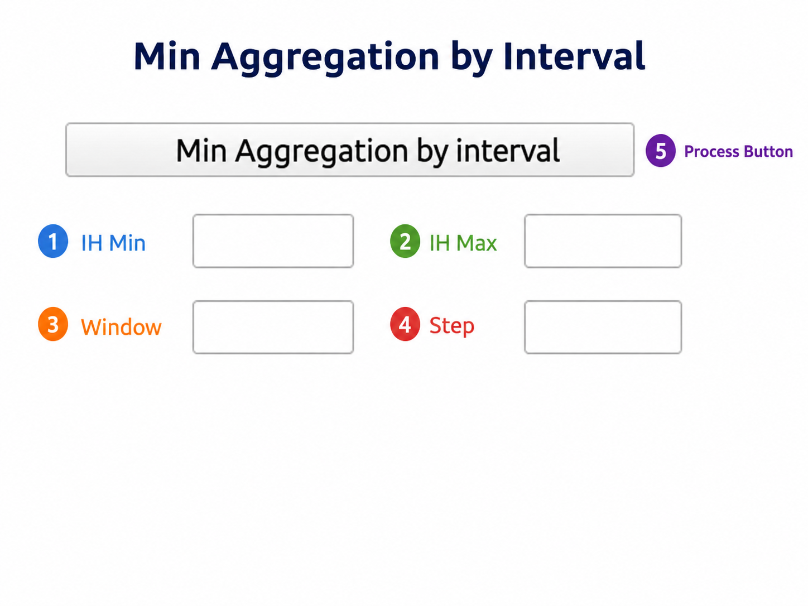

<p><em><a href="#fig-min-aggregation-by-interval"><strong>Figure 27. Min Aggregation by Interval.</strong></a> Interval settings used to search minimum aggregation across IH percentage ranges.</em></p>

</div>

The **Min Aggregation by Interval** panel is the setup and process area used to generate the values displayed in **[Section 3. Result Table View](#3-result-table-view)**.

This means Section 6 is not separate from Section 3. Section 6 defines the interval rules, and Section 3 displays the calculated result.

```text
Min Aggregation by Interval setup
   ↓
Run process button
   ↓
Calculate best distance and aggregation
   ↓
Show result in Result Table View
   ↓
Save result to CSV
```
### 6.1 Input Example

The screenshot below shows an example setup:

<div className="center">

<a id="fig-min-aggregation-input-example"></a>

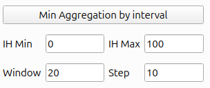

<p><em><a href="#fig-min-aggregation-input-example"><strong>Figure 31. Min Aggregation by Interval Input Example.</strong></a> Example settings using IH Min = 0, IH Max = 100, Window = 20, and Step = 10.</em></p>

</div>

In this example:

| Field | Value | Meaning |
|---|---:|---|
| **IH Min** | `0` | The interval search starts from 0 percent IH. |
| **IH Max** | `100` | The interval search can go up to 100 percent IH. |
| **Window** | `20` | Each interval covers 20 percent IH range. |
| **Step** | `10` | The interval moves forward by 10 percent each step. |

With this setup, the system can generate interval ranges such as:

```text
0 ~ 20%
10 ~ 30%
20 ~ 40%
...
80 ~ 100%
```
### 6.2 Main Components

| No. | Component | Description |
|---:|---|---|
| 1 | **IH Min** | Starting IH percentage value. |
| 2 | **IH Max** | Ending IH percentage value. |
| 3 | **Window** | Width of each IH interval. |
| 4 | **Step** | Shift value used to move from one interval to the next interval. |
| 5 | **Process Button** | Starts the minimum aggregation by interval process. |

### 6.3 Meaning of Window and Step

`Window` and `Step` are IH percentage settings.

They are not time values.

| Parameter | Meaning | Example |
|---|---|---|
| **Window** | Size of each interval range | `20` means each interval covers 20 percent IH. |
| **Step** | Movement between interval starts | `10` means the next interval starts 10 percent after the previous start. |

Example:

```text
IH Min = 0
IH Max = 100
Window = 20
Step = 10
```
Generated intervals:

```text
0 ~ 20%
10 ~ 30%
20 ~ 40%
30 ~ 50%
...
80 ~ 100%
```
### 6.4 Process Flow

When the user clicks **Min Aggregation by interval**, the system performs the following process:

```text
Read IH Min, IH Max, Window, and Step
   ↓
Collect IH and ZFL data from enabled rounds
   ↓
Generate interval ranges
   ↓
Convert IH percentage interval into actual IH pixel bounds
   ↓
Search the best distance for each interval
   ↓
Calculate minimum aggregation
   ↓
Count total sampling
   ↓
Fill Result Table View
   ↓
Ask user where to save CSV
   ↓
Save interval result to CSV
```
### 6.5 Result Written to Section 3

After the process is complete, the output is shown in **Result Table View**.

<div className="center">

<a id="fig-result-table-output-from-interval"></a>


<p><em><a href="#fig-result-table-output-from-interval"><strong>Figure 32. Result Table Generated from Interval Setup.</strong></a> The result table is filled using the interval setup from this section.</em></p>

</div>

The output columns are:

| Output Column | Meaning |
|---|---|
| **IH Range (%)** | The generated interval range. |
| **Alpha Range** | Minimum and maximum alpha value inside that interval. |
| **Distance** | Best distance found for that interval. |
| **Aggr** | Minimum aggregation value for that interval. |
| **Total Sampling** | Number of valid data samples inside that interval. |

### 6.6 Save CSV Dialog

After the interval calculation, the system can ask the user to save the result as a CSV file.

<div className="center">

<a id="fig-interval-save-dialog"></a>

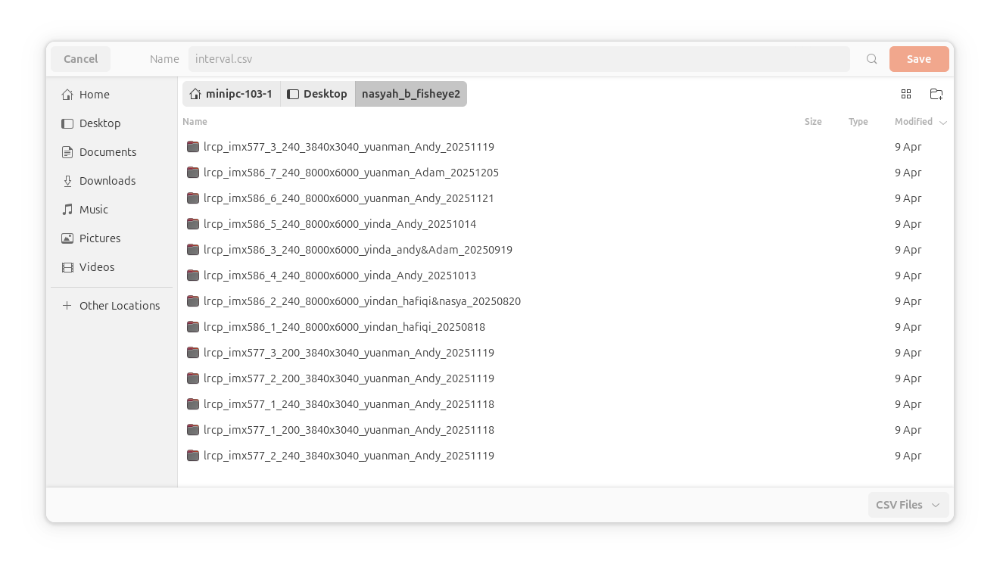

<p><em><a href="#fig-interval-save-dialog"><strong>Figure 33. Interval CSV Save Dialog.</strong></a> Save dialog used to choose the output location and CSV file name.</em></p>

</div>

Use this dialog to choose where the interval result should be saved.

The default or example file name can be:

```text
interval.csv
```
### 6.7 Save Confirmation

After the CSV file is saved, a confirmation message is displayed.

<div className="center">

<a id="fig-interval-save-confirmation"></a>

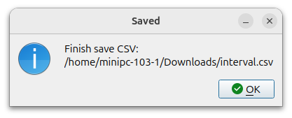

<p><em><a href="#fig-interval-save-confirmation"><strong>Figure 34. Interval CSV Saved Confirmation.</strong></a> Confirmation message showing that the CSV file has been saved successfully.</em></p>

</div>

The message shows the final save path, for example:

```text
/home/minipc-103-1/Downloads/interval.csv
```
### 6.8 CSV File Output

The saved CSV can be opened using spreadsheet software such as LibreOffice Calc.

<div className="center">

<a id="fig-interval-csv-libreoffice"></a>

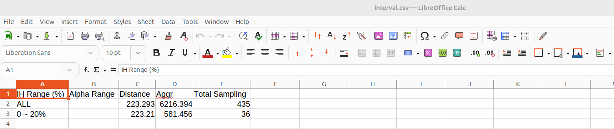

<p><em><a href="#fig-interval-csv-libreoffice"><strong>Figure 35. Interval CSV Opened in LibreOffice Calc.</strong></a> Saved interval result opened as a CSV spreadsheet.</em></p>

</div>

The CSV output contains the same result columns as the Result Table View:

```text
IH Range (%), Alpha Range, Distance, Aggr, Total Sampling
```
### 6.9 How to Use

1. Load calibration data first.
2. Make sure the required rounds are enabled.
3. Confirm that IH/ZFL data exists.
4. Enter **IH Min**.
5. Enter **IH Max**.
6. Enter **Window**.
7. Enter **Step**.
8. Click **Min Aggregation by interval**.
9. Check the output in **Result Table View**.
10. Save the output CSV when the save dialog appears.
11. Open the CSV file if you need to inspect or share the result.

<div className="custom-note custom-warning">

<div className="custom-note-title">Important</div>

If no valid IH/ZFL data exists in the enabled rounds, the interval calculation cannot produce a reliable result. Always load and update calibration data before running this process.

</div>

---
## 7. Aggr by Range and Distance

<a id="aggr-by-range-and-distance"></a>

The **Aggr by Range and Distance** section is used to calculate the aggregation value based on a selected **IH range** and a specific **distance**.

Unlike **Min Aggregation by Interval**, which automatically generates multiple interval ranges, this section focuses on **one selected IH range only**.

This tool is commonly used when the user wants to:

- manually inspect aggregation behavior,
- verify a specific distance result,
- compare aggregation values between IH ranges,
- check whether a selected distance produces a stable IH-ZFL curve.

---

<div className="center">

<a id="fig-aggr-by-range-distance"></a>

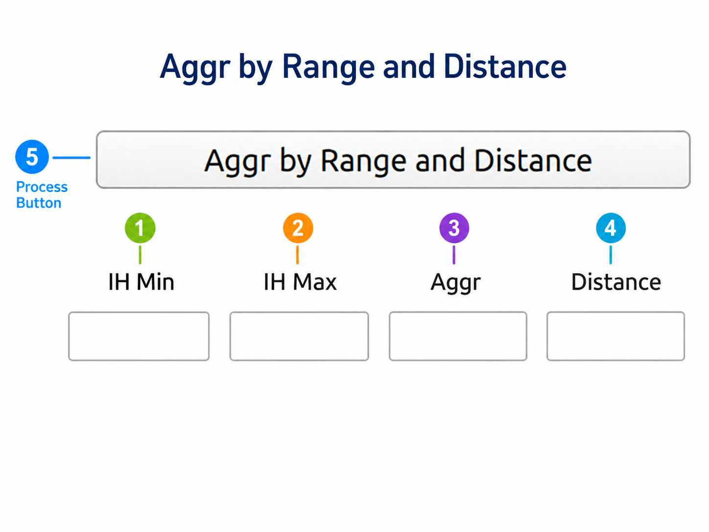

<p><em><a href="#fig-aggr-by-range-distance"><strong>Figure 13. Aggr by Range and Distance.</strong></a> Main calculation panel used to calculate aggregation from IH range and distance.</em></p>

</div>

---

### 7.1 Main Components

| No. | Component | Description |
|---:|---|---|
| 1 | **IH Min** | Minimum IH percentage used as the lower boundary of the selected range. |
| 2 | **IH Max** | Maximum IH percentage used as the upper boundary of the selected range. |
| 3 | **Aggr** | Output aggregation value calculated by the system. |
| 4 | **Distance** | Input distance value used during aggregation calculation. |
| 5 | **Process Button** | Starts the aggregation calculation process. |

---

### 7.2 Example Result

The image below shows an example result generated by the system.

<div className="center">

<a id="fig-aggr-range-distance-example"></a>

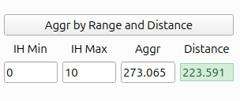

<p><em><a href="#fig-aggr-range-distance-example"><strong>Figure 14. Aggr by Range and Distance Example.</strong></a> Example showing aggregation result calculated from IH range and distance.</em></p>

</div>

Based on Figure 14:

| Field | Value | Meaning |
|---|---:|---|
| **IH Min** | `0` | Aggregation starts from 0 percent IH. |
| **IH Max** | `10` | Aggregation only uses data until 10 percent IH. |
| **Distance** | `223.591` | Distance value used during calculation. |
| **Aggr Result** | `273.065` | Aggregation value generated from the selected IH range and distance. |

This means the system analyzes the **0 ~ 10% IH range** and calculates the aggregation value using distance **223.591**.
The calculated aggregation result is **273.065**.

---

### 7.3 Main Purpose

This section is mainly used to evaluate aggregation behavior for one selected IH range.

General workflow:

```text
Select IH range
        ↓
Enter distance value
        ↓
Run aggregation calculation
        ↓
System filters IH-ZFL data inside selected IH range
        ↓
Aggregation value is calculated
        ↓
Result is displayed in Aggr field
```
---

### 7.4 Calculation Concept

Aggregation is used to measure how smooth or stable the IH-ZFL curve is.

```text
Lower aggregation
        ↓
Smoother IH-ZFL curve
        ↓
More stable calibration result
```
```text
Higher aggregation
        ↓
More unstable curve
        ↓
Larger jumps between IH-ZFL points
```

Because of this relationship, the aggregation value is often used to check whether a distance configuration produces a stable calibration result.

---

### 7.5 Relationship with IH-ZFL Graph

The aggregation value is directly related to the IH-ZFL curve behavior.

```text
Distance changes
        ↓
ZFL values change
        ↓
IH-ZFL curve shape changes
        ↓
Aggregation value changes
```
For this reason, users commonly use these tools together:

| Tool | Purpose |
|---|---|
| **ZFL-IH Graph** | Visually inspect the IH-ZFL curve. |
| **Overlap Graph** | Check whether curve overlap is stable. |
| **Aggr by Range and Distance** | Calculate aggregation value numerically for a selected range and distance. |

---

### 7.6 How to Use

#### Manual Aggregation Check

Use this when you already have a distance value and want to calculate its aggregation.

1. Enter **IH Min**.
2. Enter **IH Max**.
3. Enter **Distance**.
4. Click **Aggr by Range and Distance**.
5. Check the calculated aggregation result in the **Aggr** field.

---

#### Compare Multiple IH Ranges

Use this when you want to compare aggregation stability across different IH ranges.

1. Set one IH range, for example `0 ~ 10`.
2. Enter the distance value.
3. Run the calculation.
4. Record the aggregation result.
5. Change the IH range, for example `10 ~ 20`.
6. Run the calculation again.
7. Compare the aggregation values.

This helps identify which IH region produces the most stable calibration result.

---

### 7.7 Related Function

```python
onclick_btn_aggr_by_range_and_distance()
```
Button connection:

```python
self.btn_aggr_by_range_and_distance.clicked.connect(
    self.onclick_btn_aggr_by_range_and_distance
)
```
---

### 7.8 Recommended Workflow

<div className="custom-note custom-tip">

<div className="custom-note-title">
Recommended Workflow
</div>

1. Load and update calibration data first.
2. Confirm IH-ZFL data already exists.
3. Select the target IH range.
4. Enter the distance value.
5. Run aggregation calculation.
6. Compare the result with the ZFL-IH graph.
7. Inspect whether the aggregation value is stable.

</div>

---

### 7.9 Important Notes

<div className="custom-note custom-warning">

<div className="custom-note-title">
Important
</div>

The aggregation result depends heavily on:

- valid IH-ZFL data,
- correct distance configuration,
- correct calibration geometry,
- and enabled calibration rounds.

If the calibration data is incomplete or unstable, the aggregation result may also become unstable.

</div>

---

## 8. Range Analysis Matrix

<a id="range-analysis-matrix"></a>

<div className="center">

<a id="fig-range-analysis-matrix"></a>

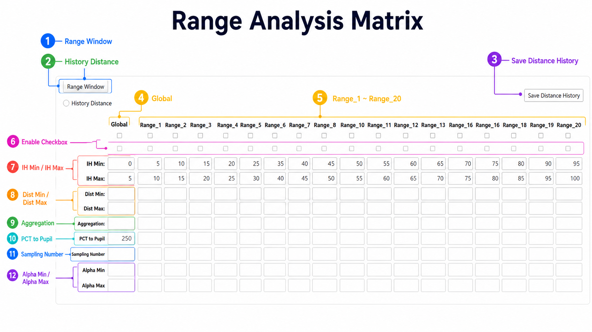

<p><em><a href="#fig-range-analysis-matrix"><strong>Figure 34. Range Analysis Matrix.</strong></a> Matrix used to calculate global and range-based distance and aggregation results.</em></p>

</div>

The **Range Analysis Matrix** is used to manage multiple IH range calculations from **Global** and `Range_1` to `Range_20`. This is the main area for finding best distances and minimum aggregation values across IH percentage ranges.

### 8.1 Main Components

| No. | Component | Description |
|---:|---|---|
| 1 | **Range Window** | Opens or applies range window settings. |
| 2 | **History Distance** | Reuses saved distance history when IH range matches. |
| 3 | **Save Distance History** | Saves current best distance results for later reuse. |
| 4 | **Global** | Global range without specific IH filter. |
| 5 | **Range_1 ~ Range_20** | IH percentage ranges used for range analysis. |
| 6 | **Enable Checkbox** | Enables or disables each range calculation. |
| 7 | **IH Min / IH Max** | IH percentage bounds for each range. |
| 8 | **Dist Min / Dist Max** | Distance search limits for each range. |
| 9 | **Aggregation** | Output minimum aggregation value. |
| 10 | **PCT to Pupil** | Reference PCT-to-pupil value. |
| 11 | **Sampling Number** | Number of samples inside the range. |
| 12 | **Alpha Min / Alpha Max** | Alpha range output, usually shown in degrees. |

### 8.2 Related Functions

| Function | Purpose |
|---|---|
| `onclick_btn_range_window()` | Handles Range Window button behavior. |
| `onclick_btn_history_distance()` | Loads or applies saved history distance. |
| `onclick_btn_save_history_distance()` | Saves current best distance history. |
| `_on_toggle_enable_range()` | Runs range search when a range checkbox is enabled. |
| `_on_toggle_enable_range_00()` | Handles master/global range toggle behavior. |
| `find_min_aggregation_by_lineedit()` | Searches distance with minimum aggregation. |
| `calculate_aggregation_by_distance()` | Calculates aggregation for a given distance. |
| `update_data_total_for_range()` | Updates sample count for a range. |
| `get_pixel_bounds_for_range()` | Converts IH percentage range into pixel bounds. |

### 8.3 Global and Range_1 ~ Range_20

`Global` is also called `range_0`. It calculates aggregation using all enabled data points without applying a specific IH percentage filter.

`Range_1` to `Range_20` are normally used as 5% IH percentage ranges:

```text
Range_1  = 0 ~ 5%
Range_2  = 5 ~ 10%
Range_3  = 10 ~ 15%
...
Range_20 = 95 ~ 100%
```
### 8.4 Range Calculation Flow

```text
Enable range checkbox
   ↓
Read IH Min and IH Max
   ↓
Convert IH percentage to pixel range
   ↓
Read Dist Min and Dist Max
   ↓
Check history distance mode
   ↓
Search best distance if needed
   ↓
Calculate minimum aggregation
   ↓
Update distance, aggregation, sampling number, and alpha range
```
### 8.5 Enable Checkbox Behavior

Each range has an enable checkbox. When the checkbox is turned on, the system starts processing that range.

Related connection:

```python
for i in range(0, 21):
    cb = getattr(self, f"checkbox_enable_range_{i}", None)
    if cb:
        cb.toggled.connect(lambda checked, i=i: self._on_toggle_enable_range(i, checked))
```
When the checkbox is turned off, the system stops or skips that range.

### 8.6 History Distance Mode

When **History Distance** is enabled, the system can reuse previous best distance values.

The history value is only reused when:

```text
current IH Min == history IH Min
current IH Max == history IH Max
```

If the IH range does not match, the system ignores the history value and searches from scratch.

<div className="custom-note custom-tip">

<div className="custom-note-title">History Distance Rule</div>

History distance is only valid when the current IH range exactly matches the saved IH range.

</div>

### 8.7 Save Distance History

The **Save Distance History** button stores the current best distance results so they can be reused later.

Use this after the range calculation has successfully filled distance values.

### 8.8 How to Use Range Analysis Matrix

#### Manual Range Calculation

1. Load calibration data.
2. Run **Update All Cali Result**.
3. Set **IH Min** and **IH Max** for the target range.
4. Optional: set **Dist Min** and **Dist Max**.
5. Enable the checkbox for the range.
6. Wait until **Aggregation** and **Distance** are filled.
7. Check **Sampling Number** and **Alpha Min / Alpha Max**.

#### Use History Distance

1. Make sure distance history exists.
2. Enable **History Distance**.
3. Enable a range checkbox.
4. If the IH range matches history, the distance is reused.
5. If not, the system searches the best distance again.

#### Save New History

1. Finish calculating the ranges.
2. Confirm that distance values are correct.
3. Click **Save Distance History**.
4. The system saves the current distance results.

<div className="custom-note custom-warning">

<div className="custom-note-title">Important</div>

Before saving distance history, make sure the ranges and distance values are correct. Wrong history data can affect future range calculations.

</div>