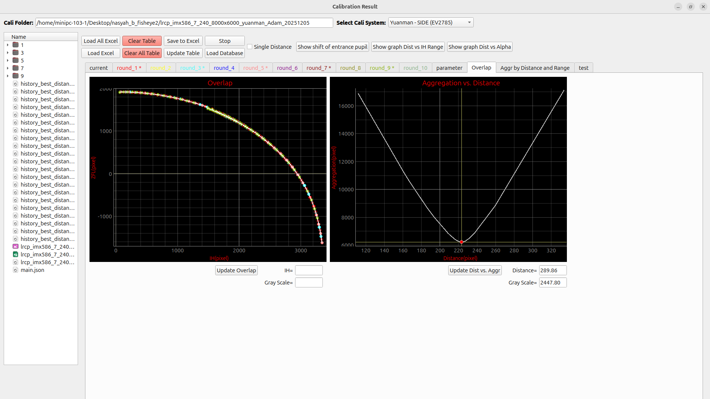

# Overlap and Aggregation View

This page explains the **Overlap** tab in the Calibration Result window. This view is used to check whether the ZFL-IH data from calibration rounds overlap smoothly and to analyze how the **aggregation value changes when the distance value changes**.

<div className="custom-note custom-important">
  <div className="custom-note-title">Main Purpose</div>
  <p>The goal of this page is to help the user evaluate the calibration result visually and numerically. The <strong>Overlap Graph</strong> shows the ZFL-IH consistency between rounds, while the <strong>Aggregation vs. Distance Graph</strong> helps find a distance value that produces the lowest aggregation.</p>
</div>

---

## Overview Images

<div className="center">

<a id="fig-1"></a>


<p><em><a href="#fig-1"><strong>Figure 1.</strong></a> Empty Overlap and Aggregation View with area labels.</em></p>

</div>

<div className="center">

<a id="fig-2"></a>



<p><em><a href="#fig-2"><strong>Figure 2.</strong></a> Overlap and Aggregation View after calibration data is loaded and updated.</em></p>

</div>

| No. | Area | Function |
|---:|---|---|
| 1 | **Overlap Graph** | Displays the ZFL-IH overlap result from enabled calibration rounds. |
| 2 | **Aggregation vs. Distance Graph** | Displays the relationship between distance and aggregation value. |

---

## 1. Overlap Graph

The **Overlap Graph** is the left graph in this tab. It is used to inspect how the ZFL-IH points from the calibration rounds are distributed and whether the data forms a smooth, consistent curve.

### 1.1 Graph Axis Meaning

| Axis | Label | Meaning |
|---|---|---|
| X-axis | **IH (pixel)** | Image height / intersection height value from calibration data. |
| Y-axis | **ZFL (pixel)** | Calculated ZFL value from the calibration result. |

The graph is created in the controller as `plot_overlap`. It uses PyQtGraph, enables grid lines, and uses the same ZFL-IH axis concept as the main ZFL-IH graph.

### 1.2 Related UI Components

| UI Component | Related Function / Variable | Description |
|---|---|---|
| **Overlap graph area** | `plot_overlap` | Main PyQtGraph widget used to display overlap data. |
| **Update Overlap** | `onclick_btn_update_overlap()` | Refreshes the overlap graph using the latest calculated round data. |
| **IH= field** | Mouse / cursor display field | Shows the IH value when inspecting the graph. |
| **Gray Scale field** | Mouse / cursor display field | Shows the corresponding graph value or cursor-related value. |
| Vertical cursor line | `overlap_vline` | Moves with the mouse to help inspect graph coordinates. |
| Horizontal cursor line | `overlap_hline` | Moves with the mouse to help inspect graph coordinates. |

### 1.3 What the Overlap Graph Shows

The graph collects IH and ZFL values from enabled round tables. The data is taken from the calculated table columns:

| Data | Source Column |
|---|---|
| IH value | `ict_avg` or directional `ict_*` values |
| ZFL value | `zfl_avg` or directional `zfl_*` values |

The function used to collect the graph data is:

```python
get_ict_zfl_into_xlist_ylist(table_index)
```
This function returns:

```text
x_list_ict  → IH / ICT values
y_list_zfl  → ZFL values
```
### 1.4 How the Overlap Data Is Built

The system separates the data based on the **side layer**.

| Layer Position | Data Used |
|---|---|
| Before side layer | Uses average values: `ict_avg` and `zfl_avg`. |
| After side layer | Uses directional values: `ict_n`, `ict_s`, `ict_w`, `ict_e`, and corresponding `zfl_*` values. |

This is important because top-screen and side-screen data are calculated differently. The overlap graph helps verify whether both parts still form a consistent result.

### 1.5 How to Use the Overlap Graph

1. Load calibration data using **Load Excel** or **Load All Excel**.
2. Select the correct **Cali System**.
3. Check that **Pixel Size**, **Distance / Round**, **V_Gap**, and **H_Gap** are correct.
4. Click **Update Table** or **Update All Cali Result**.
5. Open the **Overlap** tab.
6. Click **Update Overlap**.
7. Move the mouse over the graph to inspect IH and ZFL positions.
8. Check whether the plotted points overlap smoothly.

<div className="custom-note custom-tip">
  <div className="custom-note-title">How to Read the Overlap Graph</div>
  <ul>
    <li>A smooth and compact curve usually means the calibration rounds are consistent.</li>
    <li>A scattered curve may indicate incorrect distance, wrong center point, wrong gap value, or unstable calibration data.</li>
    <li>Large separation between rounds may mean some rounds should be checked again or disabled from the tab right-click menu.</li>
  </ul>
</div>

---

## 2. Aggregation vs. Distance Graph

The **Aggregation vs. Distance Graph** is the right graph in this tab. It is used to visualize how the aggregation value changes when the distance value changes.

### 2.1 Graph Axis Meaning

| Axis | Label | Meaning |
|---|---|---|
| X-axis | **Distance (pixel)** | Distance value used during calibration calculation. |
| Y-axis | **Aggregation (pixel)** | Aggregation value calculated from the ZFL-IH curve. |

The graph is created in the controller as:

```python
plot_dist_vs_aggr
```
The graph title is:

```text
Aggregation vs. Distance
```
### 2.2 Related UI Components

| UI Component | Related Function / Variable | Description |
|---|---|---|
| **Aggregation vs. Distance graph area** | `plot_dist_vs_aggr` | Main graph for showing aggregation trend by distance. |
| **Update Dist vs. Aggr** | `onclick_btn_update_dist_vs_aggr()` | Redraws the graph using stored distance-aggr samples. |
| **Distance field** | Distance cursor / result field | Displays selected or inspected distance value. |
| **Gray Scale field** | Cursor / graph value field | Displays related graph value while inspecting. |
| Vertical cursor line | `dist_vs_aggr_vline` | Helps inspect distance position on the graph. |
| Horizontal cursor line | `dist_vs_aggr_hline` | Helps inspect aggregation position on the graph. |

### 2.3 What Aggregation Means

Aggregation is a numerical value used to measure the smoothness of the ZFL-IH curve.

The simplified concept is:

```text
Collect IH-ZFL points
   ↓
Sort points by IH
   ↓
Calculate movement between neighboring points
   ↓
Sum all movements
   ↓
Return aggregation value
```
| Aggregation Value | Meaning |
|---|---|
| Lower value | The ZFL-IH curve is smoother and more stable. |
| Higher value | The ZFL-IH curve has larger jumps, scattered points, or unstable behavior. |

The system uses aggregation to compare distance values. The best distance is usually the distance that produces the **minimum aggregation**.

---

## 3. Relationship Between Distance and Aggregation

Distance directly affects the calculation of **alpha** and **ZFL**. Because ZFL depends on alpha, changing the distance changes the final ZFL-IH curve.

The simplified calculation chain is:

```text
Distance changes
   ↓
Alpha changes
   ↓
ZFL changes
   ↓
ZFL-IH curve changes
   ↓
Aggregation value changes
```
The system evaluates different distance values and calculates aggregation for each distance. The graph then shows which distance gives the smallest aggregation.

### 3.1 Related Calculation Functions

| Function | Purpose |
|---|---|
| `calculate_result(table_index)` | Recalculates IH, PCT_CAL, distance, alpha, ZFL, and aggregation for one table. |
| `calculate_aggregation_by_distance(distance, lineedit_distance_range_0, range_min, range_max)` | Calculates aggregation using a specific distance. |
| `find_min_aggregation_by_lineedit(...)` | Searches for the distance that produces the minimum aggregation. |
| `onclick_btn_update_dist_vs_aggr()` | Updates the Aggregation vs. Distance graph. |

---

## 4. Minimum Aggregation Search

The system can search for the best distance automatically. The main function used for this process is:

```python
find_min_aggregation_by_lineedit()
```
This function performs a distance search and evaluates the aggregation value at different distance points.

### 4.1 Default Distance Range

If no custom distance range is provided, the default search range is:

```text
1.0 ~ 500.0
```
### 4.2 Search Flow

```text
Read distance range
   ↓
Evaluate aggregation at distance candidates
   ↓
Compare aggregation values
   ↓
Keep the distance area with lower aggregation
   ↓
Repeat until tolerance or maximum iteration is reached
   ↓
Write best distance and minimum aggregation to the UI
   ↓
Update Aggregation vs. Distance graph
```

### 4.3 Output of the Search

| Output | Meaning |
|---|---|
| **Distance** | Best distance found by the search process. |
| **Aggregation** | Minimum aggregation value at the best distance. |
| **Graph samples** | Distance-aggr points used to draw the graph. |
| **Minimum marker** | The lowest aggregation point on the graph. |

---

## 5. Update Overlap Button

The **Update Overlap** button refreshes the left graph.

### 5.1 When to Click Update Overlap

Click **Update Overlap** after changing:

- loaded Excel data,
- selected calibration system,
- pixel size,
- distance value,
- V_Gap or H_Gap,
- enabled or disabled round status,
- recalculated table values.

### 5.2 Expected Result

After clicking the button, the graph should redraw the latest ZFL-IH overlap data from the enabled rounds.

---

## 6. Update Dist vs. Aggr Button

The **Update Dist vs. Aggr** button refreshes the right graph.

### 6.1 When to Click Update Dist vs. Aggr

Click this button after running a minimum aggregation search or after changing the distance and aggregation calculation settings.

### 6.2 Expected Result

The graph should display the relationship between distance and aggregation. If a minimum point exists, the graph can be used to visually confirm the best distance.

---

## Recommended Workflow

<div className="custom-note custom-important">
  <div className="custom-note-title">Recommended Workflow</div>
  <ol>
    <li>Load calibration data using <strong>Load Excel</strong> or <strong>Load All Excel</strong>.</li>
    <li>Select the correct <strong>Cali System</strong>.</li>
    <li>Check <strong>Pixel Size</strong>, <strong>Distance / Round</strong>, <strong>V_Gap</strong>, and <strong>H_Gap</strong>.</li>
    <li>Click <strong>Update Table</strong> or <strong>Update All Cali Result</strong>.</li>
    <li>Open the <strong>Overlap</strong> tab.</li>
    <li>Click <strong>Update Overlap</strong> and inspect whether the ZFL-IH points are smooth.</li>
    <li>Run aggregation search from the range or aggregation tools.</li>
    <li>Click <strong>Update Dist vs. Aggr</strong> to inspect the distance-aggr relationship.</li>
    <li>Use the distance with the lowest aggregation as the recommended calibration distance.</li>
  </ol>
</div>

---

## Common Problems and Checks

| Problem | Possible Cause | What to Check |
|---|---|---|
| Overlap graph is empty | No valid round data | Load Excel data and run Update Table. |
| Points are very scattered | Wrong center point, distance, gap, or pixel size | Recheck CPX/CPY, distance, V_Gap, H_Gap, and pixel size. |
| Aggregation graph is empty | No distance-aggr samples are available | Run minimum aggregation search first. |
| Aggregation value is very high | ZFL-IH curve is unstable | Check loaded data, disabled rounds, and calibration system selection. |
| Best distance looks wrong | Distance search range may be unsuitable | Check distance min/max settings in the aggregation range tools. |

---

## Summary

The **Overlap and Aggregation View** combines visual inspection and numerical analysis.

- The **Overlap Graph** checks whether the ZFL-IH data from enabled rounds is consistent.
- The **Aggregation vs. Distance Graph** shows how aggregation changes when distance changes.
- The best distance is usually the distance that produces the lowest aggregation value.
- Always update the table and graph after changing calibration parameters.