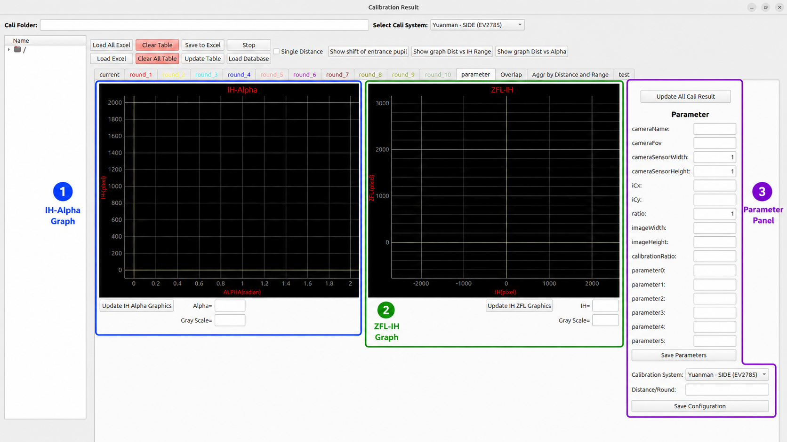
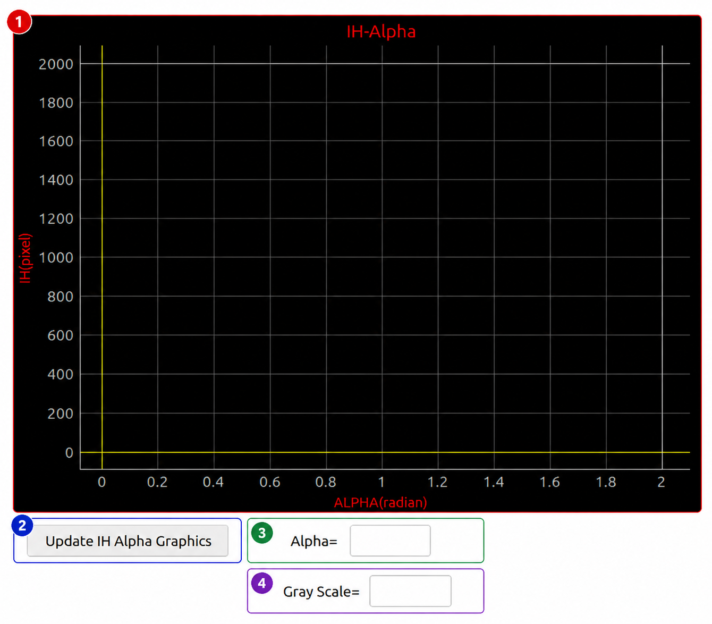
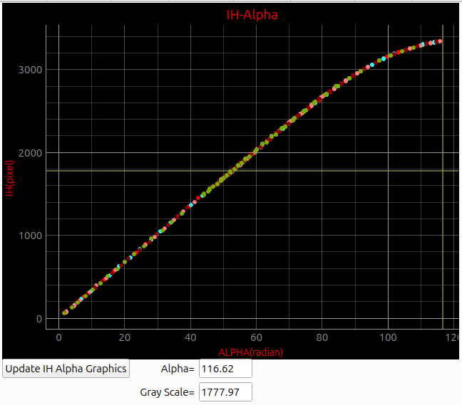
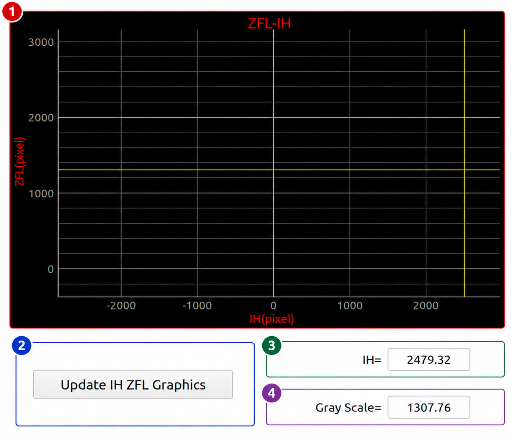
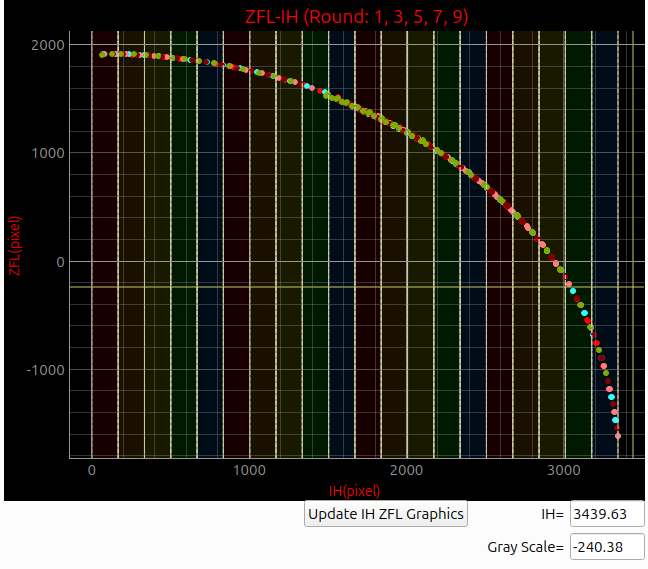
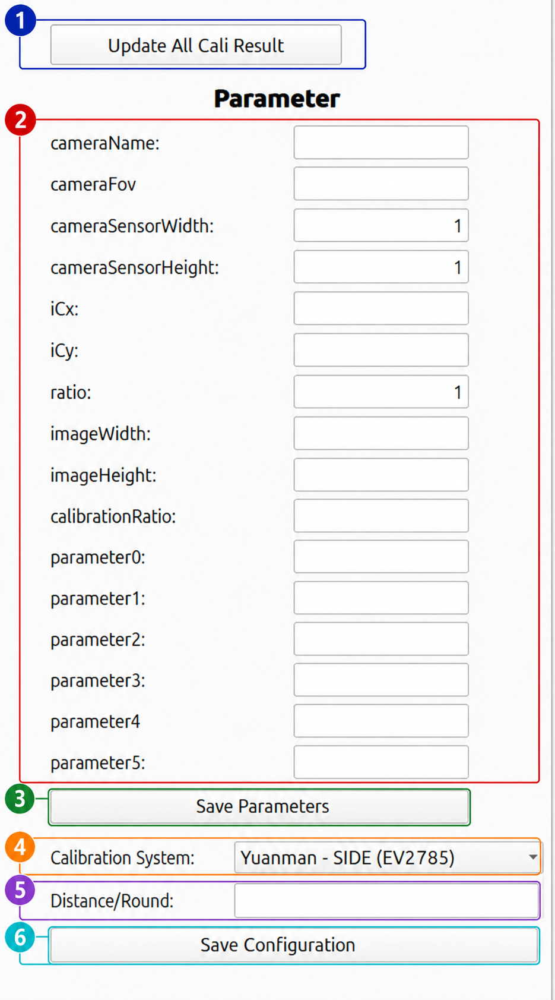

# Parameter View

This page explains the **Parameter View** in the **Main Cali Result** window.

The Parameter View is used to inspect calibration graphs, update calibration results, manage camera parameters, select the calibration system configuration, and save the calibration setup.

The explanation in this document follows the behavior implemented in `controller_cali_result.py`.

---

## Parameter View Overview

<div className="center">

<a id="fig-1"></a>



<p><em><a href="#fig-1"><strong>Figure 1.</strong></a> Parameter View overview.</em></p>

</div>

The Parameter View is divided into three main areas:

| No. | Area | Main Function |
|---:|---|---|
| 1 | **IH-Alpha Graph** | Displays the relationship between Alpha and IH. |
| 2 | **ZFL-IH Graph** | Displays the relationship between IH and ZFL. |
| 3 | **Parameter Panel** | Stores and manages camera parameters, calibration system, and distance configuration. |

The general data flow is:

```text
Loaded calibration data
   ↓
ICT / IH values
   ↓
PCT_CAL calculation
   ↓
Distance calculation
   ↓
Alpha calculation
   ↓
ZFL calculation
   ↓
IH-Alpha graph and ZFL-IH graph
   ↓
Aggregation quality analysis
```
---

## 1. IH-Alpha Graph

<div className="center">

<a id="fig-2"></a>



<p><em><a href="#fig-2"><strong>Figure 2.</strong></a> IH-Alpha graph area.</em></p>

</div>

<div className="center">

<a id="fig-3"></a>



<p><em><a href="#fig-3"><strong>Figure 3.</strong></a> IH-Alpha graph example after calibration data is loaded and updated.</em></p>

</div>

This example image shows the IH-Alpha graph after calibration points are plotted. The colored points represent enabled round data. A smooth and continuous curve means the Alpha values change consistently as IH increases. The cursor line and value fields below the graph show the selected Alpha and IH/Gray Scale reading.


The **IH-Alpha Graph** shows the relationship between **Alpha** and **IH**.

| Axis | Meaning |
|---|---|
| **X-axis** | Alpha value. The code collects Alpha values internally from the calibration table. |
| **Y-axis** | IH / ICT value in pixels. |

In the code, the graph is created as a PyQtGraph widget:

```python
self.plot_ict_alpha = pg.PlotWidget()
self.plot_ict_alpha.showGrid(x=True, y=True, alpha=10)
self.plot_ict_alpha.setTitle("IH-Alpha", color="r", size="14pt")
self.plot_ict_alpha.setLabel('left', "IH(pixel)")
self.plot_ict_alpha.setLabel('bottom', "ALPHA(radian)")
self.plot_ict_alpha.setXRange(0, 2)
self.plot_ict_alpha.setYRange(0, 2000)
```
The graph is placed inside:

```python
self.label_ict_alpha_graphics.addWidget(self.plot_ict_alpha)
```
---

### 1.1 IH-Alpha Components

| No. | Component | Related Object / Function | Explanation |
|---:|---|---|---|
| 1 | **IH-Alpha Graph** | `plot_ict_alpha` | Main graph area that displays Alpha and IH points. |
| 2 | **Update IH Alpha Graphics** | `onclick_btn_update_plot_ih_alpha()` | Refreshes the graph using the latest calculated table values. |
| 3 | **Alpha** | `lineedit_alpha_x` | Shows the current Alpha value from the mouse cursor or nearest graph point. |
| 4 | **Gray Scale / IH** | `lineedit_alpha_y` | Shows the current IH value from the mouse cursor or nearest graph point. |

---

### 1.2 How the IH-Alpha Graph Is Updated

The **Update IH Alpha Graphics** button is connected in `btn_connect()`:

```python
self.btn_update_plot_ih_alpha.clicked.connect(self.onclick_btn_update_plot_ih_alpha)
```
When clicked, the system runs:

```python
onclick_btn_update_plot_ih_alpha()
```
This function collects Alpha and IH data from all available tables:

```python
for table_index in range(11):
```
The loop includes:

| Table Index | Meaning |
|---:|---|
| 0 | Current table. |
| 1 ~ 10 | Round 1 to Round 10. |

Disabled rounds are skipped:

```python
if table_index != 0:
    is_enabled = self._round_enabled_status.get(table_index, True)
    if not is_enabled:
        continue
```
So if a round is turned off from the tab context menu, the IH-Alpha graph does not plot that round.

---

### 1.3 IH-Alpha Data Source for Top-Screen Layer

Before the side layer, the graph uses averaged values:

```python
if layer < int(side_layer):
    list_x_axis.append(alpha_avg)
    list_y_axis.append(ict_avg)
```
Conceptually:

```text
X = alpha_avg
Y = ict_avg
```
This means the top-screen section is represented by averaged 8-direction values.

The related table columns are:

| Column | Meaning |
|---|---|
| `alpha_avg` | Average Alpha from valid directions. |
| `ict_avg` | Average ICT / IH from valid directions. |

---

### 1.4 IH-Alpha Data Source for Side-Screen Layer

After the side layer, the graph uses directional values:

```python
alpha_n, alpha_s, alpha_w, alpha_e,
alpha_nw, alpha_se, alpha_sw, alpha_ne
```
and:

```python
ict_n, ict_s, ict_w, ict_e,
ict_nw, ict_se, ict_sw, ict_ne
```
This allows the graph to show calibration behavior in each direction.

For side-screen layers, diagonal Alpha values are ignored during Alpha calculation:

```python
if direction in ['nw', 'se', 'sw', 'ne'] and layer >= side_layer:
    return ''
```
This prevents invalid diagonal side-screen data from affecting the graph.

---

### 1.5 Mouse Interaction on IH-Alpha Graph

The graph has two cursor lines:

```python
self.alpha_vline = pg.InfiniteLine(angle=90, movable=False)
self.alpha_hline = pg.InfiniteLine(angle=0, movable=False)
```
The mouse movement signal is connected to:

```python
self.plot_ict_alpha.sceneObj.sigMouseMoved.connect(self.ict_alpha_mouse_move)
```
When the mouse moves inside the graph:

1. The cursor position is converted into graph coordinates.
2. `lineedit_alpha_x` is updated with the X value.
3. `lineedit_alpha_y` is updated with the Y value.
4. The vertical and horizontal cursor lines move to the cursor position.
5. If the cursor is close to an actual plotted point, the system snaps to that point.

The displayed snap text is:

```text
Alpha = selected alpha value
IH = selected IH value
```
---

## 2. ZFL-IH Graph

<div className="center">

<a id="fig-4"></a>



<p><em><a href="#fig-4"><strong>Figure 4.</strong></a> ZFL-IH graph area.</em></p>

</div>

<div className="center">

<a id="fig-5"></a>



<p><em><a href="#fig-5"><strong>Figure 5.</strong></a> ZFL-IH graph example after selected rounds are plotted.</em></p>

</div>

This example image shows the ZFL-IH graph after calibration results are calculated. The colored points represent enabled round data, while the vertical shaded regions represent IH range areas used for range-based aggregation analysis. A smooth ZFL-IH curve usually indicates a stable calibration result and lower aggregation behavior.


The **ZFL-IH Graph** shows the relationship between **IH** and **ZFL**.

| Axis | Meaning |
|---|---|
| **X-axis** | IH / ICT value in pixels. |
| **Y-axis** | ZFL value in pixels. |

In the code, this graph is created as:

```python
self.plot_ih_zfl = pg.PlotWidget()
self.plot_ih_zfl.showGrid(x=True, y=True, alpha=10)
self.plot_ih_zfl.setTitle("ZFL-IH", color="r", size="14pt")
self.plot_ih_zfl.setLabel('left', "ZFL(pixel)")
self.plot_ih_zfl.setLabel('bottom', "IH(pixel)")
self.plot_ih_zfl.setXRange(-2500, 2500)
self.plot_ih_zfl.setYRange(-600, 3000)
```
The graph is placed inside:

```python
self.label_ict_zfl_graphics.addWidget(self.plot_ih_zfl)
```
---

### 2.1 ZFL-IH Components

| No. | Component | Related Object / Function | Explanation |
|---:|---|---|---|
| 1 | **ZFL-IH Graph** | `plot_ih_zfl` | Displays IH and ZFL points. |
| 2 | **Update IH ZFL Graphics** | `onclick_btn_update_plot_ih_zfl()` | Refreshes the ZFL-IH graph. |
| 3 | **IH** | `lineedit_zfl_x` | Shows the selected IH value from the graph. |
| 4 | **Gray Scale / ZFL** | `lineedit_zfl_y` | Shows the selected ZFL value from the graph. |

---

### 2.2 How the ZFL-IH Graph Is Updated

The **Update IH ZFL Graphics** button is connected in `btn_connect()`:

```python
self.btn_update_plot_ih_zfl.clicked.connect(self.onclick_btn_update_plot_ih_zfl)
```
When clicked, the system runs:

```python
onclick_btn_update_plot_ih_zfl()
```
The function clears the graph first:

```python
self.plot_ih_zfl.clear()
```
Then it adds back the vertical and horizontal cursor lines:

```python
self.plot_ih_zfl.addItem(self.zfl_vline)
self.plot_ih_zfl.addItem(self.zfl_hline)
```
Then it collects data for every available table:

```python
for table_index in range(11):
```
Disabled rounds are skipped:

```python
if table_index != 0:
    is_enabled = self._round_enabled_status.get(table_index, True)
    if not is_enabled:
        continue
```
---

### 2.3 ZFL-IH Data Source

The function that collects ZFL-IH data is:

```python
get_ict_zfl_into_xlist_ylist(table_index)
```
This function returns:

```text
x_list = ICT / IH values
y_list = ZFL values
```
For top-screen layers:

```python
if layer < int(side_layer):
    x = ict_avg
    y = zfl_avg
```
For side-screen layers:

```python
x = ict_direction
y = zfl_direction
```
The side-screen directional values include:

```text
n, s, w, e, nw, se, sw, ne
```
---

### 2.4 ZFL Formula

ZFL is calculated by:

```python
calculate_zfl(table_index, direction, layer)
```
The formula is:

```text
zfl = 1 / tan(alpha) × ict
```
In code:

```python
return 1 / tan(float(alpha)) * float(ict)
```
If `alpha` or `ict` is invalid, the function returns an empty value:

```python
if not self.is_data_can_be_float(alpha) or not self.is_data_can_be_float(ict):
    return ''
```
---

### 2.5 Round Color Display

Each round has a different plot color:

```python
self.curve_color = [
    (255, 0, 0),
    (255, 255, 0),
    (50, 255, 255),
    (0, 0, 255),
    ...
]
```
This helps compare round behavior visually.

---

### 2.6 Mouse Interaction on ZFL-IH Graph

The graph uses:

```python
self.zfl_vline
self.zfl_hline
```
The mouse movement signal is connected to:

```python
self.plot_ih_zfl.sceneObj.sigMouseMoved.connect(self.ict_zfl_mouse_move)
```
When the mouse moves inside the graph:

1. The cursor position is converted to graph coordinates.
2. `lineedit_zfl_x` is updated with the IH value.
3. `lineedit_zfl_y` is updated with the ZFL value.
4. The vertical and horizontal cursor lines move.
5. If the cursor is close to a plotted point, the display snaps to that point.

The snap text is:

```text
IH = selected IH value
ZFL = selected ZFL value
```
---

## 3. Parameter Panel

<div className="center">

<a id="fig-6"></a>



<p><em><a href="#fig-6"><strong>Figure 6.</strong></a> Parameter panel.</em></p>

</div>

The **Parameter Panel** is used to update calibration results, edit camera parameters, select calibration system configuration, set distance-per-round behavior, and save the configuration.

---

### 3.1 Parameter Panel Components

| No. | Component | Related Function / Object | Explanation |
|---:|---|---|---|
| 1 | **Update All Cali Result** | `onclick_btn_update_all_cali_result()` | Recalculates all enabled calibration rounds and refreshes graphs. |
| 2 | **Camera Parameters** | Camera parameter line edits | Stores fisheye camera model values. |
| 3 | **Save Parameters** | `onclick_btn_save_parameter()` | Saves camera parameter values. |
| 4 | **Calibration System** | `combox_type_of_system`, `update_line_edits()` | Selects the active calibration system JSON configuration. |
| 5 | **Distance/Round** | `lineedit_dis_per_round` | Defines distance increment between rounds. |
| 6 | **Save Configuration** | `onclick_btn_save_configuration_system()` | Saves calibration system and distance configuration. |

---

## 4. Update All Cali Result

The **Update All Cali Result** button recalculates every enabled round.

The button is connected in `btn_connect()`:

```python
self.btn_update_all_cali_result.clicked.connect(self.onclick_btn_update_all_cali_result)
```
The function is:

```python
def onclick_btn_update_all_cali_result(self):
    for table_index in range(1, 11):
        is_enabled = self._round_enabled_status.get(table_index, True)
        if is_enabled:
            self.calculate_result(table_index)

    self.btn_update_plot_ih_alpha.click()
    self.btn_update_plot_ih_zfl.click()
    self.btn_update_overlap.click()
```
This means the button does three main things:

1. Recalculates round 1 to round 10.
2. Skips disabled rounds.
3. Refreshes IH-Alpha, ZFL-IH, and Overlap graphs.

---

### 4.1 When to Use Update All Cali Result

Use this button after changing:

- loaded calibration data,
- calibration system,
- distance value,
- distance per round,
- pixel size,
- V_Gap,
- H_Gap,
- camera parameters,
- enabled / disabled round status.

---

## 5. Camera Parameter Fields

The camera parameter section stores the fisheye calibration model values.

| Field | Meaning |
|---|---|
| **cameraName** | Name of the camera or calibration profile. |
| **cameraFov** | Camera field of view. |
| **cameraSensorWidth** | Sensor width value. |
| **cameraSensorHeight** | Sensor height value. |
| **iCx** | Fisheye image center X coordinate. |
| **iCy** | Fisheye image center Y coordinate. |
| **ratio** | Ratio used by the calibration model. |
| **imageWidth** | Image width in pixels. |
| **imageHeight** | Image height in pixels. |
| **calibrationRatio** | Ratio used in calibration conversion. |
| **parameter0** | Polynomial parameter coefficient 0. |
| **parameter1** | Polynomial parameter coefficient 1. |
| **parameter2** | Polynomial parameter coefficient 2. |
| **parameter3** | Polynomial parameter coefficient 3. |
| **parameter4** | Polynomial parameter coefficient 4. |
| **parameter5** | Polynomial parameter coefficient 5. |

---

### 5.1 iCx and iCy

`iCx` and `iCy` define the fisheye optical center.

```text
iCx = image center X
iCy = image center Y
```
These values are important because the calibration process depends on the correct center position.

If the center point is incorrect:

- ICT / IH extraction can shift,
- Alpha values become unstable,
- ZFL values become incorrect,
- ZFL-IH graph becomes uneven,
- aggregation value increases,
- best-distance searching becomes unreliable.

---

### 5.2 parameter0 to parameter5

`parameter0` to `parameter5` are fisheye polynomial coefficients.

They define the relationship between angle and image radius.

In the code, these values can be set from a polynomial result using:

```python
set_parameter(degree, polynomial)
```
The system first resets all parameters:

```python
for i in range(6):
    lineedit = eval(f'self.lineedit_parameter{i}')
    lineedit.setText('0')
```
Then it writes polynomial values into the parameter line edits:

```python
for i in range(degree):
    lineedit = eval(f'self.lineedit_parameter{5 - i}')
    lineedit.setText(str(round(polynomial[i + 1], 3)))
```
This means the parameter fields can be manually edited or automatically filled from a fitted calibration curve.

---

## 6. Calibration System Selection

The **Calibration System** dropdown selects the active calibration system configuration.

Example:

```text
Yuanman - SIDE (EV2785)
```
The configuration file mapping is defined as:

```python
self.config_file_map = {
    "Yuanman - SIDE (EV2785)": "cali_system_configuration_json/yuanman_ev2785.json",
    "Yuanman - SIDE (EV2730Q)": "cali_system_configuration_json/yuanman_ev2730q.json",
    "Yinda": "cali_system_configuration_json/yinda.json",
    "Brodand C++": "cali_system_configuration_json/brodand_cpp.json"
}
```
When the selected calibration system changes, the system calls:

```python
self.combox_type_of_system.currentIndexChanged.connect(self.update_line_edits)
```
So changing the dropdown updates related line edits and configuration values.

---

### 6.1 main.json Behavior

When loading a calibration folder, the system checks for:

```text
main.json
```
If the file exists, it reads:

```text
systemType
distance_per_round
```
Then it updates:

```python
combox_type_of_system
lineedit_dis_per_round
```
If `main.json` is missing or invalid, the system resets to default:

```python
default_system = "Yuanman - SIDE (EV2785)"
default_distance = 10
```
---

## 7. Distance / Round

The **Distance/Round** field controls how much distance changes between rounds.

The related line edit is:

```python
lineedit_dis_per_round
```
This value is used by:

```python
calculate_distance()
```
Formula:

```text
distance = base_distance + dis_per_round × (current_round - first_valid_round)
```
Where:

| Term | Meaning |
|---|---|
| `base_distance` | Base distance from `lineedit_distance_range_0`. |
| `dis_per_round` | Distance increment from `lineedit_dis_per_round`. |
| `current_round` | Current round number. |
| `first_valid_round` | First round that contains valid IH / ICT data. |

---

### 7.1 Single Distance Mode

Single Distance mode is connected by:

```python
connect_cb_distance()
```
When the checkbox changes, this function runs:

```python
onclick_cb_distance_changed()
```
If Single Distance mode is enabled, each round can use its own distance line edit:

```text
lineedit_distance_round_1
lineedit_distance_round_2
...
lineedit_distance_round_10
```
If Single Distance mode is disabled, the system uses the global base distance and `Distance/Round` formula.

---

## 8. Calculation Pipeline

The main calculation function is:

```python
calculate_result(table_index)
```
This function recalculates one table / round.

---

### 8.1 Complete Calculation Flow

```text
1. Update side layer
2. Update round number
3. Remove invalid diagonal side-screen data
4. Clear and calculate ICT average
5. Clear and calculate PCT_CAL
6. Calculate distance
7. Clear Alpha and ZFL columns
8. Calculate Alpha in 8 directions
9. Calculate ZFL in 8 directions
10. Calculate Alpha average
11. Calculate ZFL average
12. Update single-round aggregation
13. Refresh IH-Alpha, ZFL-IH, and Overlap graphs
```
---

### 8.2 Side Layer

The side layer is updated by:

```python
update_side_layer(table_index)
```
The system searches for the first layer marked with:

```text
*
```
If no mark is found, the default side layer is:

```text
40
```
The side layer is important because it decides which formula is used:

| Layer Condition | Formula Type |
|---|---|
| `layer < side_layer` | Top-screen formula. |
| `layer >= side_layer` | Side-screen formula. |

---

### 8.3 ICT Average

ICT average is calculated by:

```python
update_ict_avg(table_index)
calculate_ict_avg(table_index, layer)
```
The function reads 8 ICT directions:

```text
ict_n, ict_w, ict_s, ict_e,
ict_nw, ict_se, ict_sw, ict_ne
```
Then it calculates the average using valid values only.

---

### 8.4 PCT_CAL

PCT_CAL is calculated by:

```python
calculate_pct_cal(table_index, layer_pct_cal)
```
The function reads:

```python
pixel_size_top = float(eval(self.lineedit_pixel_size_top.text()))
pixel_size_side = float(eval(self.lineedit_pixel_size_side.text()))
```
If the layer is before the side layer:

```python
pixel_size = pixel_size_top
```
If the layer is after or equal to the side layer:

```python
pixel_size = pixel_size_side
```
The simplified formula is:

```text
pct_cal = sum(PCT values) × selected_pixel_size
```
---

### 8.5 Alpha Calculation

Alpha is calculated by:

```python
calculate_alpha(table_index, direction, layer)
```
For top-screen layers:

```text
alpha = atan(pct_cal / distance)
```
For side-screen layers:

```text
alpha = π/2 - atan((distance - pct_cal - v_gap) / h_gap)
```
The side-screen calculation uses:

```python
get_dict_h_gap_4direction()
get_dict_v_gap_4direction()
```
Diagonal directions are ignored for side-screen layers:

```python
if direction in ['nw', 'se', 'sw', 'ne'] and layer >= side_layer:
    return ''
```
---

### 8.6 ZFL Calculation

ZFL is calculated by:

```python
calculate_zfl(table_index, direction, layer)
```
Formula:

```text
zfl = 1 / tan(alpha) × ict
```
If either Alpha or ICT is invalid, ZFL becomes empty.

---

### 8.7 Alpha Average and ZFL Average

Alpha average is calculated by:

```python
update_alpha_avg(table_index)
```
ZFL average is calculated by:

```python
update_zfl_avg(table_index)
```
Both only process the top-screen layer:

```python
if layer >= side_layer:
    break
```
This means averaged Alpha and ZFL values are only used before the side layer.

---

## 9. Aggregation Relationship

Aggregation is used to measure the smoothness of the ZFL-IH curve.

The function is:

```python
calculate_aggregation_total(xlist_ict, ylist_zfl)
```
The process is:

```text
Collect IH and ZFL points
   ↓
Sort points by IH
   ↓
Calculate distance between neighboring points
   ↓
Sum all point-to-point distances
   ↓
Return aggregation value
```
The code sorts the points:

```python
list_xy = sorted(list(zip(xlist_ict, ylist_zfl)))
```
Then it calculates the distance between consecutive points:

```python
coord_dis = sqrt((current_x - next_x)^2 + (current_y - next_y)^2)
```
Lower aggregation means the ZFL-IH curve is smoother.

Higher aggregation means the ZFL-IH curve has larger jumps or instability.

---

## 10. Save Parameters

The **Save Parameters** button is connected by:

```python
self.btn_save_parameter.clicked.connect(self.onclick_btn_save_parameter)
```
Use this button after editing camera calibration parameters.

It is used for values such as:

- cameraName,
- cameraFov,
- cameraSensorWidth,
- cameraSensorHeight,
- iCx,
- iCy,
- ratio,
- imageWidth,
- imageHeight,
- calibrationRatio,
- parameter0 to parameter5.

---

## 11. Save Configuration

The **Save Configuration** button is connected by:

```python
self.btn_save_configuration_system.clicked.connect(self.onclick_btn_save_configuration_system)
```
This button saves the active configuration, including:

- selected calibration system,
- distance per round,
- system configuration values.

---

## Recommended Workflow

1. Load calibration data first.
2. Select the correct **Calibration System**.
3. Check camera parameter values.
4. Check **Distance/Round**.
5. Click **Update All Cali Result**.
6. Inspect the **IH-Alpha Graph**.
7. Inspect the **ZFL-IH Graph**.
8. If the graph is unstable, check:
   - iCx,
   - iCy,
   - distance,
   - pixel size,
   - V_Gap,
   - H_Gap,
   - parameter0 to parameter5.
9. Click **Save Parameters** if the camera parameters are correct.
10. Click **Save Configuration** if the calibration system setup is correct.

---

## Troubleshooting

| Problem | Possible Cause | Solution |
|---|---|---|
| IH-Alpha graph is empty | No valid Alpha or IH data. | Load data and click **Update All Cali Result**. |
| ZFL-IH graph is empty | No valid ZFL or IH data. | Check ICT, Alpha, and distance values. |
| ZFL-IH graph is not smooth | Wrong center, wrong distance, wrong pixel size, or wrong gap values. | Check iCx/iCy, Distance, Pixel Size, V_Gap, and H_Gap. |
| Alpha value is empty | ICT, PCT_CAL, or distance is invalid. | Check table data and distance configuration. |
| ZFL value is empty | Alpha or ICT is invalid. | Check Alpha calculation and ICT values. |
| Disabled round does not appear in graph | Round status is OFF. | Enable the round again from the round tab context menu. |
| Cursor does not snap to graph point | Mouse is too far from a plotted point. | Move closer to the plotted point. |

---

## Summary

The Parameter View is an important validation page in the Main Cali Result window.

It is used to:

- update all calibration results,
- inspect IH-Alpha behavior,
- inspect ZFL-IH behavior,
- manage camera parameters,
- select calibration system,
- configure distance per round,
- save parameters and configuration.

The key relationship is:

```text
PCT + ICT + Distance + Gap
   ↓
Alpha
   ↓
ZFL
   ↓
IH-Alpha Graph / ZFL-IH Graph
   ↓
Aggregation Quality
```

If the IH-Alpha and ZFL-IH graphs are smooth and stable, the calibration result is usually better.