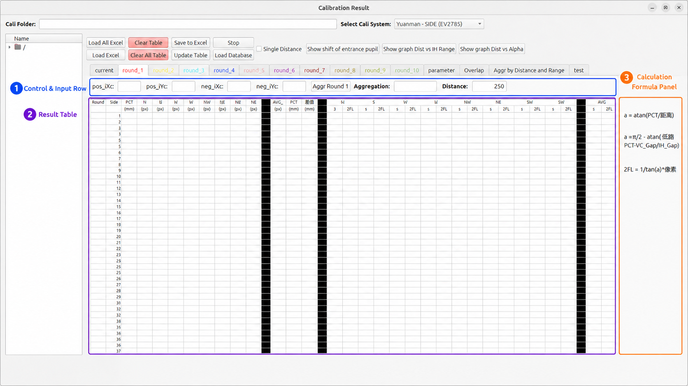
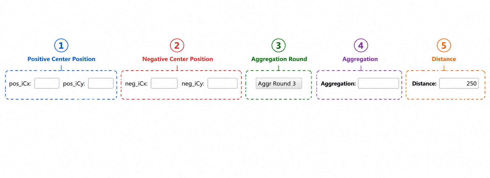
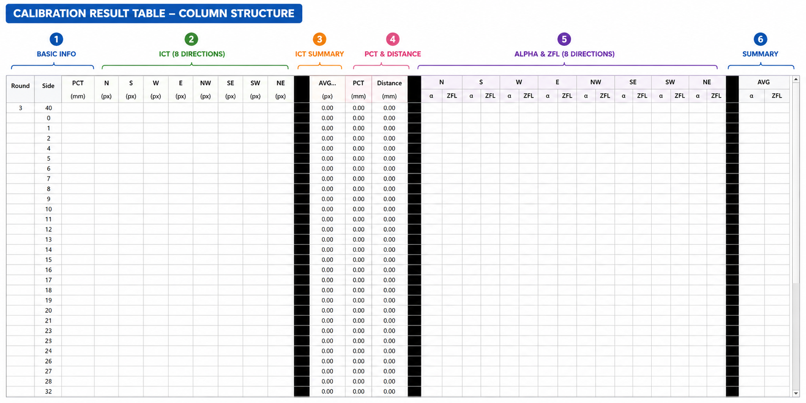
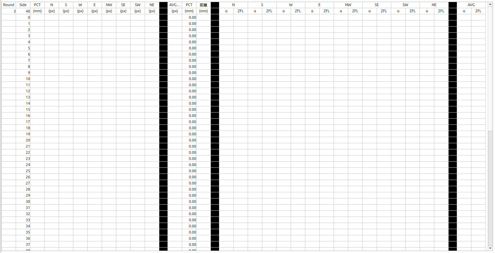
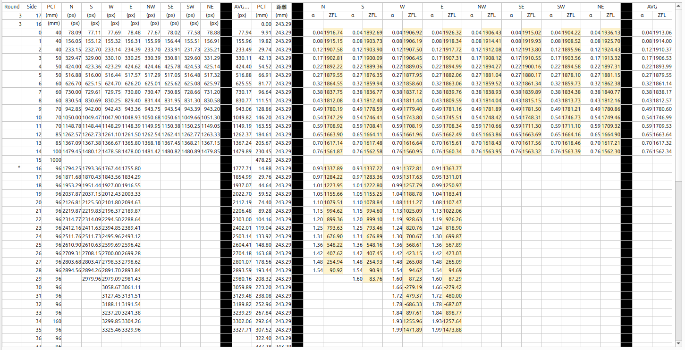
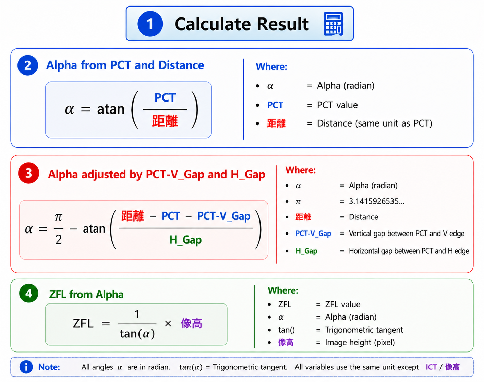

# Result Table View

The **Main Cali Result** window is the main calculation workspace for the calibration result system. This window reads calibration data from Excel, stores the data in round tables, calculates **ICT / IH**, **PCT_CAL**, **Distance**, **Alpha**, **ZFL**, and **Aggregation**, then uses those values to check the smoothness of the ZFL-IH curve.

This page explains the window based on the actual behavior in `controller_cali_result.py`, especially the table column structure, control row, formulas, and calculation flow.

<div className="custom-note custom-important">
  <div className="custom-note-title">Main Purpose</div>
  <p>The main goal of this window is to convert raw calibration table data into calculated Alpha and ZFL values, then use the IH-ZFL points to evaluate aggregation. A lower aggregation value means the IH-ZFL curve is smoother and the calibration result is more stable.</p>
</div>

---

## 1. Main Window Layout

<div className="center">

<a id="fig-1"></a>



<p><em><a href="#fig-1"><strong>Figure 1.</strong></a> Main Cali Result Window.</em></p>

</div>

The Main Cali Result window is divided into three main areas.

| No. | Area | Purpose |
|---:|---|---|
| 1 | **Control & Input Row** | Stores center position values, selected aggregation round, aggregation output, and the distance value used for calculation. |
| 2 | **Result Table** | Stores raw calibration data and calculated output columns such as ICT average, PCT_CAL, Distance, Alpha, and ZFL. |
| 3 | **Calculation Formula Panel** | Shows the formulas used by the table calculation, especially Alpha and ZFL formulas. |

The result table is the center of the calculation. The top row controls the input values and the table stores the result for each layer. The right formula panel helps users understand why Alpha and ZFL change when distance, PCT, V_Gap, H_Gap, or ICT changes.

---

## 2. Control & Input Row

<div className="center">

<a id="fig-2"></a>



<p><em><a href="#fig-2"><strong>Figure 2.</strong></a> Control and Input Row.</em></p>

</div>

The control row contains the input and output fields that are directly related to the table calculation.

| No. | UI Component | Related Code / Data | Detailed Explanation |
|---:|---|---|---|
| 1 | **Positive Center Position** | `lineedit_pos_icx_tablewidget_*`, `lineedit_pos_icy_tablewidget_*` | Stores the fisheye center position from the positive calibration image. These values are copied from the main window when **Update Table** is pressed. |
| 2 | **Negative Center Position** | `lineedit_neg_icx_tablewidget_*`, `lineedit_neg_icy_tablewidget_*` | Stores the fisheye center position from the negative calibration image. These values are also copied from the main window during table update. |
| 3 | **Aggregation Round** | `btn_aggr_round_*`, `lineedit_aggregation_round_*` | Shows which round is being used for single-round aggregation. The related button can calculate the best distance for a single round. |
| 4 | **Aggregation** | `lineedit_aggregation_round_*` | Displays the aggregation value calculated from IH-ZFL points. In the code, aggregation is calculated by collecting IH and ZFL points and summing the distance between neighboring points. |
| 5 | **Distance** | `lineedit_distance_round_*`, `lineedit_distance_range_0` | Distance is the main value used in the Alpha formula. When distance changes, Alpha changes, ZFL changes, and aggregation also changes. |

### 2.1 Positive Center Position

The positive center position is filled from the main window center-detection result.

Related functions:

```python
update_table_lineedit_img_center(table_index)
get_main_lineedit_pos_icx()
get_main_lineedit_pos_icy()
```
When **Update Table** is clicked, the controller copies:

```text
main positive CPX → pos_iCx
main positive CPY → pos_iCy
```
These values are important because ICT values are extracted from the calibration image using the center point. If the center point is wrong, the 8-direction ICT values can also become wrong.

### 2.2 Negative Center Position

The negative center position is copied in the same update process.

Related functions:

```python
get_main_lineedit_neg_icx()
get_main_lineedit_neg_icy()
```
The positive and negative center positions are used together when the controller extracts intersection nodes from the positive and negative images.

The ICT data is obtained through:

```python
MoilCali.get_dict_8direction_intersecting_nodes_by_pos_neg_img_path(
    pos_image,
    neg_image,
    pos_icx_icy,
    neg_icx_icy
)
```
The result is inserted into these 8 direction columns:

```text
N, S, W, E, NW, SE, SW, NE
```
### 2.3 Aggregation Round

The **Aggr Round** button is connected to the per-round aggregation logic.

Related function:

```python
onclick_btn_aggr_round(table_index)
```
When this function runs, it searches the distance that gives the minimum aggregation for the selected round. The distance search range is usually:

```text
1.0 ~ 500.0
```
For the single-round search, the code evaluates different distance values, recalculates the table, collects IH-ZFL points, and keeps the distance that produces the smallest aggregation value.

### 2.4 Aggregation Field

The aggregation field displays the output of the aggregation calculation.

Related functions:

```python
calculate_aggregation_single_round(table_index)
update_aggregation_single_round(table_index)
calculate_aggregation_total(xlist_ict, ylist_zfl)
```
The aggregation value is calculated from the IH-ZFL point list.

```text
IH-ZFL points
   ↓
Sort by IH
   ↓
Calculate point-to-point distance
   ↓
Sum all distances
   ↓
Aggregation value
```
Lower aggregation usually means the ZFL-IH curve is smoother. Higher aggregation means the curve has larger jumps or unstable transitions.

### 2.5 Distance Field

Distance is one of the most important values in the table because it directly affects Alpha.

Top-screen Alpha formula:

```text
alpha = atan(pct_cal / distance)
```
If the distance changes, the same PCT_CAL value will produce a different Alpha value. Because ZFL is calculated from Alpha, the ZFL value also changes.

```text
Distance changes
   ↓
Alpha changes
   ↓
ZFL changes
   ↓
Aggregation changes
```
---

## 3. Result Table Column Structure

<div className="center">

<a id="fig-3"></a>



<p><em><a href="#fig-3"><strong>Figure 3.</strong></a> Calibration Result Table Column Structure.</em></p>

</div>

The result table uses fixed internal column indexes. In the code, these indexes are defined in `_dict_column_index`.

| Group | Column Index / Name | Displayed Column | Meaning |
|---|---|---|---|
| **Basic Info** | `round` = 0 | Round | Stores the round number or `*` marker. The `*` marker is used to identify the side layer. |
| **Basic Info** | `side` = 1 | Side | Stores the layer number. The special row above the layer data stores the detected side layer. |
| **Basic Info** | `pct` = 2 | PCT | Raw pattern PCT value from the Pattern Generator. |
| **ICT 8 Directions** | `ict_n` = 3 | N | ICT / IH value in North direction. |
| **ICT 8 Directions** | `ict_s` = 4 | S | ICT / IH value in South direction. |
| **ICT 8 Directions** | `ict_w` = 5 | W | ICT / IH value in West direction. |
| **ICT 8 Directions** | `ict_e` = 6 | E | ICT / IH value in East direction. |
| **ICT 8 Directions** | `ict_nw` = 7 | NW | ICT / IH value in Northwest direction. |
| **ICT 8 Directions** | `ict_se` = 8 | SE | ICT / IH value in Southeast direction. |
| **ICT 8 Directions** | `ict_sw` = 9 | SW | ICT / IH value in Southwest direction. |
| **ICT 8 Directions** | `ict_ne` = 10 | NE | ICT / IH value in Northeast direction. |
| **Separator** | `empty11` = 11 | Black column | Visual separator between raw ICT data and summary data. |
| **ICT Summary** | `ict_avg` = 12 | AVG | Average value of valid ICT directions. |
| **PCT & Distance** | `pct_cal` = 13 | PCT | Calibrated PCT value after applying pixel size. |
| **PCT & Distance** | `distance` = 14 | Distance | Distance value used for Alpha calculation. |
| **Separator** | `empty15` = 15 | Black column | Visual separator before Alpha and ZFL columns. |
| **Alpha & ZFL** | `alpha_n`, `zfl_n` = 16, 17 | N α / ZFL | Alpha and ZFL for North direction. |
| **Alpha & ZFL** | `alpha_s`, `zfl_s` = 18, 19 | S α / ZFL | Alpha and ZFL for South direction. |
| **Alpha & ZFL** | `alpha_w`, `zfl_w` = 20, 21 | W α / ZFL | Alpha and ZFL for West direction. |
| **Alpha & ZFL** | `alpha_e`, `zfl_e` = 22, 23 | E α / ZFL | Alpha and ZFL for East direction. |
| **Alpha & ZFL** | `alpha_nw`, `zfl_nw` = 24, 25 | NW α / ZFL | Alpha and ZFL for Northwest direction. |
| **Alpha & ZFL** | `alpha_se`, `zfl_se` = 26, 27 | SE α / ZFL | Alpha and ZFL for Southeast direction. |
| **Alpha & ZFL** | `alpha_sw`, `zfl_sw` = 28, 29 | SW α / ZFL | Alpha and ZFL for Southwest direction. |
| **Alpha & ZFL** | `alpha_ne`, `zfl_ne` = 30, 31 | NE α / ZFL | Alpha and ZFL for Northeast direction. |
| **Separator** | `empty32` = 32 | Black column | Visual separator before final average columns. |
| **Summary** | `alpha_avg` = 33 | AVG α | Average Alpha for top-screen rows only. |
| **Summary** | `zfl_avg` = 34 | AVG ZFL | Average ZFL for top-screen rows only. |

<div className="custom-note custom-tip">
  <div className="custom-note-title">Why There Are Black Columns</div>
  <p>The black columns are not calculation columns. They are visual separators used to divide the table into readable groups: raw ICT data, summary ICT, PCT / Distance, directional Alpha / ZFL, and final average values.</p>
</div>

---

## 4. Empty Result Table

<div className="center">

<a id="fig-4"></a>



<p><em><a href="#fig-4"><strong>Figure 4.</strong></a> Empty Calibration Result Table.</em></p>

</div>

When the table is empty, only the structure is visible. The controller still initializes the table with row numbers and side numbers.

Related function:

```python
init_table_widget()
```
The initialization process:

```text
Create table rows
   ↓
Set table font
   ↓
Set row height
   ↓
Set column width
   ↓
Fill Side column with layer numbers
   ↓
Create black separator columns
```
The table stores layer data starting from row index `layer + 2`. This is why the code repeatedly calls:

```python
get_index_row_by_layer(layer)
```
The special row for round and side metadata uses:

```python
get_index_row_by_layer(-1)
```
---

## 5. Filled Result Table

<div className="center">

<a id="fig-5"></a>



<p><em><a href="#fig-5"><strong>Figure 5.</strong></a> Filled Calibration Result Table.</em></p>

</div>

After data is loaded or calculated, the table contains:

| Data Type | Where It Comes From | Result in Table |
|---|---|---|
| **Round** | Current tab index or loaded Excel data | Identifies which round the table belongs to. |
| **Side Layer** | First layer marked with `*`, or default value `40` | Decides whether the top-screen or side-screen formula is used. |
| **PCT** | Pattern Generator concentric and stripeline data | Raw PCT values used to calculate PCT_CAL. |
| **ICT 8 Directions** | Positive and negative image intersection detection | Raw IH / ICT values for each direction. |
| **ICT AVG** | Average of valid direction values | Used for top-screen IH-ZFL points. |
| **PCT_CAL** | Sum of PCT values multiplied by pixel size | Physical calibrated PCT value. |
| **Distance** | Global distance, round distance, or calculated round distance | Used in Alpha formula. |
| **Alpha** | Calculated from PCT_CAL and Distance | Directional angular value in radians. |
| **ZFL** | Calculated from Alpha and ICT | Directional ZFL value. |
| **AVG α / AVG ZFL** | Average values before side layer | Summary values used for top-screen points. |

---

## 6. Update Table Process

The **Update Table** button is connected to:

```python
onclick_btn_update_table()
```
When clicked, the controller performs this sequence:

```text
Get current table index
   ↓
Clear current table
   ↓
Copy positive / negative center values from main window
   ↓
Update round number
   ↓
Update PCT column from Pattern Generator JSON
   ↓
Extract ICT values in 8 directions from positive and negative images
   ↓
Run Update All Cali Result
   ↓
Mark current tab with *
```
### 6.1 Clear Current Table

The update process starts by clicking the clear-table logic internally:

```python
self.btn_clear_table.click()
```
This removes old values so the new calculation does not mix with previous data.

### 6.2 Copy Center Values

The controller then calls:

```python
update_table_lineedit_img_center(table_index)
```
This updates:

```text
pos_iCx
pos_iCy
neg_iCx
neg_iCy
```
These values are taken from the main window CPX / CPY fields.

### 6.3 Update PCT Column

The PCT values are updated by:

```python
update_column_pct(table_index)
get_list_pattern_pct()
```
The function reads two pattern sources:

| Pattern Source | Code Data | Purpose |
|---|---|---|
| `json_concentric` | `radius` | Used for concentric pattern layers. |
| `json_stripeline` | `interval` | Used for stripeline pattern layers. |

The combined PCT list is inserted into the `pct` column.

### 6.4 Update ICT 8 Directions

The 8-direction ICT values are calculated by:

```python
update_ict_8direction(table_index)
```
The code uses positive and negative calibration images:

```text
image_cali/capture_positive_shot.png
image_cali/capture_negative_shot.png
```
Then the system detects intersecting nodes for:

```text
n, w, s, e, nw, se, sw, ne
```
These values are inserted into the matching ICT direction columns.

---

## 7. Full Calculation Pipeline

The main calculation function is:

```python
calculate_result(table_index)
```
The pipeline follows this order:

```text
Update side layer
   ↓
Update round number
   ↓
Remove invalid diagonal side-screen data
   ↓
Clear and calculate ICT average
   ↓
Clear and calculate PCT_CAL
   ↓
Update Distance
   ↓
Clear Alpha and ZFL columns
   ↓
Calculate Alpha in 8 directions
   ↓
Calculate ZFL in 8 directions
   ↓
Calculate Alpha average
   ↓
Calculate ZFL average
   ↓
Update single-round aggregation
   ↓
Refresh ZFL-IH, IH-Alpha, and Overlap graphs
```
This means the table calculation is not only a formula update. It also updates graph data and aggregation output.

---

## 8. Side Layer Logic

The side layer decides which formula is used.

Related functions:

```python
update_side_layer(table_index)
get_start_in_which_layer(table_index)
get_side_layer(table_index)
```
The controller searches for the first layer in the `round` column that contains:

```text
*
```
If no `*` is found, the default side layer is:

```text
40
```
| Layer Condition | Formula Type | Behavior |
|---|---|---|
| `layer < side_layer` | Top-screen calculation | Uses average Alpha and average ZFL. |
| `layer >= side_layer` | Side-screen calculation | Uses direction-specific Alpha and ZFL. |

<div className="custom-note custom-important">
  <div className="custom-note-title">Side Layer Importance</div>
  <p>The side layer controls when the calculation changes from top-screen formula to side-screen formula. If the side marker is wrong, the system may calculate Alpha and ZFL with the wrong formula.</p>
</div>

---

## 9. ICT Average Calculation

The ICT average is calculated by:

```python
update_ict_avg(table_index)
calculate_ict_avg(table_index, layer)
```
For each layer, the controller reads 8 directional ICT values:

```text
ict_n, ict_w, ict_s, ict_e, ict_nw, ict_se, ict_sw, ict_ne
```
Then it calculates the average using:

```python
average_without_zero(list_data)
```
This helper only averages values that can be converted into numbers.

```text
Valid ICT values
   ↓
Sum valid values
   ↓
Count valid values
   ↓
ICT AVG = sum / count
```
If no valid ICT value exists, the output is empty.

---

## 10. PCT_CAL Calculation

The calibrated PCT value is calculated by:

```python
update_pct_cal(table_index)
calculate_pct_cal(table_index, layer_pct_cal)
```
The system reads two pixel-size values:

```python
lineedit_pixel_size_top
lineedit_pixel_size_side
```
The selected pixel size depends on the side layer.

| Layer Condition | Pixel Size Used |
|---|---|
| `layer < side_layer` | `pixel_size_top` |
| `layer >= side_layer` | `pixel_size_side` |

The simplified formula is:

```text
PCT_CAL = sum(PCT values in selected section) × selected pixel size
```
### 10.1 Top-Screen PCT_CAL

For top-screen layers, the calculation starts from layer `0` and sums PCT values until the current layer.

```text
start_layer = 0
end_layer = current layer
pixel_size = pixel_size_top
```
### 10.2 Side-Screen PCT_CAL

For side-screen layers, the calculation starts from the side layer and sums PCT values until the current layer.

```text
start_layer = side_layer
end_layer = current layer
pixel_size = pixel_size_side
```
This means PCT_CAL is not always calculated from the first row. It depends on whether the current row is before or after the side layer.

---

## 11. Distance Calculation

Distance is calculated by:

```python
update_distance(table_index, lineedit_distance_range_0)
calculate_distance(table_index, lineedit_distance_range_0)
```
The normal distance formula is:

```text
distance = base_distance + dis_per_round × (current_round - first_valid_round)
```
| Term | Source | Meaning |
|---|---|---|
| `base_distance` | `lineedit_distance_range_0` | Base distance used as the starting distance. |
| `dis_per_round` | `lineedit_dis_per_round` | Distance increment between rounds. |
| `current_round` | Round metadata row | Current round number. |
| `first_valid_round` | First table that contains valid ICT data | Reference round for the calculation. |

### 11.1 Single Distance Mode

The checkbox **Single Distance** changes the distance behavior.

Related functions:

```python
connect_cb_distance()
onclick_cb_distance_changed()
_is_use_single_round_distance()
update_distance_auto()
update_distance_single_round()
```
When **Single Distance** is enabled, each round can use its own distance line edit:

```text
lineedit_distance_round_1
lineedit_distance_round_2
...
lineedit_distance_round_10
```
When a round distance is edited and Enter is pressed, the controller recalculates that round and updates the aggregation output.

---

## 12. Alpha Calculation

Alpha is calculated by:

```python
update_alpha_8direction(table_index)
calculate_alpha(table_index, direction, layer)
```
The controller calculates Alpha for:

```text
n, w, s, e, nw, se, sw, ne
```
However, diagonal directions are ignored after the side layer.

```text
If direction is NW / SE / SW / NE and layer >= side_layer:
    Alpha becomes empty
```
### 12.1 Top-Screen Alpha Formula

<div className="center">

<a id="fig-6"></a>



<p><em><a href="#fig-6"><strong>Figure 6.</strong></a> Calculate Result Formula.</em></p>

</div>

For rows before the side layer, Alpha is calculated using:

```text
α = atan(PCT_CAL / Distance)
```
| Variable | Meaning |
|---|---|
| `α` | Alpha angle in radians. |
| `PCT_CAL` | Calibrated PCT value after pixel-size conversion. |
| `Distance` | Distance value used by the selected round or range. |

This formula is simple because the top-screen geometry only depends on PCT_CAL and distance.

### 12.2 Side-Screen Alpha Formula

For rows at or after the side layer, Alpha is calculated using:

```text
α = π / 2 - atan((Distance - PCT_CAL - V_Gap) / H_Gap)
```
| Variable | Meaning |
|---|---|
| `π / 2` | 90 degrees in radians. |
| `Distance` | Current distance value. |
| `PCT_CAL` | Calibrated PCT value. |
| `V_Gap` | Vertical gap value for the selected direction. |
| `H_Gap` | Horizontal gap value for the selected direction. |

The code reads V_Gap and H_Gap through:

```python
get_dict_v_gap_4direction()
get_dict_h_gap_4direction()
```
The side-screen formula only uses the four main directions:

```text
N, S, W, E
```
The diagonal directions are cleared because the side-screen geometry does not use diagonal directions in this calculation.

---

## 13. ZFL Calculation

ZFL is calculated by:

```python
update_zfl_8direction(table_index)
calculate_zfl(table_index, direction, layer)
```
The formula is:

```text
ZFL = 1 / tan(α) × ICT
```
| Variable | Meaning |
|---|---|
| `ZFL` | Calculated ZFL value. |
| `α` | Alpha angle in radians. |
| `ICT` | ICT / IH value from the selected direction. |
| `tan()` | Tangent trigonometric function. |

If Alpha or ICT is invalid or empty, ZFL is also empty.

The code highlights calculated ZFL cells with a light background color when the calculated value is finite. This makes calculated ZFL values easier to identify in the table.

---

## 14. Alpha Average and ZFL Average

The average columns are calculated by:

```python
update_alpha_avg(table_index)
update_zfl_avg(table_index)
```
These two functions only process rows before the side layer.

```text
if layer >= side_layer:
    stop average calculation
```
This means:

| Area | Average Columns Used? | Explanation |
|---|---|---|
| Top-screen rows | Yes | Uses 8-direction Alpha and ZFL values to calculate average Alpha and average ZFL. |
| Side-screen rows | No | Uses direction-specific Alpha and ZFL values instead of average columns. |

The average values are important because top-screen IH-ZFL points use:

```text
x = ict_avg
y = zfl_avg
```
After the side layer, the system uses direction-specific values instead.

---

## 15. How IH-ZFL Points Are Collected

IH-ZFL points are collected by:

```python
get_ict_zfl_into_xlist_ylist(table_index)
```
The function separates top-screen and side-screen behavior.

### 15.1 Before Side Layer

For layers before the side layer:

```text
x = ict_avg
y = zfl_avg
```
This means the table uses average values because all 8 directions are still treated as one top-screen result.

### 15.2 At and After Side Layer

For layers at or after the side layer:

```text
x = ict_direction
y = zfl_direction
```
The controller loops through:

```text
n, s, w, e, nw, se, sw, ne
```
and appends valid direction data to the IH-ZFL list.

---

## 16. Aggregation Calculation

Aggregation is calculated by:

```python
calculate_aggregation_total(xlist_ict, ylist_zfl)
```
The process is:

```text
Collect IH and ZFL points
   ↓
Pair each IH with ZFL
   ↓
Sort the pairs by IH
   ↓
Calculate the distance between each neighboring point
   ↓
Sum all point-to-point distances
   ↓
Return aggregation value
```
The point-to-point distance concept is:

```text
distance_between_points = sqrt((x1 - x2)^2 + (y1 - y2)^2)
```
Aggregation is then:

```text
aggregation = sum(distance_between_points)
```
| Aggregation Result | Meaning |
|---|---|
| Lower value | IH-ZFL curve is smoother and more stable. |
| Higher value | IH-ZFL curve has larger jumps or unstable transitions. |

---

## 17. Aggregation by Distance

The aggregation for a specific distance is calculated by:

```python
calculate_aggregation_by_distance(distance, lineedit_distance_range_0, range_min, range_max)
```
This function does the following:

```text
Set distance value into distance line edit
   ↓
Recalculate every enabled table
   ↓
Collect IH-ZFL points from all enabled rounds
   ↓
Optional: filter points by IH range
   ↓
Calculate aggregation
   ↓
Return aggregation value
```
If `range_min` and `range_max` are provided, aggregation is calculated only inside that IH range. If no range is provided, aggregation is calculated globally.

---

## 18. Best Distance Search

The best distance search is handled by:

```python
find_min_aggregation_by_lineedit()
```
The search uses a ternary-search style method.

```text
Read distance min and max
   ↓
Evaluate aggregation at two internal distance points
   ↓
Keep the distance section with lower aggregation
   ↓
Repeat until tolerance or max iteration is reached
   ↓
Return best distance and minimum aggregation
```
Default search range:

```text
1.0 ~ 500.0
```
The function updates:

| Output | Meaning |
|---|---|
| Distance line edit | Best distance found by the search. |
| Aggregation line edit | Minimum aggregation at the best distance. |
| `_dist_aggr_samples` | Sample points for the Aggregation vs Distance graph. |
| `_dist_aggr_min` | Best point shown on the graph. |

---

## 19. Formula Panel Explanation

The formula panel shows the three main formulas used by the result table.

### 19.1 Formula 1: Alpha from PCT and Distance

```text
α = atan(PCT / Distance)
```
This formula is used before the side layer. In the Python code, the value is calculated using:

```python
atan(pct_cal / distance)
```
### 19.2 Formula 2: Alpha Adjusted by V_Gap and H_Gap

```text
α = π / 2 - atan((Distance - PCT_CAL - V_Gap) / H_Gap)
```
This formula is used after the side layer. It includes the physical side-screen gap values.

### 19.3 Formula 3: ZFL from Alpha

```text
ZFL = 1 / tan(α) × ICT
```
This formula converts Alpha and ICT into ZFL. Because ZFL depends on Alpha, any change in distance, PCT_CAL, V_Gap, or H_Gap can also change ZFL.

---

## 20. How Loaded Excel Data Becomes Calculated Result

The Excel loading logic supports both single Excel loading and folder-based loading.

Related functions:

```python
onclick_btn_load_excel()
onclick_btn_load_all_excel()
_load_all_excel_from_folder(folder_path)
_load_excel_to_current_round(xlsx_path)
```
### 20.1 Load One Excel

When loading one Excel file:

```text
Select active round tab
   ↓
Click Load Excel
   ↓
Select one .xlsx file
   ↓
Clear the active table
   ↓
Insert data into columns A to K
   ↓
Mark the tab with *
   ↓
Run Update All Cali Result
```
Only the raw columns are loaded from Excel first:

```text
Round, Side, PCT, N, S, W, E, NW, SE, SW, NE
```
The calculated columns are then generated by the controller.

### 20.2 Load All Excel

When loading all Excel files:

```text
Select main calibration folder
   ↓
Search folders 1 to 10
   ↓
Find the first .xlsx file in each round folder
   ↓
Load each file into its matching round table
   ↓
Mark loaded round tabs with *
   ↓
Run Update All Cali Result
   ↓
Load main.json if it exists
```
Expected folder structure:

```text
main_folder/
├── 1/
│   └── result.xlsx
├── 2/
│   └── result.xlsx
├── 3/
│   └── result.xlsx
...
└── 10/
    └── result.xlsx
```
---

## 21. Clear Table and Clear All Table

### 21.1 Clear Table

Related function:

```python
onclick_btn_clear_table()
```
This clears only the active table.

```text
Clear all calculation columns
   ↓
Restore black separator columns
   ↓
Update round number
   ↓
Initialize side column
   ↓
Remove * mark from tab
   ↓
Update all calibration results
```
### 21.2 Clear All Table

Related function:

```python
onclick_btn_clear_all_table()
```
This clears all round tables from round 1 to round 10. The function shows a confirmation dialog before deleting the data.

<div className="custom-note custom-warning">
  <div className="custom-note-title">Warning</div>
  <p>Clear Table and Clear All Table remove data from the user interface. Save the result first if the table values must be kept.</p>
</div>

---

## 22. Update All Cali Result

The **Update All Cali Result** action is handled by:

```python
onclick_btn_update_all_cali_result()
```
It loops through round 1 to round 10 and calculates only enabled rounds.

```text
for table_index in range(1, 11):
    if round is enabled:
        calculate_result(table_index)
```
After all enabled rounds are calculated, it refreshes:

```text
IH-Alpha graph
ZFL-IH graph
Overlap graph
```
Use **Update All Cali Result** after changing:

- distance,
- pixel size,
- V_Gap,
- H_Gap,
- calibration system,
- round data,
- enabled / disabled round status.

---

## 23. Round Enable / Disable and Right-Click Menu

The tab widget supports a right-click menu for round tabs.

Related functions:

```python
show_round_context_menu(point)
toggle_round_enabled_status(table_index, currently_enabled)
show_popup_zfl_ih_single_round(table_index)
show_popup_overlap_single_round(table_index)
```
Right-click options:

| Menu Item | Function |
|---|---|
| **Turn Off Round** | Excludes the round from calculation and graph plotting. |
| **Turn On Round** | Enables the round again. |
| **Show ZFL-IH Graph** | Opens a popup graph for one round only. |
| **Show Overlap Graph** | Opens a popup overlap graph for one round only. |

When a round is turned off:

```text
Tab text gets [OFF]
Table becomes disabled
Update All Cali Result runs again
```
---

## 24. Save to Excel

The **Save to Excel** button is connected to:

```python
onclick_btn_save_to_excel()
```
The function saves the main raw columns from:

```text
round → ict_ne
```
This means the exported Excel mainly contains the source table data needed to reload or reproduce the calculation later.

---

## Recommended Workflow

### Normal Table Calculation

1. Open **Main Cali Result**.
2. Select the correct round tab.
3. Load Excel data or click **Update Table**.
4. Confirm `pos_iCx`, `pos_iCy`, `neg_iCx`, and `neg_iCy`.
5. Confirm the side layer marker `*` or the default side layer.
6. Confirm pixel size and distance settings.
7. Click **Update All Cali Result**.
8. Check calculated PCT_CAL, Alpha, and ZFL columns.
9. Check the ZFL-IH graph and overlap graph.
10. Use aggregation tools to find the best distance.

### Checking a Single Round

1. Select or load the target round.
2. Enter a distance in the round distance field.
3. Press Enter or click the round aggregation button.
4. The controller recalculates the round.
5. Read the aggregation result.
6. Open the single-round ZFL-IH graph if detailed checking is needed.

### Checking Best Distance

1. Make sure the table data is loaded.
2. Make sure the correct rounds are enabled.
3. Set the distance search range if needed.
4. Run the aggregation search.
5. The best distance is written into the distance field.
6. The minimum aggregation is written into the aggregation field.
7. Check the Aggregation vs Distance graph.

---

## Troubleshooting

| Problem | Possible Cause | Solution |
|---|---|---|
| Alpha column is empty | ICT, PCT_CAL, or Distance is invalid. | Check raw ICT values, PCT values, and distance field. |
| ZFL column is empty | Alpha or ICT is empty / invalid. | Check whether Alpha was calculated correctly first. |
| Average Alpha / ZFL is empty after side layer | This is expected behavior. | Average columns only apply before the side layer. |
| Diagonal Alpha is empty after side layer | This is expected behavior. | The code ignores NW, SE, SW, and NE for side-screen rows. |
| Side layer seems wrong | The `*` marker is missing or placed in the wrong row. | Check the Round column and side marker. Default side layer is 40. |
| Aggregation is too high | ZFL-IH points are not smooth. | Check distance, center point, pixel size, V_Gap, H_Gap, and raw ICT values. |
| Loaded Excel has data but calculated columns are blank | Required source values may be missing or invalid. | Click Update All Cali Result and inspect PCT / ICT / Distance. |
| Search takes too long | Distance range is too wide or many rounds are enabled. | Narrow the distance range or disable unused rounds. |

---

## Quick Reference

| Task | Main Function |
|---|---|
| Update active table from images and pattern data | `onclick_btn_update_table()` |
| Calculate one result table | `calculate_result(table_index)` |
| Update all enabled rounds | `onclick_btn_update_all_cali_result()` |
| Calculate ICT average | `update_ict_avg()` / `calculate_ict_avg()` |
| Calculate PCT_CAL | `update_pct_cal()` / `calculate_pct_cal()` |
| Calculate distance | `update_distance()` / `calculate_distance()` |
| Calculate Alpha | `update_alpha_8direction()` / `calculate_alpha()` |
| Calculate ZFL | `update_zfl_8direction()` / `calculate_zfl()` |
| Collect IH-ZFL points | `get_ict_zfl_into_xlist_ylist()` |
| Calculate aggregation | `calculate_aggregation_total()` |
| Calculate aggregation by distance | `calculate_aggregation_by_distance()` |
| Search best distance | `find_min_aggregation_by_lineedit()` |
| Calculate single-round aggregation | `calculate_aggregation_single_round()` |
| Save active table | `onclick_btn_save_to_excel()` |
| Load one Excel | `onclick_btn_load_excel()` |
| Load all Excel | `onclick_btn_load_all_excel()` |
| Clear active table | `onclick_btn_clear_table()` |
| Clear all round tables | `onclick_btn_clear_all_table()` |

---

## Simple Summary

The Main Cali Result calculation can be summarized as:

```text
Excel / image / pattern data
   ↓
PCT and ICT values
   ↓
PCT_CAL and ICT average
   ↓
Distance
   ↓
Alpha
   ↓
ZFL
   ↓
IH-ZFL points
   ↓
Aggregation
   ↓
Best distance search
```
The most important relationships are:

```text
PCT + pixel size → PCT_CAL
PCT_CAL + Distance → Alpha
Alpha + ICT → ZFL
IH + ZFL → Aggregation
Distance search → Minimum Aggregation
```

If the final ZFL-IH curve is unstable, check the center points, side layer marker, distance, pixel size, V_Gap, H_Gap, and raw ICT data first.