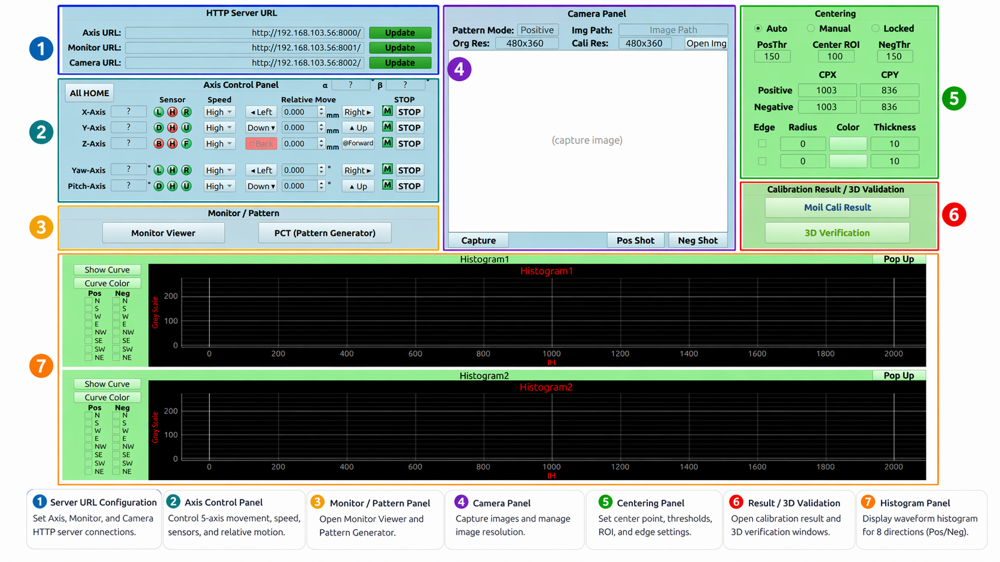
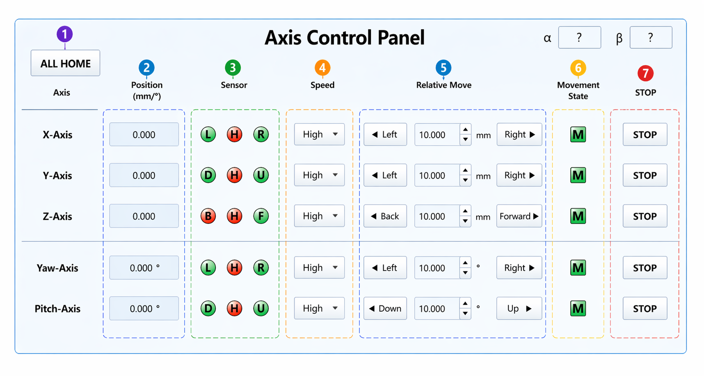
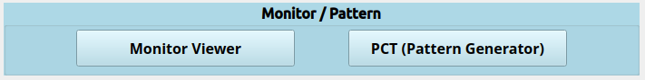
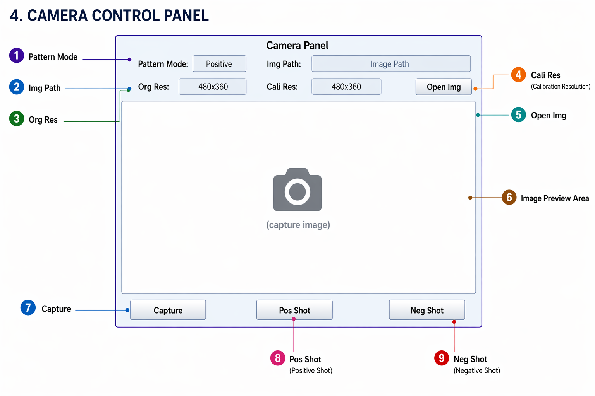
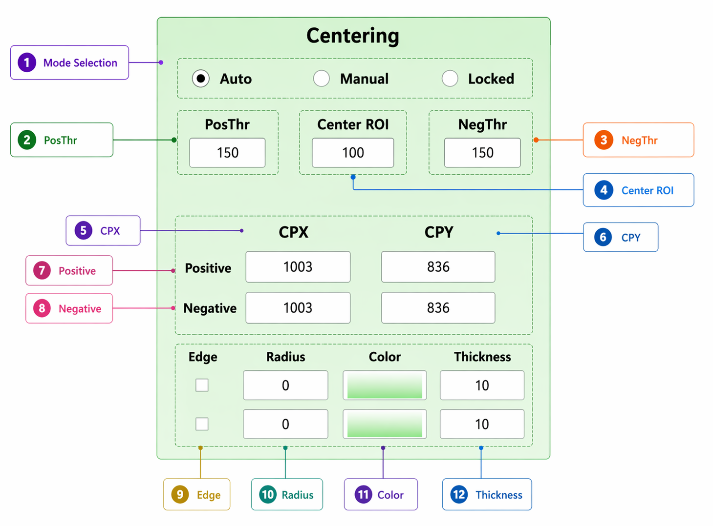
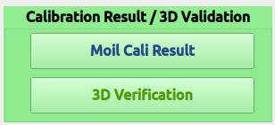
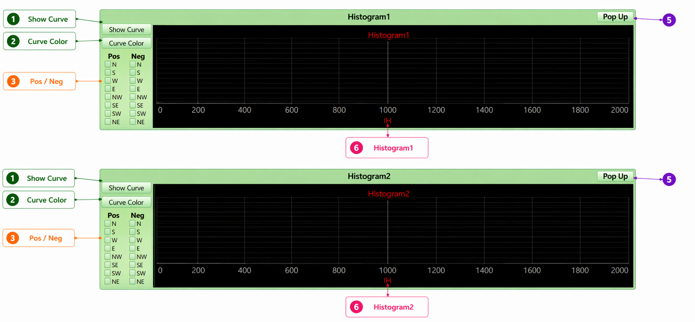

# Main Window Overview

The **Main Window** is the central interface of the Moil230 Fisheye Calibration System. It integrates hardware connectivity, 5-axis motion control, pattern display, image capture, center-point detection, histogram analysis, calibration result processing, and 3D verification into a unified workflow.

<em><a href="#fig-1"><strong>Figure 1.</strong></a> Main Window Overview.</em>

---

## Main Functional Areas

| No. | Area | Purpose |
|---:|---|---|
| 1 | **Server URL Configuration** | Establishes HTTP connections to Axis, Monitor, and Camera servers for hardware control and image acquisition. |
| 2 | **Axis Control Panel** | Manages 5-axis platform movement (X, Y, Z linear axes and Yaw/Pitch rotation axes) with sensor monitoring and safety controls. |
| 3 | **Monitor / Pattern Panel** | Launches Monitor Viewer and PCT Pattern Generator windows for calibration pattern display and management. |
| 4 | **Camera Panel** | Handles image capture from HTTP camera server, local image loading, and calibration shot acquisition (Positive/Negative). |
| 5 | **Centering Panel** | Performs automatic and manual fisheye center point detection with ROI visualization and edge circle overlays. |
| 6 | **Calibration Result / 3D Validation** | Opens calibration result analysis and 3D measurement/verification dialogs for result validation. |
| 7 | **Histogram Panel** | Displays grayscale intensity curves extracted from calibration images for quality assessment. |

  
✅ Recommended Workflow

  <ol>
    <li>Configure Axis, Monitor, and Camera server URLs and establish connections.</li>
    <li>Initialize the 5-axis platform by homing all axes to establish reference positions.</li>
    <li>Launch Monitor Viewer and Pattern Generator for calibration pattern setup.</li>
    <li>Capture Positive and Negative calibration shots with automatic center detection.</li>
    <li>Verify center points and adjust if necessary using manual or automatic modes.</li>
    <li>Analyze histogram curves to ensure image quality and pattern detection accuracy.</li>
    <li>Open calibration result window for parameter analysis and 3D verification.</li>
  </ol>

---

## 1. Server URL Configuration Panel

This panel establishes HTTP client connections to the three core services required by the calibration system.

| Field | Connected Service | Controller Implementation |
|---|---|---|
| **Axis URL** | `AxisHTTPClient` | Handles all 5-axis platform control, sensor reading, homing operations, position monitoring, and emergency stops. |
| **Monitor URL** | `MonitorHTTPClient` | Manages calibration pattern transmission to display monitors for visual calibration setup. |
| **Camera URL** | `CameraHTTPClient` | Controls image acquisition from network cameras for calibration shot capture. |
| **Update** | Client Reconnection | Creates new HTTP client instances with updated URLs and validates connectivity. |

The controller maintains persistent HTTP client objects (`axis_http_client`, `cam_http_client`, `monitor_http_client`) that are recreated when URLs are updated. Connection status is indicated by button color changes (red for pending updates, green for successful connection).

  
⚠️ Connection Requirements

  
The system requires active HTTP services for Axis control, Monitor display, and Camera capture. URL validation occurs only when Update buttons are pressed. Unreachable services disable related functionality and display warning dialogs.

---

## 2. Axis Control Panel

The **Axis Control Panel** provides comprehensive control over the 5-axis calibration platform with real-time sensor monitoring and safety interlocks.

<em><a href="#fig-2"><strong>Figure 2.</strong></a> Axis Control Panel.</em>

### 2.1 Controlled Axes

| Axis | Motion Type | Unit | Controller Implementation |
|---|---|---|---|
| **X-Axis** | Linear (Left/Right) | mm | Horizontal positioning for camera alignment |
| **Y-Axis** | Linear (Up/Down) | mm | Vertical positioning for camera alignment |
| **Z-Axis** | Linear (Back/Forward) | mm | Distance adjustment with safety limits |
| **Yaw-Axis** | Rotational (Left/Right) | degrees | Horizontal angular positioning |
| **Pitch-Axis** | Rotational (Down/Up) | degrees | Vertical angular positioning |

### 2.2 Main Components

| No. | Component | Controller Implementation |
|---:|---|---|
| 1 | **ALL HOME** | Sequentially homes axes in order: Yaw → Pitch → X → Y → Z, checking home sensors first |
| 2 | **Position Display** | Real-time position reading from axis encoders |
| 3 | **Sensor Indicators** | Visual status for limit sensors, home position, and movement state |
| 4 | **Speed Selection** | Movement velocity control for relative positioning |
| 5 | **Relative Move** | Incremental movement with distance/angle input validation |
| 6 | **Movement State** | Blinking indicator during axis motion with UI locking |
| 7 | **STOP** | Emergency stop with sensor refresh and position update |

### 2.3 Sensor Status Indicators

| Indicator | Status | Controller Behavior |
|---|---|---|
| **L / R** | Limit sensors | Movement direction locking when triggered |
| **D / U** | Limit sensors | Movement direction locking when triggered |
| **B / F** | Limit sensors | Movement direction locking when triggered |
| **H** | Home sensor | Position zeroing when detected |
| **M** | Movement | UI interlock during motion |

### 2.4 Controller Safety Features

| Safety Mechanism | Implementation |
|---|---|
| **Motion Interlocking** | Only one axis can move at a time; controls lock during movement |
| **Limit Protection** | Movement commands blocked when limit sensors are active |
| **Emergency Stop** | Immediate halt with position refresh and sensor update |
| **Home Validation** | Pre-movement home status checking |
| **Thread Monitoring** | Background threads track movement completion |

### 2.5 Controller Implementation Details

| Action | Program Behavior |
|---|---|
| **Application Startup** | Validates Axis URL connectivity, reads sensor states, updates UI indicators |
| **Individual Axis Home** | Checks home sensor status, executes homing sequence if not at home position |
| **ALL HOME Sequence** | Yaw → Pitch → X → Y → Z homing order with sensor validation |
| **Relative Movement** | Validates connection, reads distance/speed, sends HTTP command, starts monitoring thread |
| **Movement Execution** | Locks UI controls, monitors axis state, updates position display |
| **Limit Sensor Trigger** | Disables movement in triggered direction, prevents further motion |
| **Emergency Stop** | Sends stop command, terminates monitor thread, refreshes all sensors |

  
⚠️ Critical Safety Measures

  
The controller implements multiple safety layers: motion interlocking prevents simultaneous axis movement, limit sensors block dangerous motion, and emergency stops provide immediate halting capability. Never attempt to override limit sensor protections.

---

## 3. Monitor / Pattern Panel

This panel launches the calibration pattern display and management interfaces that work together for visual calibration setup.

<em><a href="#fig-3"><strong>Figure 3.</strong></a> Monitor / Pattern Panel.</em>

| Button | Function | Controller Implementation |
|---|---|---|
| **Monitor Viewer** | Launches monitor display window connected to Monitor URL | `ControllerMonitor` instance with HTTP client integration |
| **PCT (Pattern Generator)** | Opens pattern creation and configuration window | `ControllerPatternGenerator` with JSON-based pattern management |

The controllers maintain inter-window communication: pattern generator signals update the monitor viewer display automatically when patterns change.

  
💡 Pattern Setup Sequence

  
Always verify pattern display on the monitor before capturing calibration shots. The controller links pattern generation with monitor display for seamless calibration workflow.

---

## 4. Camera Control Panel

The **Camera Control Panel** manages image acquisition from network cameras and handles the calibration shot sequence.

<em><a href="#fig-4"><strong>Figure 4.</strong></a> Camera Control Panel.</em>

### 4.1 Main Components

| No. | Component | Controller Implementation |
|---:|---|---|
| 1 | **Pattern Mode** | Displays current capture state: blank, `Positive`, or `Negative` |
| 2 | **Img Path** | Shows current image file path used by the system |
| 3 | **Org Res** | Original image resolution from camera capture |
| 4 | **Cali Res** | GUI preview resolution (automatically calculated) |
| 5 | **Open Img** | Loads local image file and sets as positive shot |
| 6 | **Image Preview** | Interactive display with single-click center setting and double-click zoom |
| 7 | **Capture** | Single image acquisition from camera server |
| 8 | **Pos Shot** | Automated positive pattern display + capture + center detection sequence |
| 9 | **Neg Shot** | Automated negative pattern display + capture + center detection sequence |

### 4.2 Image File Management

| Image Type | Storage Path | Controller Variable |
|---|---|---|
| Positive calibration shot | `image_cali/capture_positive_shot.png` | `pos_image_path` |
| Negative calibration shot | `image_cali/capture_negative_shot.png` | `neg_image_path` |
| Single capture | `image_cali/capture_single_image.png` | `single_image_path` |

### 4.3 Automated Capture Sequence

| Step | Pos Shot Action | Controller Implementation |
|---:|---|---|
| 1 | Send positive pattern to monitor | `monitor_http_client` transmits pattern |
| 2 | Capture image from camera | `cam_http_client` acquires image |
| 3 | Save as positive shot | File I/O to `pos_image_path` |
| 4 | Auto-detect center point | Threshold-based center finding algorithm |
| 5 | Update histogram display | Curve calculation and plotting |
| 6 | Refresh visual overlays | ROI and edge circle rendering |

| Step | Neg Shot Action | Controller Implementation |
|---:|---|---|
| 1 | Send negative pattern to monitor | `monitor_http_client` transmits pattern |
| 2 | Capture image from camera | `cam_http_client` acquires image |
| 3 | Save as negative shot | File I/O to `neg_image_path` |
| 4 | Auto-detect center point | Threshold-based center finding algorithm |
| 5 | Update histogram display | Curve calculation and plotting |
| 6 | Refresh visual overlays | ROI and edge circle rendering |

  
⚠️ Image Quality Requirements

  
Calibration accuracy depends on proper pattern display, adequate lighting, correct focus, and accurate center detection. Poor image quality leads to unreliable histogram curves and calibration results.

---

## 5. Centering Panel

The **Centering Panel** handles automatic and manual fisheye lens center point detection with visual feedback overlays.

<em><a href="#fig-5"><strong>Figure 5.</strong></a> Centering Panel.</em>

### 5.1 Main Components

| No. | Component | Controller Implementation |
|---:|---|---|
| 1 | **Mode Selection** | Auto/Manual/Locked modes for center point management |
| 2 | **PosThr** | Threshold value for positive image center detection algorithm |
| 3 | **NegThr** | Threshold value for negative image center detection algorithm |
| 4 | **Center ROI** | Radius for center region visualization and detection |
| 5 | **CPX** | Center point X coordinate (fisheye optical center) |
| 6 | **CPY** | Center point Y coordinate (fisheye optical center) |
| 7 | **Positive** | Center coordinates for positive image processing |
| 8 | **Negative** | Center coordinates for negative image processing |
| 9 | **Edge** | Toggle for edge circle overlay visualization |
| 10 | **Radius** | Edge circle radius for distortion boundary marking |
| 11 | **Color** | Color picker for edge circle customization |
| 12 | **Thickness** | Edge circle line thickness control |

### 5.2 Center Detection Modes

| Mode | Controller Behavior |
|---|---|
| **Auto** | Iterative center finding using threshold-based algorithms until convergence |
| **Manual** | User click on preview image sets CPX/CPY coordinates |
| **Locked** | Preserves current center values during inspection |

### 5.3 Center Detection Workflow

| Trigger Event | Controller Response |
|---|---|
| **Positive Shot Capture** | Applies `PosThr`, detects ROI, refines center point, updates Positive CPX/CPY |
| **Negative Shot Capture** | Applies `NegThr`, detects ROI, refines center point, updates Negative CPX/CPY |
| **Parameter Editing** | Real-time overlay refresh for CPX/CPY/Radius/Thickness changes |
| **Edge Toggle** | Renders circle overlay using current parameters |
| **Color Selection** | Qt color dialog integration with overlay update |
| **Manual Click** | Coordinate transformation from preview to original image space |
| **Double Click Preview** | Launches enlarged image dialog for detailed inspection |

  
🎯 Center Point Criticality

  
Histogram curve accuracy depends entirely on correct center point detection. Incorrect CPX/CPY values cause curve distortion and invalid calibration results. Always verify center detection before proceeding to result analysis.

---

## 6. Calibration Result / 3D Validation Panel

This panel launches the post-processing windows for calibration analysis and 3D measurement validation.

<em><a href="#fig-6"><strong>Figure 6.</strong></a> Calibration Result / 3D Validation Panel.</em>

| Button | Function | Controller Implementation |
|---|---|---|
| **Moil Cali Result** | Opens comprehensive calibration result analysis window | `ControllerCaliResult` with database integration and parameter optimization |
| **3D Verification** | Launches 3D measurement and verification dialog | `Controller3dMeasurement` with automated testing sequences |

These windows should only be opened after successful calibration shot capture and center point verification. The calibration result window provides detailed parameter analysis, while 3D verification validates measurement accuracy.

  
💡 Validation Timing

  
Execute result analysis and 3D verification only after confirming accurate image capture, proper center detection, and quality histogram curves. Premature validation may produce misleading results.

---

## 7. Histogram Panel

The **Histogram Panel** provides visual analysis of grayscale intensity curves extracted from calibration images for quality assessment.

<em><a href="#fig-7"><strong>Figure 7.</strong></a> Histogram Panel.</em>

### 7.1 PyQtGraph Implementation

The controller initializes two PyQtGraph plot widgets with identical configurations:

| Histogram | X-Axis | Y-Axis | Range Configuration |
|---|---|---|---|
| **Histogram1** | IH (Intensity Horizontal) | Gray Scale | X: 0–2000, Y: 0–270 |
| **Histogram2** | IH (Intensity Horizontal) | Gray Scale | X: 0–2000, Y: 0–270 |

### 7.2 Main Components

| No. | Component | Controller Implementation |
|---:|---|---|
| 1 | **Show Curve** | Clears plot and redraws selected direction curves |
| 2 | **Curve Color** | Launches `ControllerCurveColor` for color customization |
| 3 | **Direction Checkboxes** | Selects cardinal and diagonal directions for curve display |
| 4 | **Graph Display** | PyQtGraph widget with grid, labels, and curve plotting |
| 5 | **Pop Up** | Opens selected histogram in separate enlarged window |
| 6 | **Title Display** | Shows active histogram identifier |

### 7.3 Supported Analysis Directions

| Direction | Abbreviation | Implementation Notes |
|---|---|---|
| **North** | N | Vertical upward from center |
| **South** | S | Vertical downward from center |
| **West** | W | Horizontal leftward from center |
| **East** | E | Horizontal rightward from center |
| **Northwest** | NW | Diagonal up-left with √2 scaling |
| **Southeast** | SE | Diagonal down-right with √2 scaling |
| **Southwest** | SW | Diagonal down-left with √2 scaling |
| **Northeast** | NE | Diagonal up-right with √2 scaling |

### 7.4 Curve Rendering Logic

| Selection Scenario | Controller Behavior |
|---|---|
| **Positive Only** | Plots curves from `capture_positive_shot.png` using Positive CPX/CPY |
| **Negative Only** | Plots curves from `capture_negative_shot.png` using Negative CPX/CPY |
| **Same Direction Both** | Overlays positive (red) and negative (green) curves with intersection markers |
| **Diagonal Selection** | Applies `sqrt(2)` distance scaling for accurate representation |
| **Pop Up Activation** | Refreshes histogram then launches `ControllerCurveColor` popup |

  
💡 Quality Indicators

  
Smooth, consistent histogram curves indicate good image quality and center detection. Jagged or irregular curves suggest problems with lighting, focus, or center point accuracy.

  
🔍 How to Read the Histogram

  <ul>
    <li><strong>Balanced curves</strong> usually mean the positive and negative shots are consistent.</li>
    <li><strong>Large curve differences</strong> may indicate wrong center, wrong pattern, poor capture quality, or lighting problems.</li>
    <li><strong>White vertical lines</strong> appear when positive and negative curves of the same direction are compared and intersection points are found.</li>
  </ul>

---

## Complete Calibration Workflow

| Step | User Action | Main Panel |
|---:|---|---|
| 1 | Check and update Axis, Monitor, and Camera URLs. | Server URL Configuration |
| 2 | Home the platform or move the axes to the required position. | Axis Control Panel |
| 3 | Open Pattern Generator and Monitor Viewer. | Monitor / Pattern Panel |
| 4 | Capture Positive and Negative images. | Camera Panel |
| 5 | Confirm or adjust CPX / CPY. | Centering Panel |
| 6 | Enable edge / ROI display if visual checking is needed. | Centering Panel |
| 7 | Select directions and press Show Curve. | Histogram Panel |
| 8 | Inspect positive / negative histogram relationship. | Histogram Panel |
| 9 | Open calibration result. | Calibration Result / 3D Validation |
| 10 | Run 3D verification. | Calibration Result / 3D Validation |

  
⚠️ Final Check Before Calibration Result

  <ul>
    <li>All three server URLs have been updated.</li>
    <li>The Axis server is reachable before moving hardware.</li>
    <li>The platform position is correct.</li>
    <li>Positive and Negative images are captured correctly.</li>
    <li>CPX and CPY values are correct for both image modes.</li>
    <li>Histogram curves look reasonable and are not strongly asymmetric.</li>
  </ul>

---

## Summary

The **Main Window** controls the full calibration process from hardware connection to final verification. The user should update the server URLs, control or home the 5-axis platform, display calibration patterns, capture positive and negative images, check the fisheye center point, inspect histogram curves, open calibration results, and then perform 3D validation.