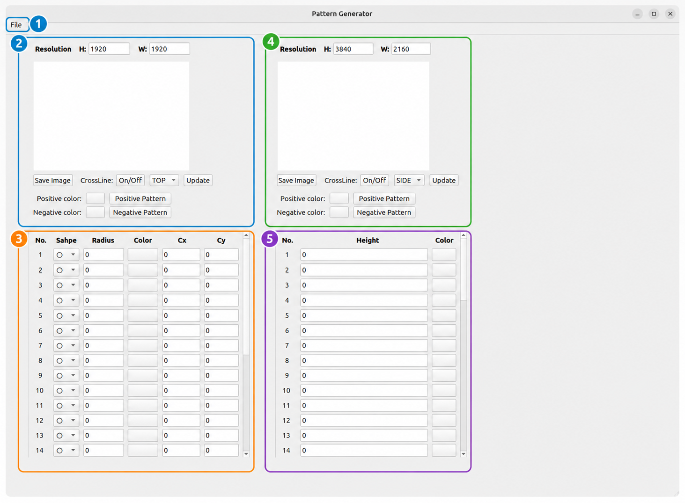
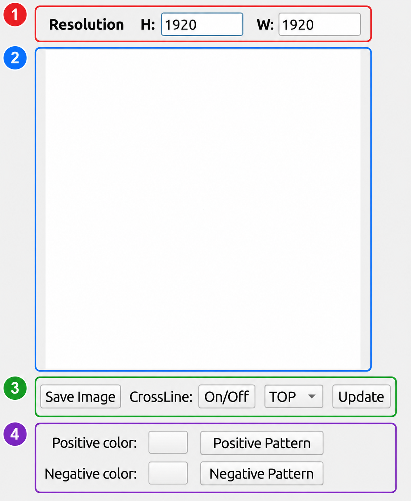
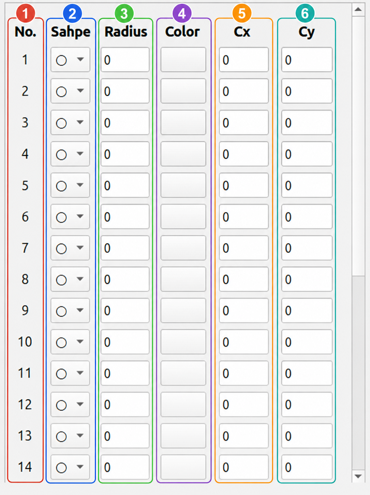
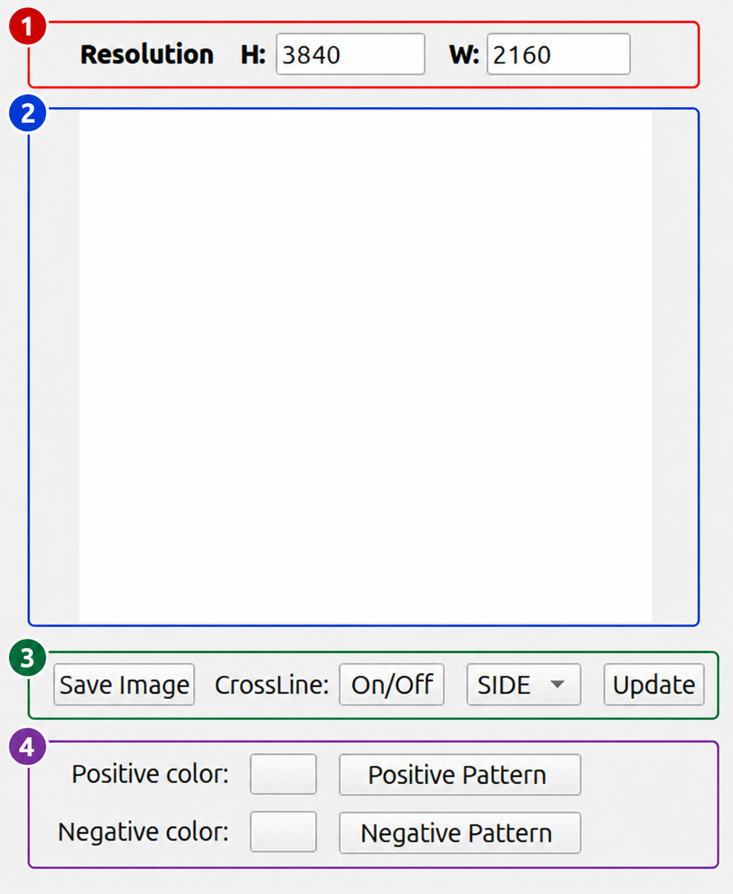
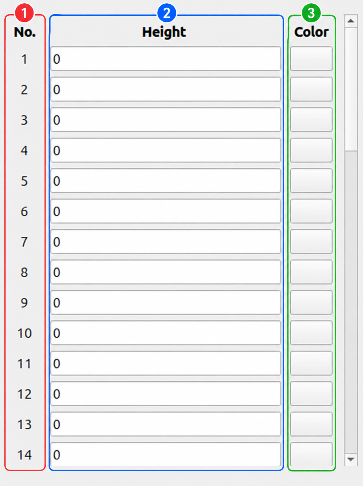
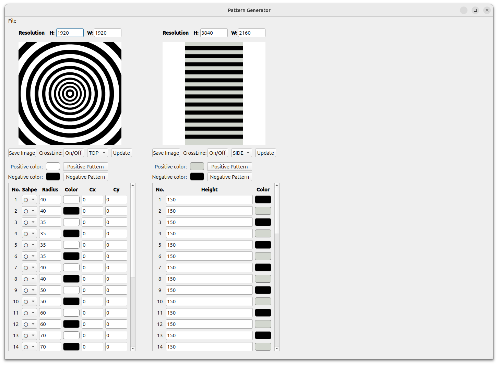

# PCT Pattern Generator

The **PCT Pattern Generator** is used to create, preview, edit, import, export, and send calibration patterns to the monitor viewer. In this window, the user can configure two pattern groups:

1. **Concentric Pattern** for circular calibration layers.
2. **Stripline Pattern** for horizontal or vertical stripe calibration layers.

The pattern data is stored in JSON format, then rendered into an image preview. The generated pattern is also used by the calibration result window as PCT reference data.

---

## 1. Window Overview

<div className="center">

<a id="fig-1"></a>



<p><em><a href="#fig-1"><strong>Figure 1.</strong></a> PCT Pattern Generator main window overview.</em></p>

</div>

The Pattern Generator window is divided into five main areas.

| No. | Area | Purpose |
|---:|---|---|
| 1 | **File Menu** | Imports and exports pattern JSON files for concentric and stripline patterns. |
| 2 | **Concentric Pattern Preview & Control** | Sets concentric resolution, previews the generated circular pattern, selects monitor direction, saves the image, toggles crossline, and applies positive/negative pattern colors. |
| 3 | **Concentric Pattern Table** | Configures each concentric layer using shape, radius, color, center X, and center Y. |
| 4 | **Stripline Pattern Preview & Control** | Sets stripline resolution, previews the generated stripe pattern, selects monitor direction, toggles crossline, and applies positive/negative pattern colors. |
| 5 | **Stripline Pattern Table** | Configures each stripline layer using height / interval and color. |

<div className="custom-note custom-important">
  <div className="custom-note-title">Main Goal</div>
  <p>The main goal of this window is to prepare accurate calibration pattern data before image capture. The concentric radius values and stripline interval values are later used as PCT values in the calibration result calculation.</p>
</div>

---

## 2. Controller Structure

The Pattern Generator is controlled by:

```python
class ControllerPatternGenerator(Ui_Sub_Maindow_Pattern_Creator):
```

The controller initializes two JSON pattern objects:

| JSON Object | Default Function | Purpose |
|---|---|---|
| `json_concentric` | `moil_pg.init_json_concentric(1920, 1920)` | Stores concentric pattern configuration. |
| `json_stripeline` | `moil_pg.init_json_stripline(1920, 1920)` | Stores stripline pattern configuration. |

The controller also stores the active monitor direction:

| Variable | Meaning |
|---|---|
| `monitor_direction_concentric` | Selected monitor direction for the concentric pattern. |
| `monitor_direction_stripeline` | Selected monitor direction for the stripline pattern. |
| `last_cross_line` | Stores crossline toggle state. |

The window connects all buttons and fields inside:

```python
def btn_connect(self):
```

This function connects import/export actions, resolution fields, color buttons, positive/negative pattern buttons, update buttons, and all layer table fields.

---

## 3. File Menu

The **File** menu is used to import and export pattern JSON files.

| Menu Action | Related Function | Description |
|---|---|---|
| **Import JSON Concentric** | `import_json_concentric()` | Loads a concentric JSON file, validates it, fills the UI fields, and updates the preview. |
| **Export JSON Concentric** | `export_json_concentric()` | Saves the current concentric configuration into a `.json` file. |
| **Import JSON Stripline** | `import_json_stripeline()` | Loads a stripline JSON file, validates it, fills the UI fields, and updates the preview. |
| **Export JSON Stripline** | `export_json_stripeline()` | Saves the current stripline configuration into a `.json` file. |

When a JSON file is imported, the system updates:

- Resolution fields.
- Positive color and negative color buttons.
- Crossline state.
- Layer values.
- Layer color buttons.
- Pattern preview image.

<div className="custom-note custom-warning">
  <div className="custom-note-title">Important</div>
  <p>Concentric JSON and stripline JSON are different pattern types. Import the correct JSON type into the correct menu action. A stripline JSON should not be imported through the concentric import action, and a concentric JSON should not be imported through the stripline import action.</p>
</div>

---

## 4. Concentric Pattern Preview & Control

<div className="center">

<a id="fig-2"></a>



<p><em><a href="#fig-2"><strong>Figure 2.</strong></a> Concentric Pattern Preview & Control area.</em></p>

</div>

This area controls the generated concentric pattern preview.

| No. | UI Element | Related Function | Description |
|---:|---|---|---|
| 1 | **Resolution H / W** | `finish_edit_height_concentric()` / `finish_edit_width_concentric()` | Sets the concentric image height and width. Invalid values are reset to default. |
| 2 | **Pattern Preview** | `update_pattern_concentric()` / `update_img_to_label()` | Shows the rendered concentric pattern image in the UI. |
| 3 | **Save Image / CrossLine / Direction / Update** | `save_image_concentric()`, `crossline_concentric()`, `select_monitor_concentric()`, `onclick_btn_update_concentric()` | Saves the image, toggles crossline, selects the monitor direction, and sends the updated pattern direction signal. |
| 4 | **Positive / Negative Color Controls** | `select_color()` / `onclick_pos_neg_pattern_concentric()` | Selects positive/negative colors and applies alternating colors to the concentric layers. |

### 4.1 Resolution

The concentric pattern normally uses a square resolution. In the shown example:

```text
H = 1920
W = 1920
```

When the user edits the height or width field and finishes editing, the controller updates the JSON data and redraws the pattern preview.

| Field | Meaning |
|---|---|
| **H** | Pattern height in pixels. |
| **W** | Pattern width in pixels. |

### 4.2 Preview Area

The preview area displays the current rendered pattern. The image is generated from the current JSON configuration using:

```python
moil_pg.render_from_json(self.json_concentric)
```

After rendering, the image is written to the calibration image folder and shown in the label preview.

### 4.3 Save Image, CrossLine, Direction, and Update

| Control | Description |
|---|---|
| **Save Image** | Saves the current concentric pattern image. |
| **CrossLine: On/Off** | Toggles crossline display inside the generated pattern. Crossline is useful for checking alignment and center position. |
| **TOP / SIDE / Direction ComboBox** | Selects which monitor direction the pattern belongs to. |
| **Update** | Re-renders the pattern and emits the selected direction to update the connected monitor viewer. |

The update button calls:

```python
onclick_btn_update_concentric()
```

The function then runs:

```python
self.update_pattern_concentric()
self.dir.emit(self.monitor_direction_concentric)
```

### 4.4 Positive and Negative Pattern Colors

The positive and negative color controls are used to quickly apply alternating colors to the pattern layers.

| Control | Description |
|---|---|
| **Positive color** | Opens a color dialog and stores the selected positive color. |
| **Negative color** | Opens a color dialog and stores the selected negative color. |
| **Positive Pattern** | Applies the selected positive color to odd layers and negative color to even layers. |
| **Negative Pattern** | Swaps the positive and negative colors before applying them to the layers. |

For concentric patterns, the controller loops through layers `1` to `25` and applies alternating colors.

---

## 5. Concentric Pattern Table

<div className="center">

<a id="fig-3"></a>



<p><em><a href="#fig-3"><strong>Figure 3.</strong></a> Concentric Pattern Table.</em></p>

</div>

The concentric table controls each circular or square layer. The table contains up to **25 layers**, although only part of the list is visible at one time because the table is scrollable.

| No. | Column | Related Widget Pattern | Description |
|---:|---|---|---|
| 1 | **No.** | Layer index | Shows the layer number. |
| 2 | **Shape** | `combobox_shape_i` | Selects the layer shape, usually circle or square. |
| 3 | **Radius** | `lineedit_radius_i` | Sets the radius value for the selected layer. This value is also used as concentric PCT data. |
| 4 | **Color** | `btn_color_i` | Opens a color picker and sets the layer color. |
| 5 | **Cx** | `lineedit_cx_i` | Sets the center X offset or center X coordinate for the layer. |
| 6 | **Cy** | `lineedit_cy_i` | Sets the center Y offset or center Y coordinate for the layer. |

### 5.1 Shape

The **Shape** column chooses the drawing type for each layer.

| Shape | Meaning |
|---|---|
| **Circle** | Draws a circular layer. This is the common setting for concentric calibration. |
| **Square** | Draws a square layer if square calibration geometry is needed. |

When the shape combo box changes, the controller updates the JSON field for that layer and redraws the preview.

### 5.2 Radius

The **Radius** column defines the size of each concentric layer. A larger value creates a larger ring / layer in the pattern.

The radius value is important because it becomes part of the pattern PCT reference data used later by the calibration result window.

Example usage:

```text
Layer 1  → radius 40
Layer 2  → radius 40
Layer 3  → radius 35
...
```

### 5.3 Color

Each layer has its own color button. Clicking the button opens a color picker. After a color is selected, the controller stores the RGB value in the concentric JSON and updates the button background.

This is useful when the user wants full manual control instead of using **Positive Pattern** or **Negative Pattern**.

### 5.4 Cx and Cy

`Cx` and `Cy` are used to control the center position of each concentric layer.

| Field | Meaning |
|---|---|
| **Cx** | Horizontal center coordinate / offset. |
| **Cy** | Vertical center coordinate / offset. |

If the values are left as `0`, the layer uses the default center behavior from the pattern generator.

<div className="custom-note custom-tip">
  <div className="custom-note-title">Usage Tip</div>
  <p>Use the Positive Pattern / Negative Pattern buttons when you want alternating layer colors quickly. Use the Color column when you need to customize individual layers one by one.</p>
</div>

---

## 6. Stripline Pattern Preview & Control

<div className="center">

<a id="fig-4"></a>



<p><em><a href="#fig-4"><strong>Figure 4.</strong></a> Stripline Pattern Preview & Control area.</em></p>

</div>

This area controls the generated stripline pattern preview.

| No. | UI Element | Related Function | Description |
|---:|---|---|---|
| 1 | **Resolution H / W** | `finish_edit_height_stripeline()` / `finish_edit_width_stripeline()` | Sets the stripline image height and width. Invalid values are reset to default values. |
| 2 | **Pattern Preview** | `update_pattern_stripeline()` / `update_img_to_label()` | Shows the rendered stripline pattern image in the UI. |
| 3 | **Save Image / CrossLine / Direction / Update** | `select_monitor_stripeline()` / `onclick_btn_update_stripeline()` | Selects monitor direction and updates the connected monitor viewer. |
| 4 | **Positive / Negative Color Controls** | `select_color()` / `onclick_pos_neg_pattern_stripeline()` | Selects positive/negative colors and applies alternating colors to stripline layers. |

### 6.1 Resolution

The stripline pattern is commonly used for a wide monitor or side display. In the shown example:

```text
H = 3840
W = 2160
```

The height and width fields update the stripline JSON and regenerate the preview when editing is finished.

### 6.2 Preview Area

The preview area displays the generated stripe pattern. The controller renders the image from:

```python
moil_pg.render_from_json(self.json_stripeline)
```

The rendered image is then resized for preview, centered in the label, and saved to the calibration image folder.

### 6.3 Direction and Update

The direction combo box selects where the stripline pattern should be sent or used.

| Direction Example | Meaning |
|---|---|
| **SIDE** | Pattern is prepared for side monitor usage. |
| **TOP** | Pattern is prepared for top monitor usage, if selected. |

After pressing **Update**, the controller emits the selected direction using:

```python
self.dir.emit(self.monitor_direction_stripeline)
```

This allows the connected monitor viewer to refresh the correct pattern display.

### 6.4 Positive and Negative Pattern Colors

The stripline positive/negative pattern buttons apply alternating colors to stripline layers.

For stripline patterns, the controller loops through layers `1` to `50` and applies alternating colors.

| Button | Behavior |
|---|---|
| **Positive Pattern** | Applies the positive and negative colors in alternating order. |
| **Negative Pattern** | Swaps the color order before applying the alternating pattern. |

---

## 7. Stripline Pattern Table

<div className="center">

<a id="fig-5"></a>



<p><em><a href="#fig-5"><strong>Figure 5.</strong></a> Stripline Pattern Table.</em></p>

</div>

The stripline table controls each stripe layer. The table contains up to **50 layers**, although only part of the list is visible at one time because the table is scrollable.

| No. | Column | Related Widget Pattern | Description |
|---:|---|---|---|
| 1 | **No.** | Layer index | Shows the stripline layer number. |
| 2 | **Height** | `lineedit_interval_stripeline_i` | Sets the stripe height / interval value for the selected layer. |
| 3 | **Color** | `btn_color_stripeline_i` | Opens a color picker and sets the stripe layer color. |

### 7.1 Height / Interval

In the UI, this column is shown as **Height**. In the controller code, it is handled as `interval`.

This value controls the size or spacing of each stripline layer. It is also used as stripline PCT data in the calibration result window.

Example usage:

```text
Layer 1  → height / interval 150
Layer 2  → height / interval 150
Layer 3  → height / interval 150
...
```

### 7.2 Color

Each stripline layer has a color button. Clicking the button opens a color picker. After the user selects a color, the controller updates the stripline JSON and redraws the pattern preview.

<div className="custom-note custom-important">
  <div className="custom-note-title">Height Column Naming</div>
  <p>The UI label is <strong>Height</strong>, but the controller stores this value using the JSON key <code>interval</code>. When documenting or debugging the code, treat <code>Height</code> and <code>interval</code> as the same stripline parameter.</p>
</div>

---

## 8. Generated Pattern Example

<div className="center">

<a id="fig-6"></a>



<p><em><a href="#fig-6"><strong>Figure 6.</strong></a> Example after concentric and stripline values are filled and rendered.</em></p>

</div>

In this example:

- The left preview shows a generated concentric pattern.
- The right preview shows a generated stripline pattern.
- The concentric table contains radius values for circular layers.
- The stripline table contains height / interval values for stripe layers.
- Positive and negative color buttons are used to create alternating black and white calibration patterns.

After the pattern is sent to the monitor and captured by the fisheye camera, the captured image shows the concentric pattern at the center and the stripline patterns at the top, bottom, left, and right sides.

<div className="center">

<a id="fig-7"></a>


<p><em><a href="#fig-7"><strong>Figure 7.</strong></a> Captured positive pattern: concentric pattern at the center and stripline patterns at the four sides.</em></p>

</div>

<div className="center">

<a id="fig-8"></a>


<p><em><a href="#fig-8"><strong>Figure 8.</strong></a> Captured negative pattern: same layout as the positive pattern with inverted colors.</em></p>

</div>

The positive and negative captures are used together by the calibration process to detect intersection points (ICT) and extract calibration data.

---

## 9. Pattern Update Logic

### 9.1 Concentric Update Logic

When a concentric parameter changes, the system follows this flow:

```text
User edits concentric field
   ↓
update_json_concentric()
   ↓
Update selected JSON key
   ↓
update_pattern_concentric()
   ↓
Render image from JSON
   ↓
Save temporary pattern image
   ↓
Display image in preview label
```

The edited field can be:

- Shape.
- Radius.
- Color.
- Cx.
- Cy.

### 9.2 Stripline Update Logic

When a stripline parameter changes, the system follows this flow:

```text
User edits stripline field
   ↓
update_json_stripeline()
   ↓
Update selected JSON key
   ↓
update_pattern_stripeline()
   ↓
Render image from JSON
   ↓
Save temporary pattern image
   ↓
Display image in preview label
```

The edited field can be:

- Height / interval.
- Color.

---

## 10. Pattern Image Output

When the pattern is updated, the controller renders the pattern and writes image files into the calibration image folder.

| Pattern Type | Main Update Function | Output Behavior |
|---|---|---|
| Concentric | `update_pattern_concentric()` | Renders `json_concentric`, saves temporary image, saves direction-based image, updates preview label. |
| Stripline | `update_pattern_stripeline()` | Renders `json_stripeline`, saves temporary image, saves direction-based image, updates preview label. |

The direction-based image name follows the selected monitor direction:

```text
image_cali/pattern_circle_{direction}.png
```

Example:

```text
image_cali/pattern_circle_top.png
image_cali/pattern_circle_side.png
```

<div className="custom-note custom-warning">
  <div className="custom-note-title">File Naming Note</div>
  <p>The controller currently uses the same base filename style, <code>pattern_circle_&#123;direction&#125;.png</code>, for rendered output. When checking generated files, always confirm the selected direction and the current pattern type from the UI.</p>
</div>

---

## 11. Relationship with Calibration Result

The Pattern Generator is not only a drawing tool. Its JSON values are also used by the calibration result calculation.

The calibration result window reads PCT values from:

| Pattern Source | Data Used |
|---|---|
| `json_concentric` | Radius values from layers `1` to `25`. |
| `json_stripeline` | Interval values from layers `1` to `50`. |

Together, these produce the pattern PCT list used in the calibration table:

```text
25 concentric radius values
+
50 stripline interval values
=
75 PCT values
```

These PCT values are then used during calibration result processing to calculate PCT calibration, alpha, ZFL, and aggregation behavior.

<div className="custom-note custom-important">
  <div className="custom-note-title">Why This Matters</div>
  <p>If the concentric radius or stripline height / interval values are wrong, the calibration result table will receive incorrect PCT data. This can affect alpha, ZFL, overlap, and aggregation results.</p>
</div>

---

## Recommended Workflow

### Create a Concentric Pattern

1. Open **PCT Pattern Generator**.
2. Set the concentric resolution, usually `1920 × 1920`.
3. Fill the **Radius** values in the concentric table.
4. Select each layer shape if needed.
5. Choose positive and negative colors.
6. Click **Positive Pattern** or **Negative Pattern** to apply alternating colors.
7. Select the monitor direction, for example **TOP**.
8. Click **Update**.
9. Check the preview image.
10. Export JSON if the configuration must be reused.

### Create a Stripline Pattern

1. Set the stripline resolution, for example `3840 × 2160`.
2. Fill the **Height** values in the stripline table.
3. Choose positive and negative colors.
4. Click **Positive Pattern** or **Negative Pattern** to apply alternating stripe colors.
5. Select the monitor direction, for example **SIDE**.
6. Click **Update**.
7. Check the preview image.
8. Export JSON if the configuration must be reused.

### Use Imported JSON

1. Open the **File** menu.
2. Choose the correct import action:
   - Import Concentric JSON for concentric pattern.
   - Import Stripline JSON for stripline pattern.
3. Confirm the preview is updated.
4. Check the resolution, colors, and layer values.
5. Click **Update** to send the updated pattern direction to the monitor viewer.

---

## Quick Reference

| Action | Use This UI | Main Function |
|---|---|---|
| Import concentric JSON | File menu | `import_json_concentric()` |
| Export concentric JSON | File menu | `export_json_concentric()` |
| Import stripline JSON | File menu | `import_json_stripeline()` |
| Export stripline JSON | File menu | `export_json_stripeline()` |
| Change concentric height | Concentric resolution H | `finish_edit_height_concentric()` |
| Change concentric width | Concentric resolution W | `finish_edit_width_concentric()` |
| Change stripline height | Stripline resolution H | `finish_edit_height_stripeline()` |
| Change stripline width | Stripline resolution W | `finish_edit_width_stripeline()` |
| Change concentric shape/radius/color/Cx/Cy | Concentric table | `update_json_concentric()` |
| Change stripline height/color | Stripline table | `update_json_stripeline()` |
| Apply concentric positive/negative colors | Positive Pattern / Negative Pattern | `onclick_pos_neg_pattern_concentric()` |
| Apply stripline positive/negative colors | Positive Pattern / Negative Pattern | `onclick_pos_neg_pattern_stripeline()` |
| Update concentric monitor direction | Update button | `onclick_btn_update_concentric()` |
| Update stripline monitor direction | Update button | `onclick_btn_update_stripeline()` |
| Save concentric image | Save Image button | `save_image_concentric()` |
| Toggle concentric crossline | CrossLine button | `crossline_concentric()` |

---

## Troubleshooting

| Problem | Possible Cause | Solution |
|---|---|---|
| Pattern preview does not change | The edited field was not confirmed yet. | Press Enter or click outside the field so `editingFinished` is triggered. |
| Imported JSON does not load | Wrong JSON type or invalid JSON structure. | Use the correct import action for the pattern type. |
| Pattern color does not match expectation | Positive/negative colors may have been swapped. | Click the opposite pattern button or manually set layer colors. |
| Stripline table says Height but code says interval | UI label and JSON key use different names. | Treat Height as stripline interval in documentation and debugging. |
| Monitor does not update | Direction was not emitted or monitor viewer is not connected. | Select the correct direction and click Update again. |
| Calibration result PCT values are wrong | Radius or stripline interval values are incorrect. | Check all concentric radius and stripline height / interval values before updating table. |

---

## Summary

The **PCT Pattern Generator** manages two calibration pattern types: concentric and stripline. The concentric section uses up to 25 radius-based layers, while the stripline section uses up to 50 height / interval layers. The window allows the user to edit layer values, choose colors, preview the generated image, save or export pattern data, and update the monitor direction. These pattern values are important because they are later used as PCT input data in the calibration result calculation.